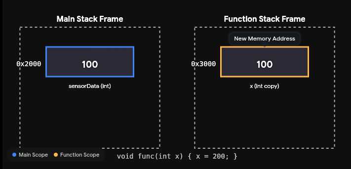
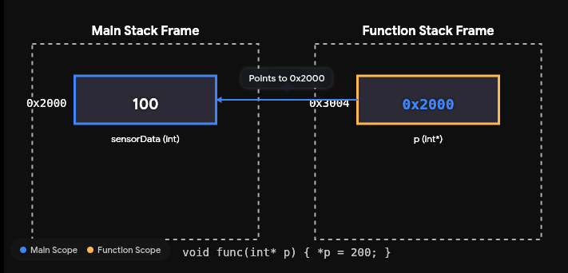
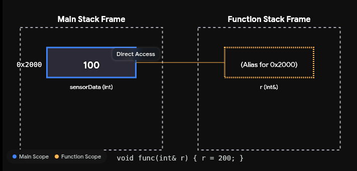

# C++ Documentation

## Overview
C++ is fundamentally an extension of C that introduces object-oriented and generic programming paradigms. Its core philosophy is providing zero-cost abstractions—meaning you can write highly structured, readable code without sacrificing the execution speed, memory layout control, or bare-metal hardware access you would expect from C.

For systems development, C++ shifts the focus from managing raw data and functions to modeling state, owning resources, and enforcing safety at compile time.

## Roadmap

### Phase 1: The Foundations & Modularity
```
Note: This Phase Covers the Chapters 1-3 of the reference book "A Tour of C++"
```
The goal here is to stop writing C and start utilizing C++'s strong type system and organizational features. The book moves fast through pointers, references, and basic classes.
- Focus Topics:
    - References vs. Pointers: Master passing by reference (&).
    - constexpr: Moving calculations to compile-time.
    - User-Defined Types: struct, class, and enum class (strongly typed enums).
    - Modularity: Namespaces and basic exception handling.
- Actionable Implementation: Create a clean hardware abstraction header.
    - Define a namespace (e.g., namespace hw::uart).
    - Use enum class to define strict states for your peripherals (e.g., BaudRate, PinState).
    - Write a basic struct to represent a hardware configuration, using references instead of pointers for initialization.

### Phase 2: Lifetimes and Abstraction
``` 
Note: This Phase Covers the Chapters 4-6 of the reference book "A Tour of C++"
```
This is where the paradigm shift happens. You will learn how C++ manages memory and resources automatically.
- Focus Topics:
    - RAII (Resource Acquisition Is Initialization): The single most important concept in the book. You will learn constructors and destructors.
    - Class Hierarchies: Abstract classes (interfaces) and virtual functions.
    - Move Semantics: Transferring ownership of data safely without copying (std::move).
    - Templates: Writing generic functions and classes.
- Actionable Implementation: Build a C++ wrapper for a C-based system library (like a serial port or GPIO interface).
    - Create an abstract base class called Peripheral.
    - Write a concrete class (e.g., UartDriver) that acquires the file descriptor or hardware lock in the constructor and releases it in the destructor (RAII).
    - Ensure that if an error occurs during initialization, the class throws an exception rather than returning an integer error code.

### Phase 3: The Standard Library & Memory
```
Note: This Phase Covers the Chapters 7-13 of the reference book "A Tour of C++"
```
The book shifts from the core language to the Standard Template Library (STL). You will learn to rely on the STL instead of writing custom linked lists or unsafe raw arrays.
- Focus Topics:
    - Containers: `std::array` (fixed size, perfect for bare-metal/stack allocation) and `std::vector` (dynamic buffers).
    - Smart Pointers: `std::unique_ptr` and `std::shared_ptr`. You should practically never use new and delete manually again.
    - Algorithms: Using <algorithm> for data manipulation instead of writing raw for loops.
- Actionable Implementation: Develop the payload handler for a protocol stack.
    - Use `std::vector<uint8_t>` to manage incoming data streams.
    - Use `std::unique_ptr` to manage the lifecycle of a protocol node—ensuring that only one part of the system can "own" the active master node at a time.
    - Use `std::find` or `std::copy` from the algorithms library to parse and extract frames from a data stream.

### Phase 4: Concurrency & Systems Integration (Chapters 14–15)
```
Note: This Phase Covers the Chapters 14-15 of the reference book "A Tour of C++"
```
Modern systems require asynchronous operations, especially when handling high-speed communication or bridging hardware interrupts to software processing.
- Focus Topics:
    - Threads and Tasks: <thread> and std::async.
    - Synchronization: <mutex>, std::lock_guard, and <atomic>.
- Actionable Implementation: Implement a thread-safe message queue.
    - Create a system where one thread continuously polls a hardware interface (like an RS485 bus) and pushes parsed messages into a queue.
    - Protect that queue using a std::mutex and a std::lock_guard (another form of RAII) so a separate processing thread can safely read the messages without data corruption.

### Strategy for Reading the Tour
1. Iterative Builds: Pair the book with modern, target-based CMake. Create a new add_executable or add_library target for each chapter's concept. This builds muscle memory for both the language and the build system.
2. Type it Out: Stroustrup provides short, brilliant code snippets. Do not just read them. Type them out, compile them, and intentionally break them to see what errors the compiler throws.
3. Embrace the "Why": The book heavily emphasizes why a feature exists (e.g., why std::unique_ptr is safer than a raw pointer). Internalizing the "why" is what separates C coders from C++ architects.

```
Note
1. In the book, Chapter 1 is literally called "The Basics." This is where you learn the syntax and mechanics that separate C++ from C or other languages.
2. Stroustrup doesn't use the buzzword "OOPs" as a chapter title; instead, he breaks it down into "Classes" and "Class Hierarchies." This is where you learn the four pillars of OOP (Encapsulation, Abstraction, Inheritance, Polymorphism) applied to C++.
3. Chapter 4 will cover Encapsulation, Chapter 4 & 5 will cover Abstraction & Inheritance, and Polymorphism post mid chapter 5 and 6.
```

### Strategy of learning C++
```
Note:
We will be using two resources:
1. The Video Resource: The Cherno (Youtube Playlist)
2. The Text Resource: A Tour of C++
```

**The Dual-Engine Learning Strategy**
To learn this effectively without hitting a wall, synchronize them by topic rather than trying to finish one before starting the other.
1. Watch the Concept: Watch The Cherno's videos on a topic (e.g., Classes, Destructors, or Smart Pointers) to get the visual and low-level layout breakdown.
2. Read the Standard: Read the brief corresponding sections in A Tour of C++ to see the official, modern syntax and architectural guidelines.
3. Build the Driver: Write a small piece of mock firmware code in your build system. For example, if you just learned about destructors and RAII, write a class that simulates opening, reading from, and safely closing an SPI or UART device node.

--- ---

## Cpp YT Playlist - The Cherno

Playlist Link >> https://www.youtube.com/playlist?list=PLlrATfBNZ98dudnM48yfGUldqGD0S4FFb


### How C++ Works

```text
Lecture 01 - how C++ Works
Notes:
1. Preprocessors in C++
2. iostream in C++
3. << in C++ and when its used with cout
4. C++ Compilation Workflow
5. Debug vs Release, platforms like x84 & x64, solution configuration s for C++
6. Header files and source files
7. Declaration  and Definition in C++
8. Linker in C++ 
```

#### Preprocessors in C++
- The preprocessor is a text-manipulation tool that runs before the actual compiler even sees your code.
- Any line starting with `#` e.g. `#include` or `#define` is a preprocessor directive.
- When you write `#include "dock_hw.h"`, the preprocessor physically opens that header file, copies all the text inside it, and pastes it into your `.cpp` file.

#### iostream in C++
- This is the standard library file that handles input and output streams (like priniting to a console).
- It contains the declarations for objects like `std::cout` and `std::cin`.
- You have to `#include` it because C++ inherently does not know how to print text to a screen, it relies on this library to interface with the operating system's standard output.

#### `<<` in C++
- In raw C, `<<` is strictly a bitwise left-shift operator used for register manipulation.
- C++ introduces `operator overloading` which allows you to redefine what standard symbols do.
- The iostream library overloads << to act as an "insertion" operator.
- When you write `std::cout << "Data"`, you aren't doing bit math. You are taking the "Data" and pushing it into the cout stream object. It is conceptually identical to calling a method on an object in Python, like `dock.enclosure("Data")`. You are just using an operator symbol instead of a standard function call to pass that data into the object.

#### C++ Compilation Workflow
The C++ build process happens in three distinct, isolated phases:
1. **Preprocessing:** Resolves all `#` directives (copy-pasting text).
2. **Compilation:** The compiler translates each individual `.cpp` file into an intermediate machine-code file called an Object file (`.o` or `.obj`). It does this blindly, file by file, without knowing about the rest of your project.
3. **Linking:** The linker takes all those standalone Object files and stitches them together into the final executable binary.

##### Debug vs Release & Solution Configurations
These are build rules that tell the compiler how to generate your machine code.
1. **Debug:** The compiler leaves the code mostly unoptimized and injects "debug symbols" (markers that map the machine code back to your exact lines of C++). It runs slower, but allows you to step through the code line-by-line.
2. **Release:** The compiler aggressively optimizes the code for maximum speed and minimum footprint, stripping out all debug symbols.
3. **x86 vs x64 (Architecture):** This specifies the target CPU instruction set. x86 is for 32-bit processors, and x64 is for 64-bit processors. If you were cross-compiling this C++ code for your RPi5 later, you would switch this target configuration to ARM64.

#### Declarations and Definitions
1. **Declaration:** You are making a promise to the compiler. `void initDock();` tells the compiler, "A function with this name and return type exists somewhere. Trust me." (This goes in the Header).
2. **Definition:** You are fulfilling the promise. `void initDock() { /* setup code */ }` is the actual memory and logic allocated to that function. (This goes in the Source file).

#### Linker in C++
- Because the compiler works on each `.cpp` file in complete isolation, it relies entirely on Declarations to compile successfully.
- The Linker is the final glue. It searches through all the generated `.o` files to match the Declarations with their actual Definitions.
- If you promised the compiler that `initDock()` existed, but you forgot to write the definition in your `.cpp` file (or forgot to tell CMake to compile that specific file), the compiler will pass, but the Linker will fail and throw an "unresolved external symbol" error.

## How C++ Compiler Works


## How C++ linker Works


## Variables in C++
- Discussed about variables and memory relation
- Discussed primitive data types and memory consumption of these data types like bool, char, char, short, int, long, long long, float, and double
- Discussed on signed and unsigned data types and how signed data bytes use the 32th bit for representing +/- number.
- Discussed difference between float and double.
- Discussed on `sizeof()` operator.

## Functions in C++
- Discussed on functions - overview, input and output, function types via data types.
- Discussed on how functions being called in runtime.

## Operators in C++ (Reference Book - Ch1:1.5)
- The Arithmetic Operators can be used for appropriate combinations of these types:
```cpp
x+y     // plus
+x      // unar y plus
x−y     // minus
−x      // unar y minus
x∗y     // multiply
x/y     // divide
x%y     // remainder (modulus) for integers
```

- Comparison Operators:
```cpp
x==y    // Equality
x!=y    // Not Equal
x<y     // less than
x>y     // greater than
x<=y    // less than or equal
x>=y    // greater than or equal
```

- Logical Operators
    - The logical operators `&&` and `||` simply return `true` or `false` depending on the values of their operands.
    - A bitwise logical operator yield a result of their operand type for which the operation has been per-formed on each bit.

    ```cpp
    x&y     // bitwise and
    x|y     // bitwise or
    xˆy     // bitwise exclusive or
    ˜x      // bitwise complement
    x&&y    // logical and
    x||y    // logical or
    ```
- Note: that `=` is the assignment operator and `==` tests equality.

## Scope & lifetime in C++ (Reference Book - Ch1:1.6)
- **Local Scope:** A name declared in a function is called a local name, and its scope extends from its point of declaration to the end of the block in which its declaration occurs/
- **Note:** A Block is delimited by a `{ }` pair.
- **Class Scope:** A name is called a member name, if it is definied in a class, outside any function, or enum class, and its socpe extends from the opening `{` of its enclosing declaration to the end of that declaration.
- **Namespace Scope:** A name is called a namespace member name if it is defined in an namespace outside any function, class, or enum class. and its scope extends from the point of declaration to the end of its namespace.
- A name not declared inside any other construct is called a global name and is said to be in the global namespace.
- **Note:** We can have objects without names, such as `temporaries` and objects created using `new`.
- An **object** must be constructed (initialized) before it is used and will be destroyed at the end of its scope.
- For a **namespace object** the point of destruction is the end of the program.
- For a **member**, the point of destruction is determined by the point of destruction of the object of which it is a member.
- An Object created by `new` "lives" until destroyed by `delete`.

## Constants in C++ (Reference Book - Ch1:1.7)
- C++ supports two notions of immutability i.e. `const` and `constexpr`.
- `const` means roughly "I promise not to change this value", this is used primarily to specify interfaces, so that data can be passed to functions without fear of it being modified and the compiler enforces the promise made by const.
- `constexpr` means roughly "to be evaluated at compile time", and this is used primarily to specify constants, to allow placement of data in read only memory (where ir is unlikely to be corrupted) and for performance.

```cpp
const int dmv = 17;         // dmv is a named constant
int var = 17;               // var is not a constant

constexpr double max1 = 1.4∗square(dmv);    // OK if square(17) is a constant expression
constexpr double max2 = 1.4∗square(var);    // error: var is not a constant expression
const double max3 = 1.4∗square(var);        // OK, may be evaluated at run time

double sum(const vector<double>&);          // sum will not modify its argument (§1.8)
vector<double> v {1.2, 3.4, 4.5};           // v is not a constant
const double s1 = sum(v);                   // OK: evaluated at run time
constexpr double s2 = sum(v);               // error: sum(v) not constant expression
```

- For a function to be usable in a constant expression i.e. in an expression that will be evaluated by the compiler, it must be defined `constexpr`. for example
```cpp
constexpr double square(double x){
    return x*x
}
```
- To be `constexpr`, a function must be rather simple like return-statement computing a value.
- A `constexpr` function can be used for non-constant arguments, but when that is done the result is not a constant expression.
- We allow a constexpr function to be called with non-constant-expression arguments in contexts that do not require constant expressions, so that we don’t have to define essentially the same function twice: once for constant expressions and once for variables.
- In a few places, constant expressions are required by language rules e.g. array bounds, case labels, template value arguments, and constants declared using `constexpr`.
- In other cases, compile-time evaluation is important for performance.
- Independently of performance issues, the notion of immutability (of an object with an unchangeable state) is an important design concern.

### Personal Notes on this topic
- In the raw `C` you write for hardware, you usually just `#define` a macro or use a basic `const` and call it a day. But in `C++`, the difference between `const` and `constexpr` comes down to a critical concept for system performance: When is the value figured out?

**`constexpr` - The Compile-Time Calculator (Flash / ROM)**

Think of constexpr as a command to the compiler that says: "Figure out this exact value on my laptop while you are compiling the code, and burn the final number directly into the read-only memory (ROM/Flash)."
- **The Rule:** The compiler must have 100% of the information it needs to do the math before the program ever runs.
- **The Firmware Advantage:** It costs zero CPU cycles at runtime.
- **Example explained from above notes:** `constexpr double max1 = 1.4 * square(17);` Because 17 is a hardcoded number, the C++ compiler on your laptop calculates the square, multiplies it by 1.4, and just embeds the final result into the executable.

**`const` - The Run-Time Guardrail (RAM)**

Think of const as a strict rule for your interfaces: "You can figure out this value while the system is actively running, but once it is set, no one is allowed to change it."
- **The Rule:** The value might depend on something that happens while the program is executing (like a sensor reading or a dynamically changing variable).
- **The Firmware Advantage:** It protects your memory. If you pass a large data packet into a communication stack, labeling it const ensures the protocol layer can read it, but the compiler will throw an error if the protocol layer accidentally tries to overwrite your data.
- **Example explained from above notes:** `const double max3 = 1.4 * square(var);` Because var is a standard variable, its value might change. The compiler cannot know what var is beforehand. So, your hardware has to spend CPU cycles to calculate this math during runtime, store it in RAM, and put a const lock on it so it cannot be altered afterward.

**The `constexpr` Function: A Dual-Purpose Tool**

constexpr function can take non-constant arguments. This is a brilliant feature of modern C++ designed to stop you from writing the same function twice.
- If you write a simple function like this:
```cpp
constexpr double square(doubel x){
    return x*x;
}
```
C++ makes this function "smart" depending on how you use it:
- **Scenario A (Laptop does the work):** If you call it with a hardcoded number: `square(10)`, the compiler calculates 100 during the build process and flashes the constant 100 to the board.
- **Scenario B (Board does the work):** If you call it with a live variable: `square(sensor_reading)`, the compiler says, "I can't calculate that right now," strips away the constexpr promise, and just compiles it as a normal run-time function that your processor will execute.

Therefore:
- Use `constexpr` for hardware constants, pin definitions, and math you want the compiler to do in advance to save CPU Cycles.
- Use `const` for function arguments to protect your structs and variables from accidetal modifications while the system is running.

## C++ Header Files
- Discussed what header files are and why we need them and what it solves.
- Discussed the use `#pragma once` and why its needed and used.
- Discussed the alternative via `#ifndef` based header guard.
- Discussed about #include statements using Double Quotes(`""`) and Angular brackers (`<>`). and also established a rule like angual brackets(`<>`) for compiler included paths and Double Quotes(`""`) for the rest.

## Conditions and Branches in C++
- Discussion on if, if-else, if-else if-else statements.
- Disassembly view of conditional based C++ code

## Loops in C++
- Discussed loops application in C++ (game dev example)
- Discussed for loops, while loops, do-while loops.
- Discussed when to use different kind of loops in C++.

## Control Flow in C++
- Discussed keywords - Continue, break, and return
- Discussed use case / application of the above keywords in loops and functions.

## Pointers in C++
- Discussed on Memory and raw pointers.
- Pointers are important for managing and manipulating memory.
- A Pointer is an integer or number which stores a memory address.
- Discussed void pointers, NULL and nullptr (Cpp11)
- Discussed Asterisk(*) and Ampersand(&) operator and its use-cases in pointers.
- Discussed read & write operations with pointers and also discussed the use of data type when a pointer is declared.
- Talked about stack vs heap memory allocation when it comes to variables and pointers.
- Showed examples of using new and delete keyword, and memset api.
- Discussed double pointers with an example.

## References in C++
- Explained the use `<data-type>*` and `<data-type>&` for pointer declaration and reference declarations.
- Discussed that reference is just an alias, it just exists in the source code and it does not exists in or consume memory when we compare with pointers.
    - Conceptually yes, it is just an alias.
    - If you write `int&b = a;` inside a single function, the compiler usually optimizes it away completely using zero memory.
    - The Exception is when you pass a reference into a function (for e.g. `void process_data(int& data)`), the compiler cannot magically alias accross different stack frames.
    - Under the hood, the compiler implements references as standard pointers, it passes the memory address over the stack exactly like a pointer would, meaning it takes the same bytes of overhead as a pointer.
    - The Benefit is purely syntactic sugar and safet for the programmer.
- Discussed how passing by value, pointer, and reference work with functions.
    
    - In Call by Value, a function receives a complete copy of the variable and changes to the parameter inside the function does not affect the original variable in the caller's stack frame.

    
    - In Pass by Pointer, the fucntion receives the memory address (0x2000) of the variable, and the function uses the pointer to reach back and modify the original memory directly.

    
    - In Pass by Reference, the function parameter becomes an alias for the original variable, and it shares the same memory address, and behaves like a pointer but with cleaner, 'value like' syntax.

- Discussed how the reference can tied to a variable1, cannot make the same reference point to a new variable called variable2.
    - A pointer can point to something else later, but a reference is locked to its target for life.
- Discussed how pointers and reference can be used together.

## Pointers, Arrays, and References in C++ (Reference Book - Ch1:1.8)
- In Declarations, `[]` means "array of" and `*` means "pointer to".
- All arrays have 0 as their lower bound, so for example char v[6] is from v[0] to v[5].
- The size of an array x[number] must be a constant expression.
- In an Expression, prefix unary `*` means "contents of" and prefix unary `&` means "address of".
- In a Declaration, the unary suffix `&` means "reference to".
- A Reference is similar to a pointer, except that you dont need to use a prefix `*` to access the value referred to by he reference.
- Also, a reference cannot be made to refer to a different object after its initialization.
- References are particular useful for specifying function arguments, for example `void sort(vector<double>& v);`. Therefore by using a reference, we ensure that for a call `sort(my_vec)`, we do not copy `my_vec` and that it is relay `my_vec` that is sorted ad not a copy of it.
- When we don't want to modify an argument, but still don't want the cost of copying, we use a const reference, for e.g. `double sum(const vector<double>&)`

Note: Chapter 01 is now completed in reference textbook - A Tour of C++.

---

## Classes in C++
- Classes group data and functionality together.
- Dicussed on Object and Instances in Classes.
- Discussed on classes, visibility of data in a class, methods (functionality) in classes.

### Notes (reference textbook ch2)
1. A Class is defined to have a set of members, and private members are accessible only through that interface.
2. A function with the same name as its class is called a constructor i.e. a function used to construct objects of a class.
3. There is no fundamental difference between a struct and a class; a struct is simply a class with members public by default.


## Classes VS Structs in C++
- Discussed difference between structs and Class & also on the visibility property.
- Discussed why structs exist in C++ when classes already exists - due to backwards compatibiltiy.
- Discussed application for structs and Classes in C++
- Discussed struct application - to use to represent a structure of data
- Discussed classes applucation - to not only represent data, but for it to also have functionality, visibility, and inheritence concepts applied, would go for classes.
- Note: Structs can also have functions defined in them with data attributes in C++, for e.g.
    ```Cpp
    struct example{
        float x,y;
        void move(example &ex){
            x += ex.x;
            y += ex.y;
        }
    }
    ```

## How to Write a C++ Class
- Discussed Log Class implementation that would contain 3 levels i.e. error, warning, message/trace and set our log systems level to only print to console depending on the level.
- Discussed and implemented the logging class - public variables, public static variables, public methods, private variables and private function implemented.
- Hands on implmentation done on log class implementation

## Static in C++
- Discussed how static has two meanings wrt context
    - static keyword usage outside classes / structs (global level)
    - static keyword usage inside classes / structs (internally in classes/structs)
- Discussed static and extern keywords and usage
- Discussed using static on global variables and with functions
- The Cherno explains the difference between using the static keyword inside and outside of classes. The discussion focuses on how static influences symbol linkage across translation units, affecting variable and function visibility.
- Discussed how static is used in classes wrt attributes and methods.
- Discussed why we need to intialize the static variables inside a class or struct.
- Discussed about static methods.
- Discussed how we can just access static attributes and methids via namespace and why this is how they should be accessed.
- Discussed why static methods cannot access non static attributes of a class, and this can be solved by passing on the class via arguments of that static method of he class.
- Discussed the differences between static and non-static attributes and methods
- Discussed how a c++ class actually works (internals)
- The Cherno demonstrates how static variables and methods function within classes and structs, focusing on memory sharing across instances. Examples highlight the distinction between static and non-static members and their behavior during compilation.


### Personal notes on static
1. In C++, the word `static` is overloaded. It dictates two completely different behaviors depeding entirely on where you type it - Linkage (Visibility) VS Lifetime (Storage)
2. **Context 1:** Outside a class (file scope/Global level)
    1. Internal Linkage basically imples that this symbol is invisible outside this specific `.cpp` file.
    2. By default, any global variable or standalone function we write has External Linkage. When the compiler turns `sensor.cpp` into `sensor.o`, it puts that variable's name into a public "Symbol Table" so the linker can let other `.cpp` files connect to it via `extern`.
    3. Adding `static` acts as a Linker Cloak:
        1. Static changes the linkage from external to internal
        2. The compiler still puts the variable in RAM, but it refuses to write its name into the public symbol table.
        ```cpp
        // 3. Example >> inside driver_a.cpp
        int global_speed = 100; // Public to the whole project
        static int private_offset = 12; // Strictly trapped inside driver_a.cpp file
        ```

    4. Static prevents Namespace pollution, for e.g. if `i2c_driver.cpp` and `spi_driver.cpp` both need a local tracking variable named `static bool is_busy`, marking them both statuc guarantees the linker won't crash with a `Multiple Definition`error, since they exisit as two totally isolated addresses in RAM.
3. **Context 3:** Inside a Local Function (Function Scope)
    1. In C++, using static inside a local function implies "Persistent Lifetime" i.e. intialize me once, remember my value forever.
    2. When you put `static` on a variable inside a function, it does not live on the stack; it lives in the global data segment.
    3. The line of code that intializes it is only executed the  very first time the CPU calls that function.
    ```cpp
    void triggerheartbeat(){
        static uint32_t last-toggle_time = 0; // Evaluated ONCE at boot
        if(millis() - last_toggle_time >= 1000){
            toggleLed();
            last_toggle_time = millis(); //Remembers this value for the next call!!
        }
    }
    ```

## Unions in C++

### Notes (reference textbook ch2)
1. A union is a struct in which all members are allocated at the same address so that the union occupies only as much space as its largest member.
2. Naturally, a union can hold a value for only one member at a time.
3. The language doesn’t keep track of which kind of value is held by a union, so the programmer must do that.

## Enums in C++
- Discussed Enum which are a set of values which the user gives a name to for readability.
- Enum is basically an integer
- You can specify the type of integer you want the enum to be such as `enum Example :: unsigned char`
- By default, enum’s are 32-bit integers
- integrating enum to log class example
- using log::<enum> as a log namespace in main code to access enum
- will later focus on enum classes in C++
- **Video Summary:** The Cherno demonstrates how to use enumerations to name integer values, improving code readability and grouping related constants. Learn to define custom types to restrict valid inputs and keep code cleaner.

### Notes (reference textbook ch2)
1. In C++, there are two ways to work with enummeration i.e. enum and enum class.
    1. **Enum** >> basically an unscoed enum, which leaks its values into the surrounding scope and allows implicit conversions to integers
    2. **Enum Class** >> basically a scoped enum whcih restricts its values to its own scope and strictly prevents implicit integer conversion.
2. In addition to classes, C++ supports a simple form of user-defined type for which we can enumerate the values.
    ```cpp
    enum class Color { red, blue, green };
    enum class Traffic_light{ green, yellow, red };

    Color col = Color::red;
    Traffic_light light = Traffic_light::red;
    ```
3. Enumerations are used to represent small sets of integer values. They are used to make code
more readable and less error-prone than it would have been had the symbolic (and mnemonic) enumerator names not been used.
4. The class after the enum specifies that an enumeration is strongly typed and that its enumerators are scoped.
5. Class & Enums, Being separate types, enum classes help prevent accidental misuses of constants.
6. In particular, we cannot mix Traffic_light and Color values:
    ```cpp
    Color x = red;                  // error : which red?
    Color y = Traffic_light::red;    // error : that red is not a Color
    Color z = Color::red;           // OK
    ```
7. Similarly, we cannot implicitly mix Color and integer values:
    ```cpp
    int i = Color::red;     // error : Color ::red is not an int
    Color c = 2;            // error : 2 is not a Color
    ```
8. The enumerators from a "plain" enum are entered into the same scope as the name of their enum and implicitly converts to their integer value. for e.g.
    ```cpp
    enum Color { red, green, blue };
    int col = green;
    ```
9. The "plain" enums have been in C++ (and C) from the earliest days, so even though they are less well behaved, they are common in current code.

**Notes:**
1. Chapter 2 of reference text book "A Tour of C++" is now completed, moving to chapter 3.
2. Chapter 2 contents - structs, class, unions, and enums covered.

---

## Constructors in C++
- Constructor is a special type of method in classes, which runs whenever instantiated an object.
- You can create a constructor by creating a function with the class name, for e.g. `class entity` → `entity(){ }` and if needed you can also pass arguments like `entity(int a, int b){ }` .
- We can hide the constructor if not needed like a static class by including the entity under private section of the class.
- If the user does not want the inbuilt constructor of a class, so that the object is not instantiated by just writing this piece of code >> `classname() = delete;`
- **Video Summary:** The Cherno demonstrates how to properly initialize class member variables using special methods called upon object instantiation. The tutorial covers creating default and parameterized constructors to replace manual initialization methods.

```cpp
#include <iostream>

class log{
public:
    enum class Log_Level{
        LEVEL_ERROR,
        LEVEL_WARNING,
        LEVEL_INFO
    };
private:
    Log_Level __log_level;
public:
    // Default Constructor
    log(){
        __log_level = Log_Level::LOG_LEVEL_INFO;
        std::cout << "LOG INSTANCE CREATION SUCCESS - WITH LOG LEVEL: " << (int)__log_level << std::endl;
    }

    // Constructor with input arguments option
    log(Log_Level level){
        __log_level = level;
        std::cout << "LOG INSTANCE CREATION SUCCESS - WITH LOG LEVEL: " << (int)__log_level << std::endl;
    }

    // APIs
    void log_set_level(Log_Level level){
        //
    }
    
    void log_info(const char* message){
        //
    }

    void log_warning(const char* message){
        //
    }

    void log_error(const char* message){
        //
    }
}

int main(){
    log file_logger(log::Log_Level::LEVEL_WARNING);
    log console_logger(log::Log_Level::LEVEL_INFO)
}
```

## Destructors in C++
- Destructors run when you destroy an object
- You can create a destructor in a similar way like its done for a constructor, but just add a tilde (~) as a prefix, for e.g. `~entity(){ }`
- Implemented the entire constructor to destructor cycle of an object by creating an object in a function to show the constructor and destructor outputs via print.
- **Video Summary:** The Cherno demonstrates how to implement destructors to manage memory cleanup when objects go out of scope or are deleted. Examples include using breakpoints in Visual Studio to trace when the destructor is called on stack-allocated objects.

```cpp
#include <iostream>

class log{
public:
    enum class Log_Level{
        LEVEL_ERROR,
        LEVEL_WARNING,
        LEVEL_INFO
    };
private:
    Log_Level __log_level;
public:
    // Default Constructor
    log(){
        __log_level = Log_Level::LOG_LEVEL_INFO;
        std::cout << "LOG INSTANCE CREATION SUCCESS - WITH LOG LEVEL: " << (int)__log_level << std::endl;
    }

    // Default Destructor
    ~log(){
        std::cout << "LOG INSTANCE WILL BE DESTROYED DUE TO DESTRUCTOR BEING TRIGGERED" << std::endl;
    }

    // Constructor with input arguments option
    log(Log_Level level){
        __log_level = level;
        std::cout << "LOG INSTANCE CREATION SUCCESS - WITH LOG LEVEL: " << (int)__log_level << std::endl;
    }

    // APIs
    void log_set_level(Log_Level level){
        //
    }
    
    void log_info(const char* message){
        //
    }

    void log_warning(const char* message){
        //
    }

    void log_error(const char* message){
        //
    }
}

int main(){
    log file_logger(log::Log_Level::LEVEL_WARNING);
    log console_logger(log::Log_Level::LEVEL_INFO)
}
```

## Inheritance in C++
- Discusses on Inheritance in C++ and how it helps programmers avoid duplication.
- Implemented an example of inheritance, where a base class called `entity` and sub-class `player` was created and new functionality was added in the player class.
- Discussed on the visibility concept wrt base class and sub-classes.
- Discussed an introductary overview on polymorphism and how it can be used between base class and sub-classes.
- Discussed how a programer can create a function that takes in the entity type as its input arguments, and that function is capable of taking the player sub-class via that arguments, because the player class is a subset of the base class entity, therefore it is type player and entity, therefore it is completely valid.
    - Book Definition: A subclass object (Player) is an instance of both itself and its base class (Entity). Because it satisfies an "is-a" relationship (Player is-an Entity), any function expecting a parameter of type Entity will seamlessly accept a Player argument.
- **Video Summary:** The Cherno explores how inheritance allows for a hierarchy of classes, using a base class to share common functionality like position and movement methods with derived subclasses. This approach significantly reduces code duplication while introducing new data members and specialized functionality to specific entities.

```cpp
#include <iostream>
#include <stdint.h>

class i2c_slave{
private:
    uint8_t  m_slave_address;
    uint32_t m_bus_speed;
    bool m_internal_pull_up_en;
public:
    // Default Constructor
    i2c_slave(){
        m_slave_address = 0x40;         // Default Sensor Address
        m_bus_speed = 100000;           //100 Khz - Standard Bus Speed
        m_internal_pull_up_en = true;   // Internal pull-up enable status
        std::cout << "[CONSTRUCTOR] I2C SENSOR INSTANCE INTIALIZED - WITH PARAMS: " << std::endl;
        std::cout << "DEFAULT I2C SENSOR ADDRESS: 0x" << std::hex << (uint)m_slave_address << std::endl;
        std::cout << "DEFAULT I2C BUS SPEED: " << std::dec << m_bus_speed << " KHz" << std::endl;
        std::cout << "DEFAULT I2C INTERNAL BUS PULL-UP EN: " << m_internal_pull_up_en << std::endl;
    }

    // Constructor with Input Arguments
    i2c_slave(uint8_t slave_addr, uint32_t bus_speed, bool internal_pull_up_en){
        m_slave_address = slave_addr;               // Default Sensor Address
        m_bus_speed = bus_speed;                    //100 Khz - Standard Bus Speed
        m_internal_pull_up_en = internal_pull_up_en;     // Internal pull-up enable status
        std::cout << "[CONSTRUCTOR] I2C SENSOR INSTANCE INTIALIZED - WITH PARAMS: " << std::endl;
        std::cout << "I2C SENSOR ADDRESS: 0x" << std::hex << (uint)slave_addr << std::endl;
        std::cout << "I2C BUS SPEED: " << std::dec << bus_speed << " KHz" << std::endl;
        std::cout << "I2C INTERNAL BUS PULL-UP EN: " << internal_pull_up_en << std::endl;
    }

    // Default Destructor
    ~i2c_slave(){
        std::cout << "[DESTRUCTOR] I2C SENSOR INSTANCE RESOURCES RELEASED" << std::endl;
    }

    // APIs
    void i2c_read(){
        std::cout << "I2C SENSOR READ SUCCESS" << std::endl;
    }
    void i2c_write(){
        std::cout << "I2C SENSOR WRITE SUCCESS" << std::endl;
    }
};

// Inheritance Example below
class sensor_ina260 : public i2c_slave {
private:
    uint16_t m_ina260_calibration_data;
public:
    float voltage, current, power;
    // Default Constructor
    sensor_ina260(){
        std::cout << "[CONSTRUCTOR] INA260 SENSOR INITALIZED" << std::endl;
        m_ina260_calibration_data = 0x0000;
        voltage = 0.00f;
        current = 0.00f;
        power = 0.00f;
    }

    // Default Destructor
    ~sensor_ina260(){
        std::cout << "[DESTRUCTOR] INA260 SENSOR RESOURCES RELEASED" << std::endl;
    }

    void log_sensor_info(){
        std::cout << "INA260 SENSOR - DESIGNED BY TI - USED FOR PWR SENSING APPLICATIONS" << std::endl;
    }

    void fetch_calibration(){
        i2c_read();
        m_ina260_calibration_data = 0x2890;
        std::cout << "INA260 SENSOR CALIBRATION VALUE: 0x2890" << std::endl;
    }
};

int main(){
    // i2c_slave in219;
    i2c_slave ina219(0x44, 400000, true);

    sensor_ina260 charger_power_sensor;
    charger_power_sensor.fetch_calibration();

    std::cout << "SIZE OF I2C_SLAVE CLASS: " << sizeof(i2c_slave) << std::endl;
    std::cout << "SIZE OF SENSOR_INA260 CLASS: " << sizeof(sensor_ina260) << std::endl;
    
    std::cin.get();
}
```

**Note:** Upto this point classes, constructor, destructor, and basics of inheritance are learnt, so there might be somethings missing like virtual stuff, will focus on it when that topic is in-progress and wil lmodify the above code at that point.


## Virtual Functions in C++
- Virtual functions allow us to override methods in sub-classes.
- Virtual functions increase dynamic dispatch which compilers typically implement by our VTable.
- VTable is basically a table that contains the mapping of all the virtual functions aside our base class, so that we can actually map them to the correct overwritten function at runtime.
- Discussed about the `virtual` and `override` keywords in C++.
- Discussed the cost of using virtual functions:
    - The additional memory required in order for us to store the VTable so that we can dispatch to correct function that includes a member pointer that points to the base class.
    - Every time we call a virtual function, we have to go throught the VTable to determine which function to actually map to which is an additional performance penalty.

### Personal Notes
To understand why `virtual` is necessary, you first need to see how the C++ Compiler behaves when it gets confused by pointers.
1. The Problem: Static Dispatch (No Virtual)
    1. Imagine you are writing a hardware driver, and you have a base `Peripheral` class and a `SPI` Class that inherits from it.
        ```cpp
        #include <iostream>

        class Peripheral {
        public:
            void transmit() {
                std::cout << "Sending generic peripheral data..." << std::endl;
            }
        };

        class SPI : public Peripheral {
        public:
            void transmit() {
                std::cout << "Sending fast SPI data!" << std::endl;
            }
        };
        ```
    2. The Scenario: You create an `SPI` object, but you store its address inside a `Peripheral*` pointer. (this is incredibly common in firmware when you wanr an array of generic pointers pointing to different specific sensors).
        ```cpp
        int main(){
            SPI mySpibus;

            // Create a base pointer pointing to the derived object
            Peripheral* devPtr = &mySpibus;

            // What happens here?
            devPtr->transmit();
            return 0;
        }
        ```
    3. The Output: "Sending generic peripheral data"
    4. Why did it fail? because of static dispatch, the compiler looked at `Peripheral* devPtr` and saw the type was `Peripheral*` and hardcoded a direct assembly jump to `Peripheral::transmit()`.
    5. It completely ignored the fact that the actual object sitting in memory was an `SPI` object.
2. The Solution: Dynamic Dispatch (Using `virtual`)
    1. To fix this, we add the `virtual` keyword to the base class, and the `override` keyword to the derived class.
        ```cpp
        #include <iostream>

        class Peripheral {
        public:
            // Virtual Tells the compiler: "Check the VTable at runtime!"
            virtual void transmit() {
                std::cout << "Sending generic peripheral data..." << std::endl;
            }
        };

        class SPI : public Peripheral {
        public:
            // override tells the compiler: "Make sure i am actually overriding a virtual base function"
            void transmit() override {
                std::cout << "Sending fast SPI data!" << std::endl;
            }
        };
        ```
    2. Now if we run the same `main()` function, The Output: "Sending fast SPI Data!"
    3. Why did it work? the compiler saw `virtual`, so it did not hardcode a jump, instead it injected assembly instruction to say "When we hit this line, look at the objecy `devPtr` is pointing to, find its hidden `_vptr`, follow it to the `SPI` VTable, and run whatever fucntion address is sitting there".
3. The True Cost (Memory & Speed) - As a system engineer, you need to know exactly  what you are paying for this flexibility.
    1. The Memory Penalty - When you add a virtual function, the compiler silently changes your memory layout:
        1. The VTable (ROM/FLASH): The compiler creates an array of function pointers for the `SPI` class. this exists exactly once per class type. (Cost: ~4-8 bytes per virtual function per class)
        2. The vptr (RAM): The Compiler injects a hidden pointer (`_vptr`) into the actual `SPI` object instance.
            1. If `SPI` had an `int baud_rate` (4 bytes), `sizeof(SPI)` without virtual functions would be 4 bytes.
            2. With virtual functions on a 64-bit system, `sizeof(SPI)` becomes 12 bytes (4 Bytes for the int + 8 Bytes for the hidden `_vptr`)

    2. The Speed Penalty
        1. To Call `devPtr->transmit()`, the CPU must perform extra work:
            1. Fetch the Object's `_vptr` from RAM.
            2. Dereference the _vptr` to find the VTable in FLASH.
            3. Read the function address from the VTable.
            4. jump to that function address.
        2. This indirect jumping can cause Pipeline Stalls or Cache Misses in your CPU.

## Interfaces in C++
- Discussed about a type of virtual function called a "pure virtual function".
- A pure virtual function allows us to define a function in a base class that does not have an implementation, and then force subclasses to actually implement that function.
- Discusses on why programmers create base class that consists of only unimplemented methods, and the forc a subclass to actually implement them, and this is often referred to as an interface.
- An Interface is a class that only consists of unimplemented methods and acting as a template of sorts.
- An Interface class doesn't actually contain method implementations, therefore not possible to instantiate this type of class.
- Discussed the C++ Interface Hierarchy & Concrete Sub-Classes
    - An Interface (a class containing at least one pure virtual function) cannot be instantiated. Any sub-class inheriting from it must implement those pure virtual functions to become a concrete class (a class you can actually create objects from).
    - However, once a sub-class fully implements those pure virtual functions, the requirement is satisfied for the entire branch of that family tree. Any further sub-classes down the chain inherit that implementation and are instantly concrete—they do not have to re-implement the interface functions unless they want to override them.

### Personal Notes
1. In C++, an Interface isn't a special keyword.
2. An Interface is simply a standard C++ `class` where at least one virtual function is set to `=0`. We cann this an Abstract Class.
3. The Syntax & The Hardware Contract
    1. When you append `=0` to a virtual function, you are creating a "Pure virtual Interface".
        ```Cpp
        // The 'I' prefix is a naming convection meaning "Interface"
        class ICommBus {
        public:
            // pure Virtual Function: "I will not write this code. You must."
            virtual void transmit(uint8_t data) = 0;

            // Always include a virtual destructor in an Interface!
            virtual ~ICommBus() = default;
        };
        ```
    2. The VTable Reality of `=0`: why `=0`? >> It is actually a literal instruction to the compiler.
    3. It tells the compiler: "Put a `NULL` pointer in the VTable for this function".
    4. Becasue the VTable contains a `NULL` pointer, if you tried to create an `ICommBus` object and call `transmit()`, the CPU would jumpt to `NULL` and the system would instanty crash (Segmentation Fault).
    5. This is why the compiler strictly forbids you from instantiating an Interface.
4. Enforcing the Contract (The Concrete Class)
    1. When a subclass inherits from an interface, it signs a contract. If it does not provide an implementation for every single pure virtual function, the compiler treats the subclass as an Interface too, and refuses to let you instantiate it.
    2. Scenario A: The Broken Contract
        ```cpp
        class I2CBus : public ICommBus {
        public:
            void init() {
                // Did some setup, but forgot to implement transmit()!
            }
        };

        // COMPILER ERROR! I2CBus is still an abstract class because transmit() is missing.
        I2CBus myI2C; 
        ```
        1. E.g. Firmware benefit: this is a massive safety net. if a junior engineer tries to write a new SPI driver but forgets to implement the core `transmit` function, this code simply won't compile.
    3. Scenario B: the Fullfilled Contract (Concrete Class)
        ```cpp
        class I2CBus : public ICommBus {
        public:
            // The contract is fulfilled! The compiler is happy.
            void transmit(uint8_t data) override {
                // Code to write data to the STM32 I2C Data Register...
            }
        };

        // SUCCESS! You can now create objects of this type.
        I2CBus myI2C; 
        ```
    4. The Family Tree (Concrete Propagation)
        1. Once a sub class fully implements those pure virtual functions, the requirement is satisfied for the entire branch of that family tree.
        2. For E.g. you want to make a specialized version of your i2c bus that automatically retries if the transmission fails.
        ```cpp
        // Family Tree Example: FastI2CBus inherits from I2CBus (which already fullfilled the ICommBus contract)
        class FastI2CBus : public I2CBus {
        public:
            void setFastMode() {
                std::cout << "I2C BUS FAST MODE SET" << std::endl;
            }

            // Note that we did not implement transmit() here
        };

        int main(){
            std::cout << "==== TOPIC: INTERFACES IN C++ ====" << std::endl;

            FastI2CBus myFastBus; //Instantiate - SUCCESS

            myFastBus.setFastMode();
            // The above instance automatically uses the transmit() implementation which it inherited from the parent I2CBus Cass
            myFastBus.transmit(0xff);

            std::cout << "==================================" << std::endl;
            std::cin.get();
        }
        ```
        3. Because `I2CBus` provided the memory address for `transmit()` to the VTable, `FastI2CBus` inherits a fully populated VTable (no `NULL` POINTERS).
        4. It is instantly a Concrete Class without you having to write any extra boilerplate code.
        5. If `FastI2CBus` wanted to change how transmitting works, it could imply `override` the function again, replacing the Parent's VTable entry with its own.


## Visibility in C++
- Discussed visibility in Classes.
- Visibility concept implementation in classes does not have any effect of performace of speed in runtime.
- Visibility in C++ has 3 basic modifiers i.e. `public`, `protected`, `private`.
- Discussed about `friend` keyword.
- When using `public` keyword in a class, all attributes and methods under the keyword is accessable to outside code by calling the `instance.attribute` or `instance.method()`.
- When using the `private` keyword in a class all attributes and methods under the keyword is not accessable to outside code and can only be used by the class and the programmer might need to create public methods to do any operations on the private data attributes or methods. Note: even sub-classes cannot call these data attributes or methods directly.
- When using `protected` keyword in a class, all attributes and methods under the keyword can be accessed by the class and all sub-classes, but no access to outside code to those protected data attributes and methods.
- Discussed few example use-cases/application of visibility modifiers in C++

---

## Separate Compilation in C++ (Reference Textbook Ch3:3.2)
- C++ supports a notion of separate compilation where user code sees only declarations of the types and functions used.
- The definitions of those types and functions are in separate source files and compiled separately.
- This can be used to organize a program into a set of semi-independent code fragments, such separation can be used to minimize compilation times and to strictly enforce separation of logically distinct part of a program, thus minimizing the chance of errors.
- A Library is often a collection of separately compiled code fragments (e.g. functions).
- E.g. Implementation of a Header file and Source file for Vector class code design
    - Programmers will implement a header file `vecotr.h`
    ```cpp
    // vector.h
    class Vector{
    private:
        double* elem;   // elem points to an array of sz double
        int sz;
    public:
        Vector(int s);
        double& operator[](int i);
        int size();
    };
    ```
    - Programmers will then implement a `vector.cpp` file that will house the implementation of the header file declarations
    ```cpp
    // Vector.cpp
    #include "vector.hpp"

    Vector::Vector(int s) : elem{new double[s]}, sz{s} {}

    double& Vector::operator[](int i) {
        return elem[i];
    }

    int Vector::size() {
        return sz;
    }
    ```
    - Note: Compared to C, C++ in the above implementation si doing three massive things i.e. Scope binding, Pre-body Initialization, and Operator Overloading.
        - The Scope Resolution Operator (`::`): In C++, `::` tells the compiler: "I am defining a function, but it strictly belongs to the `Vector` class blueprint defined in the header". It implicity passes the pointer to the object behind the scenes, so you dont have to pass it as an argument, like its done in C i.e. `void Vector_Init(Vector_t* v, int s)`.
        - The Member Initializer List (`:`): In C++, there is a strict difference between Initialization (giving memory a value the moment it is created) and Assignment (overwriting existing memory with a new value).
            - The Code after the colon `:` runs before the code inside the `{}`.
            - It initalizes `elem` and `sz` directly into memory.
            - If you did it inside the `{}` (like its done in C), C++ would first creare the variables with garbage values, and then you would overwrite them.
            - The Initalizer List skips the garbage step, saving CPU cycles. it is standard practice in modern C++.
        - The Dynamic Memory (`new` vs `malloc`): C++ introduces `new` which calculates the size for you based on the type, handles the type-casting automatically, and if you were creating an array of objects rather than standard `double`, it would automatically call the constructors for every single object in the array.
        - The Operator Overloading & references: `double& Vector::operator[](int i)` - this is pure C++, in C, you cannot change what mathematical symbols or brackets do. To get an element, you'd have to write a function like `double get_item(Vector* v, int i)`, but by naming the function `operator[]`, C++ allows you to use your custom class like a native array, for e.g
        ```cpp
        Vector myVec(10);
        myVec[3] = 42.5; // this secretly calls your operator[] function!
        ```
        - Note: by returning a `&` Reference, you hand the exact memory address abck to the caller, allowing them to overwrite the value.
    - Programmers will include the header file `vector.h or .hpp` in main.cpp to access vector implementation

## Namespaces in C++
- C++ offers namespaces as a mechansim for expressing that some declarations belong together and that their names shouldn't clash with other names.
- In C, the concept of a "namespace" doesn't exist. All functions and global variables live in one giant, global pool.
- If you are writing firmware in C and you have a UART driver and an SPI Driver, you cannot name there initialization functions `init()`. The linker will throw a "Multiple Definition" error because it sees two `init` symbols in the global table. To fix this, you use prefixes: `UART_init()` and `SPI_init()`.
- In C++, Namespaces exist to solve exactly this problem. A namespace is simply a named box that you put your code inside to keep it isolated from the rest of the project.
- Note: The Scope Resolution Operator `::` is used with namespace
- How to define a namespace:
```cpp
#include <iostream>
#include <stdint.h>

namespace UART {
    int baud_rate = 115200;
    
    void init(){
        std::cout << "UART Peripheral Initialized" << std::endl;
    }

    void transmit(char data){
        std::cout << "Transmitting data via UART: " << data << std::endl;
    }
}

namespace SPI {
    int clock_speed = 400'000;
    
    void init(){
        std::cout << "SPI Peripheral Initialized" << std::endl;
    }

    void transmit(char& data){
        std::cout << "Transmitting data via SPI: 0x" << std::hex << (int)(unsigned char)data << std::endl;
    }
}


int main(){
    std::cout << "==== Topic: Namespaces in C++ ====" << std::endl;
    char spi_byte = 0xAA;
    UART::init();
    SPI::init();

    UART::transmit('A');
    SPI::transmit(spi_byte);

    std::cout << "==================================" << std::endl;
    std::cin.get();
}
```
- C++ offers the `using` keyword to remove UART::<> or SPI::<> while using the namespace box definitions.

## Error Handling in C++
- C++ introduces Exceptions with `try`, `catch`, and `throw` keywords to ensure errors cannot be ignored. If an error occurs and nobody handles it, the program stops immediately.
- In C++, when a function detects a problem that it cannot solve on its own, it throws an exception. It is essentially hitting the emergency stop button and saying, "I can't continue. Whoever called me needs to deal with this."

### exceptions
- The Core Syntax: `throw`, `try`, and `catch`:
    - Instead of returning a -1 status code, we use the `throw` keyword. To handle the thrown error safely, the caller wraps the dangerous code in a `try` block, and `catches` the error in a catch block.
    ```cpp
    #include <iostream>
    #include <stdexcept> // Standard C++ exception types

    // A mock function that might fail
    int readSensorData(int pin) {
        if (pin < 0 || pin > 15) {
            // We throw an exception object instead of returning -1
            throw std::invalid_argument("Hardware error: Invalid pin number!");
        }
        
        return 1024; // Simulated valid reading
    }

    int main() {
        try {
            // The compiler attempts to run this code
            std::cout << "Reading pin 5: " << readSensorData(5) << std::endl;
            
            // This will trigger the exception!
            std::cout << "Reading pin 99: " << readSensorData(99) << std::endl; 
            
            // This line will NEVER execute because the line above threw an exception.
            std::cout << "All sensors read successfully." << std::endl;
            
        } catch (const std::invalid_argument& e) {
            // If an invalid_argument exception is thrown anywhere in the 'try' block, 
            // the CPU jumps immediately here.
            std::cout << "CAUGHT EXCEPTION: " << e.what() << std::endl;
        }
        
        return 0;
    }
    ```
    ```text
    Output Log:
    Reading pin 5: 1024
    Reading pin 99: CAUGHT EXCEPTION: Hardware error: Invalid pin number!
    ```
### Invarients
- Why use Exceptions instead of Error Codes? (The Constructor Problem)
    - In Object-Oriented C++, Constructors do not have return types.
    - If you try to creare a `RingBuffer` object, but the system doesn't have enough RAM to allocate the array, how does the constructor tell `main()` that it failed? it can't return `false`.
    - The Creator of C++ call this establishing an **Invarient** which means that a rule that must be true for the object to exist.
    - If the Constructor cannot establish the invarient, it must throw an exception. this guarantees that if an object existsm it is completely valid and safe to use.
    - Example code:
        ```cpp
        class NetworkSocket {
        public:
            NetworkSocket(int port) {
                if (port < 1024) {
                    throw std::runtime_error("Cannot bind to privileged port!");
                }
                // Bind port...
            }
        };

        int main() {
            try {
                NetworkSocket mySock(80); // Fails to construct! Throws exception.
            } catch (const std::runtime_error& e) {
                std::cout << "Failed to start server: " << e.what() << '\n';
            }
        }
        ```
        ```text
        Output Log:
        Failed to start server: Caught Exception: Cannot bind to privileged port!
        ```
- Firmware Compatibiltiy check (No exception mode)
    - While A Tour of C++ teaches exceptions as the gold standard, firmware and game engine developers often ban them.
    - If you look at the compilation flags for many STM32, Arduino, or high-performance game engine projects, you will see this flag: `-fno-exceptions`.
    - Why do embedded engineers turn exceptions off?
        - Flash Memory Bloat (Stack Unwinding):
            - To make try/catch work, the compiler must inject massive "Exception Tables" into your binary.
            - When an exception is thrown, a hidden C++ runtime function must walk backward through the call stack (called "unwinding"), figuring out exactly which local objects need their destructors called before it finally lands in your catch block.
            - This metadata can bloat your `.bin` file by 10% to 30%, which is catastrophic on a microcontroller with only 64KB of total Flash memory.
    - Unpredictable Timing (Non-Deterministic execution):
        - In a real-time operating system (RTOS) or a high-speed hardware interrupt (like a 1kHz drone motor PID loop), you need absolute, deterministic execution times.
        - The process of searching up the call stack for a catch block takes an unpredictable amount of CPU cycles.
        - If a sensor error takes 5 microseconds to handle today, but 150 microseconds tomorrow because the stack was deeper, your drone's control loop will miss its deadline and crash.
- What do we use instead for firmware?
    - If you compile with -fno-exceptions, you go back to the C-style philosophy (returning errors), but you use modern C++ safety wrappers instead of raw -1 integers.
    - **Alternative 1:** Error Structs (The simple C++ Way)
        - Instead of passing pointers to get multiple values back like in C, we return a lightweight struct containing both the data and a strictly-typed error enum. 
        ```cpp
        enum class SensorStatus { OK, I2C_ERROR, TIMEOUT };

        struct SensorResult {
            float temperature;
            SensorStatus status;
        };

        SensorResult readTemp() {
            // Hardware read failed! Return 0.0 for data, and the specific error flag.
            return { 0.0f, SensorStatus::I2C_ERROR }; 
        }
        ```
    - **Alternative 2:** `std::optional` (C++17)
        - Perfect for when a function might just fail to find something.
        - It returns a wrapper that holds "either the value, or literally nothing."
        - It forces the caller to check if the data exists before using it.
        ```cpp
        #include <optional>

        std::optional<int> getBufferData() {
            if (buffer_empty) return std::nullopt; // Fails safely
            return 42; // Succeeds
        }

        // In main.cpp:
        auto data = getBufferData();
        if (data.has_value()) {
            std::cout << data.value();
        }
        ```
    - **Alternative 3:** `std::expected` (C++23)
        - The modern holy grail for firmware.
        - It holds either the expected return value or a specific error code (very similar to Rust's famous Result type).
        - It has zero memory overhead compared to exceptions.

- The notion of invariants is central to the design of classes, and preconditions serve a similar role in the design of functions.
- Invarients helps us to understand precisely what we want, and forces us to be specific; that gives us a better chance of getting our code correct(after debugging and testing).
- The notion of invarients underlies C++'s notions of resource management supported by contructors and destructors.

### Static Assertions - Compile-Time Error Handling (`static_assert`)
- Exceptions report errors found at run time. Everything discussed above handles Runtime Errors.
- C++ also provides a mechanism for Compile-Time Error handling using the `static_assert` keyword. this tells the compiler: "If this mathematically condition is false, fail the build immediately."
- Because `static_assert` is evaluated exclusively by the compiler, it generates zero assembly code and has absolutely no CPU or Memory cost.
- The Firmware Use-Case: Memory Mapping
    - In firmware, you often map C++ structs directly over hardware registers.
    - If a 32-bit register bank requires exactly 12 bytes of data, but someone accidentally adds an extra `uint32_t` to the struct, the struct becomes 16 bytes.
    - When you write this to the hardware, the system will crash or behave erratically.
    - You can use `static_assert` to make the compiler guard your hardware constraints:
    ```cpp
    #include <cstdint>

    // Simulating a memory-mapped hardware register configuration
    struct SpiRegisters {
        uint32_t control;
        uint32_t status;
        uint32_t data;
    };

    // The compiler checks this before building the binary!
    // If someone adds a variable to SpiRegisters, the build will instantly fail.
    static_assert(sizeof(SpiRegisters) == 12, "FATAL: SpiRegisters struct must be exactly 12 bytes to match hardware!");

    int main() {
        // Normal code here...
        return 0;
    }
    ```
    - By putting `static_assert` checks throughout your firmware, you catch configuration errors, architecture mismatches, and alignment issues before you ever flash the board.

- Note: Chapter 3 is completed wrt topic coverage.
---

## Member Initializer Lists in C++
- Constructor member intialization lists is a way for us to initialize our class member functions in the constructor.
- Discussed Member Initializer lists and hands on implementation of constructor member intializer list, and emphasized on order in the member initializer list.
- Discussed what happens when Member Initializer are not used vs when they are used.

### Personal Notes
A Member Initializer List is a syntax used in constructor definitions to initialize class member variables before the constructor body executes. It is placed after the constructor parameter list, starting with `:`.

**Syntax & The "Two-Step" Trap (without vs with)**

To Understand why this feature exists, lets look at what compiler does behind the scene when you initialize a custom object (like a hardware peripheral driver) inside another class.

Below is an example code written, and we will be toggling the `MODERN_PATTERN` enable/disable to see how it affects initialization.
So by Disabling the `MODERN_PATTERN` by setting it to 0, we enable the Anti-Pattern to see what happens because of this in the output log.
```cpp
// Member Initializer List in C++
#include <iostream>

#define MODERN_PATTERN_CPP  0

class UartDriver {
public:
    UartDriver(){
        /*Default constructor: Boots in low-power mode*/
        std::cout << "DEFAULT CONSTRUCTOR: BOOTINT IN LOW POWER MODE" << std::endl;
    }
    UartDriver(int baud){
        /* Configures high-speed baud rate */
        std::cout << "DEFAULT CONSTRUCTOR: BOOTINT IN NORMAL MODE AT BAUD RATE: " << baud << std::endl;
    }

    void setBaud(int b){
        /* Overwrites baud rate */
        std::cout << "SETTING BAUD RATE TO: " << b << std::endl;
    }
};

class FlightController {
private:
    UartDriver gps_uart; // A Custom class member
    int error_count;
public:
#if MODERN_PATTERN_CPP
    // Modern-Pattern: Direct Memory Intialization
    FlightController(int baud_rate) : gps_uart(baud_rate), error_count(0) {
        // Constructor Body is now empty - and creation & Initialization is done only once now.
    }
#else
    // Anti-pattern Assigning inside the constructor body
    FlightController(int baud_rate){
        gps_uart = UartDriver(baud_rate);
        error_count = 0;
    }
#endif
};

int main(){
    std::cout << "========== TOPIC: Member Intializer List in C++ ==========" << std::endl;
    FlightController fc(9600);

    std::cout << "==========================================================" << std::endl;
    std::cin.get();
}
```
```text
Output Log:
========== TOPIC: Member Intializer List in C++ ==========
DEFAULT CONSTRUCTOR: BOOTINT IN LOW POWER MODE
DEFAULT CONSTRUCTOR: BOOTINT IN NORMAL MODE AT BAUD RATE: 9600
==========================================================
```

What actually happened in CPU Cycles? Because we didn't use an intializer list, C++ executes a Hidden Step 0 before constructor `{}` block runs.
1. Step 0 (hidden): The Compiler allocates `gps_uart` ad calls its default constructor `UartDriver()`.
2. Step 1 (Inside body): It Created a Temporary `UartDriver(baud_rate)` object.
3. Step 2: The Compiler uses the Assignment Operator `=` to copy the temporary object into `gps_uart`.
4. Step 3: The Temporary object is destroyed.
5. ResultL YOu booted the peripheral twuce and wasted memory allocations.

Now by enabling the `MODERN PATTERN` by setting 0 -> 1, we can totally see a different result:
```text
Output Log:
========== TOPIC: Member Intializer List in C++ ==========
DEFAULT CONSTRUCTOR: BOOTINT IN NORMAL MODE AT BAUD RATE: 9600
==========================================================
```

What happened here? the compiler directly constructs `gps_uart` in its final memory address using `UartDriber(baud_rate)`, it skips step 0 and therefore the results obtained are Zero wasted cycles of the CPU and the Default Constructor is completely bypassed.

**When Initializer Lists are Mandatory**

In Modern C++, there are three scenarios where the compiler will flat-out refuse to build the project if you dont use an Initializer Lists:
1. `const` Member Variables: Once memory is marked `const`, it cannot be assigned to via `=`. It must receive its value at the exact microsecond of its birth.
```cpp
// Const example for member intializer list
class Sensor {
private:
    const int i2c_address;
public:
    // ERROR: Cannot assign to variable 'i2c_address' with const-qualified type.
    // Sensor(int addr) { i2c_address = addr; }
    
    // SUCCESS: Initialized at birth
    Sensor(int addr) : i2c_address(addr) {
        // Empty constructor
    }
};
```
2. `reference` Member Variables: just like `const`, C++ references cannot be "empty" or re-seated. They must be intialized immediately.
```cpp
// reference example for member intializer list
class DataLogger {
private:
    int& rx_buffer; // Reference to an external buffer
public:
    DataLogger(int& buf) : rx_buffer(buf) {
        // Empty Constructor
    }
};
```
3. Objects without a default constructor: If you use a third party object that only has a constructor requiring arguments (no `Object()`), you cannot construct it inside the `{}` body.

**The Declaration Order Trap**

Rule: Class Members are always initialized in the exact order they are declared in the class definition (the `.h` file), completely ignoring the order you type them in the initalizer List.

Note: If the rule is not followed then there could be unefined behaviour of the object, for e.g.
```cpp
class BadActuator {
private:
    int raw_scaling_factor;
    int calibrated_speed;
public:
    // DANGER! Looks innocent, but causes undefined behavior.
    BadActuator(int input) : calibrated_speed(raw_scaling_factor * 2), raw_scaling_factor(input) {}
};
```

Why does this crash? when we look at the `private` section, the `raw_scaling_factor` is declared first. Therefore, the compiler intializes it first.
1. The Compiler intializes `raw_scaling_factor`. But in the constructor member list, the value is not given yet, so it gets unintialized garbage RAM data.
2. The Compiler then initializes `calibrated_speed` using `raw_scaling_factor * 2`
3. The Compiler finally sets `raw_scaling_factor = input`
4. Now the `calibrated_speed` is corrupted.

What can be done to avoid this? the fix could be enabling the `-Wreorder` flag in the GCC/CMake Compiler, since modern compilers will warn you if your intializer list doesn't match your header declaration order.

## const in C++
- Discussed const keyword
- Discussed using const with pointers
- Discussed using const with classes.
- Discussed const pointer return with pointer contents const as well and the function is also const, therefore no modifications in the function - `const int* const GetX() const {}`.
- Discussed using const with reference and passing arguments as const. (e.g. `void printEntity)const Entity& e){}` )
- Discussed calling const functions from classes and having identical function with const and no const function.
- Discussed mutable keyword and use case inside a const function.
- The Cherno Explains how the const keyword functions as a promise in C++ to prevent accidental modifications to variables, pointers, and class members. Learn to improve code safety by applying const to methods and understanding the difference between constant pointers and pointers to constants.

### Personal Notes
In C++, `const` is a mechanism to enforce read-only safety. Once you label something `const`, the compiler will aggressively throw errors if you or anyone else attempts to modify it.

**Pass by const reference**

This is the most common use of `const`, when passing a large struct (like a 100-byte `SensorPayload`) to a function, passing by value creates a slow, 100 byte memory copy.
Passing by reference(`&`) is fast (it just passes the 8-byte memory address), but it gives the function the power to accidently overwrite data.

The solution is to combine both `reference` and `const`.
```cpp
// const in C++
#include <iostream>

struct SensorPayload {
    float temp[20];
    int timestamp;
};

// FAST (no copy) and SAFE (read-only)
void printPayload(const SensorPayload& payload){
    std::cout << payload.timestamp << std::endl;
    
    // COMPILER ERROR: Cannot assign to variable 'payload' with const-qualifed type
    // payload.timestamp = 0;
}

int main(){
    std::cout << "========== TOPIC: const in C++ ==========" << std::endl;
    const SensorPayload data = {
        {24.6, 27.3},
        123443
    };
    printPayload(data);

    std::cout << "=========================================" << std::endl;
}
```

**The Pointer Puzzle (Read Right-to-Left)**

When combining `const` with pointers(`*`), the golden rule of C++ is to read the declaration beackward (right to left).

1. A Pointer to a Constant (`const int* ptr`)
    1. Read Right-to-Left: `ptr` is a pointer(`*`) to an integer(`int`) that is constant(`const`)
    ```cpp
    // EXAMPLE: A Pointer to a Constant (data)
    int a = 5;
    int b = 10;
    const int* ptr = &a;    // ptr is a pointer to an integer that is constant.
    ptr = &b;               // OK: You can change WHERE the pointer points.
    //*ptr = 7;             // ERROR: You cannot change the VALUE it points to.
    ```
2. Constant Pointer (`int* const ptr`)
    1. Read Right-to-Left: `ptr` is a pointer that is constant(`const`) to an integer(`int`)
    ```cpp
    // EXAMPLE: Constant Pointer
    int* const ptr2 = &a;   // ptr2 is a pointer that is constant to an integer.
    *ptr2 = 7;              // OK: You can change the data WHERE the pointer is pointing to.
    //ptr2 = &b;              //ERROR: You cannot change WHERE the pointer is pointing to.
    ```
3. Constant Pointer to a Constant (`const int* const ptr`)
    1. Read Right-to-Left: `ptr` is a pointer that is constant(`const`) to an integer(`int`) that is constant(`const`).
    ```cpp
    // EXAMPLE: Constant Pointer to a Constant (data)
    const int* const ptr3 = &b; // ptr3 is a pointer that is constant to an integer that is constant.
    //*ptr3 = 20;           // ERROR: You cannot change the VALUE the pointer points to.
    //ptr3 = &a;            // ERROR: You cannot change WHERE the pointer points to.
    // // Completely locked down. You can only read it.
    ```

**Const Methods in Classes**

1. When you put `const` at the end of a class method, you are making a promise: "This method will not modify any member variables of this class."
    ```cpp
    // Class Methods in Classes
    class UartDriver {
    private:
        int baud_rate = 115200;
    public:
        // A normal Method (can modify state)
        void setBaud(int new_baud){
            baud_rate = new_baud;
        }

        // A Const Method (Read-Only)
        int getBaud() const {
            // baud_rate = 9600; // COMPILER ERROR: Method is const!
            return baud_rate;
        }
    };
    ```
2. Why does this matter? if you pass a `UartDriver` to a function as a `const UartDriver&`, the compiler will only let you call methods that have `const` at the end! It protects the Object.
3. Example: `const int* const GetX() const {}`:
    1. Function Syntax: `<return-type>``function-name``Qualifier`{}
    2. `const int* const` (The Return Type): It returns a pointer, and the pointer itself cannot be redirected to a new address, and the integer it points to cannot be modified.
    3. `GetX()` (The Name): The Function Name.
    4. `const` (The Method Qualifier): Calling this function will not modify any variables inside the class it belongs to.

**Const Overloading** 
1. You can actually have two functions with the exact same name and arguments, where the only difference is the const keyword at the end.
2. The compiler is smart enough to pick the correct one based on whether the object is const or not.
3. E.g.
    ```cpp
    class Buffer {
    private:
        int data[10];
    public:
        // Version 1: For normal objects (Returns writable reference)
        int& get(int index) { return data[index]; }
        
        // Version 2: For const objects (Returns read-only reference)
        const int& get(int index) const { return data[index]; }
    };
    ```

## The Mutable keyword
- Discussed on mutable keyword.
- Discussed mutable keyword's 2 main use cases i.e. `const` and `lambda` in C++.

### Personal Notes
1. Sometimes, you have a `const` method (like reading a sensor), but you need to modify a hidden "background" variable, like a debug counter or a hardware cache.
2. If a method is `const`, it can't modify anything. To bypass this for a specific variable, you mark that variable as a `mutable`.
    ```cpp
    #include <iostream>

    // EXAMPLE: Mutable Keyword in a const method in a class
    class TemperatureSensor {
    private:
        int i2c_address;
        mutable int read_count_since_boot = 0;  // Allowed to change even in const methods!
    public:
        TemperatureSensor(int addr) : i2c_address(addr) {
            std::cout << "Temperature Sensor Object Instantiated Successfully" << std::endl;
        }

        // A Const Method - to promise that no changes will be done in the function/method
        float getTemp() const {
            // Read Sensor
            std::cout << "Temperature Read Success!" << std::endl;
            // update Read Count since boot variable
            read_count_since_boot++;
            // i2c_address = 0x44; // ERROR: Cannot be modifed inside a const method.
            return 25.3f;
        }

        int getCount() const{
            std::cout << "Read Count Since Boot: " << read_count_since_boot << std::endl;
            return read_count_since_boot;
        }
    };

    int main(){
        std::cout << "========== TOPIC: mutable keyword in C++ ==========" << std::endl;

        // EXAMPLE: Accessing Constant methods & use case of a mutable keyword.
        TemperatureSensor sensor(0x40);
        sensor.getCount();
        for(int i=0; i < 5; i++){
            sensor.getTemp();
            sensor.getCount();
        }

        std::cout << "=========================================" << std::endl;
        std::cin.get();
    }
    ```
    ```text
    Output Log:
    ========== TOPIC: const in C++ ==========
    1782835800
    Temperature Sensor Object Instantiated Successfully
    Read Count Since Boot: 0
    Temperature Read Success!
    Read Count Since Boot: 1
    Temperature Read Success!
    Read Count Since Boot: 2
    Temperature Read Success!
    Read Count Since Boot: 3
    Temperature Read Success!
    Read Count Since Boot: 4
    Temperature Read Success!
    Read Count Since Boot: 5
    =========================================
    ```

## Ternary Operators in C++ (Conditional Assignment)
- Discussed on Ternary Operators
- Syntax: `result = condition ? value if true : value if false`

## How to Create/Instantiate Objects in C++
- Discussed about instantiating objects and how memory plays a role in this via Stack and Heap memory.
- Discussed about object instance, stack memory and automatic lifetime.
- Discussed about object instance, heap memory and dynamic object lifetime.
- Discussed about the `new` and `delete` keyword.
- Discussed performance impact, memory consumption, managing object lifetime for stack and heap based memory usage.
- Sumamry: The Cherno breaks down the differences between stack and heap memory allocation for object creation in C++. Learn when to choose automatic lifespan on the stack versus manual management on the heap, covering performance implications and syntax.

### Personal Notes

In C++, a `class` is just a blueprint. Instantiation is the act of taking that blueprint, asking the OS for memory, and running the constructor to breathe life into the object.
There are two completely different places in memory you can put an object: the Stack and The Heap.

**The Stack Memory (Automatic Lifetime)**
1. The Stack is the default, preferred, and fastest way to create an object in C++.
2. The Syntax: Unlicke Java or C#, you do not use the `new` keyword to create standard objects in C++. you simply declare them like standard variables.
3. E.g.
```cpp
class UartDriver {
public:
    UartDriver() { std::cout << "UART Booting...\n"; }
    ~UartDriver() { std::cout << "UART Shutting down...\n"; }
    void send() { /* ... */ }
};

void transmitData() {
    // 1. Instantiation: Object created on the Stack. Constructor runs IMMEDIATELY.
    UartDriver myUart; 
    
    // 2. Use the object (using the standard dot '.' operator)
    myUart.send();
    
    // 3. The function ends. 
    // The CPU automatically pops 'myUart' off the stack.
    // The Destructor (~UartDriver) runs AUTOMATICALLY right here!
}

int main(){
    std::cout << "========== Topic: Object Instantiation in C++ ==========" << std::endl;

    // EXAMPLE: Stack Memory based Object Instantiation
    transmitData();
    
    std::cout << "========================================================" << std::endl;
    std::cin.get();
}
```
```text
Output Log:
========== Topic: Object Instantiation in C++ ==========
UART Booting...
Data Sent via UART
UART Shutting down...
========================================================
```
4. The Firmware Reality of the Stack
    1. Performace: Blazing fast, Allocating an object on the stack requres a single CPU assembly instruction (moving the stack pointer)
    2. Memory Management: 100% Automatic, you cannot have a memory leak with a stack object.
    3. The Danger(Stack Overflow): The Stack is tiny. On a RPI running linux its usually 8MB, on stm32 mcu it might only be 2KB, so if you create a massive object on the stack (e.g. `class ImageBuffer {uint8_t pixels[1000000]; };`), your system will crash.

**The Heap memory (Dynamic Lifetime)**
1. The Heap is a massive pool of available RAM. You use the Heap when your object is too large to fit on the stack, or when you need the object to survive long after the function that created it has finished.
2. The Syntax: to put an object on the Heap, you use the `new` keyword. this acts exactly like C's `malloc()`, but automatically calculates the size and forces the constructor to run. Because it's on the Heap, `new` returns a Pointer to the memory address.
```cpp
// Object Instantiation in C++
#include <iostream>

class UartDriver {
public:
    UartDriver(){
        std::cout << "UART Booting..." << std::endl;
    }

    ~UartDriver(){
        std::cout << "UART Shutting down..." << std::endl;
    }

    void send(){
        std::cout << "Data Sent via UART" << std::endl;
    }
};

void transmitData(){
    // 1. Instantiation: Object created on the Stack. Constructor runs IMMEDIATELY.
    UartDriver myUart;

    // 2. Use the Object (using the standard dot '.' operator)
    myUart.send();

    // 3. The function ends.
    // The CPU automatically pops myUart off the stack.
    // The Destructor (~UartDriver) runs AUTOMATICALLY right here!
}

UartDriver* createPersistentDriver(){
    // 1. Instantiation: Ask for heap memory and run the Constructor
    UartDriver* heapUart = new UartDriver();

    // 2. Use the object (using the arrow '->' operator because it's a pointer)
    heapUart->send();

    // 3. the function ends, BUT the object survives!
    return heapUart;
}

int main(){
    std::cout << "========== Topic: Object Instantiation in C++ ==========" << std::endl;

    // EXAMPLE: Stack Memory based Object Instantiation
    transmitData();

    // EXAMPLE: Heap Memory based Object Instantiation
    UartDriver* myGlobalDriver = createPersistentDriver();
    
    // Use the driver for the entire lifetime of the program
    for(int i=0; i<10; i++) {
        myGlobalDriver->send();
    }

    // Manual Destruction is REQUIRED
    // if you forget this line, you have a Memory leak.
    // This frees the memory and runs the Destructor.
    delete myGlobalDriver;
    
    std::cout << "========================================================" << std::endl;
    std::cin.get();
}
```
```text
Output Log:
========== Topic: Object Instantiation in C++ ==========
UART Booting...
Data Sent via UART
UART Shutting down...
UART Booting...
Data Sent via UART
Data Sent via UART
Data Sent via UART
Data Sent via UART
Data Sent via UART
Data Sent via UART
Data Sent via UART
Data Sent via UART
Data Sent via UART
Data Sent via UART
Data Sent via UART
UART Shutting down...
========================================================
```
3. the Firmware Reality of the Heap
    1. Performance: Slow, Calling `new` forces the CPU to search through the Heap looking for a contiguous block of free memory. This takes hundreds of clock cycles.
    2. The Danger (Fragmentation): In a long-running embedded system (like a drone flying for 40 minutes), repeadly calling `new` and `delete` causes Heap Fragmentation. The Memory gets chopped into tiny, unusable blocks until `new` suddenly fails and the system crashes out of the sky.

**The Golden Rules of Instantiation**

A C++ systems engineer, memorizes these decision tree:
1. Default to the StackL if you can create the object normally, do it on stack since it is faster, safer, and cleans itself up.
2. Use the Heap (`new`) ONLY if:
    1. The Object is incredibly large (e.g. a 10MB network buffer).
    2. You explicitly need the object's lifetime to outlive the scope `{ }` in which it was created.

## The `new` Keyword in C++
- Discussed that the new keyword's main purpose is to allocate memory on the Heap Memory.
- Syntax: `new <datatype>`
- Discussed how the `new` keyword works in the background in C++.
- Discussed the primary takeaway of the new keyword i.e. it takes time (speed -> slow)
- Discussed how `new` keyword works with normal data types and classes.
- Discussed how `new` keyword and `malloc()` based implementation looks like and how the constructor needs to be manually called if `malloc()` is used (generally used in C wrt `malloc()`) if used in C++.
- Discussed that in C++, creating an object requires two distinct steps: allocating raw heap memory and initializing the object (running its constructor). The `new` keyword automates both steps, whereas the C-style `malloc()` function only handles the raw memory layout.
- Summary: The Cherno explores the fundamentals of dynamic memory allocation using the `new` keyword to place data on the heap. Learn how to allocate primitive types, arrays, and objects, while understanding the essential relationship between allocating memory and calling constructors in C++.

### Personal Notes
In C++, the `new` keyword is the primary operator used to allocate memory on the Heap (dynamic memory) at runtime. Unlike the Stack, where the compiler knows exactly how much memory is needed at compile-time, the Heap is used when you don't know how much memory you need until the program is actually running, or when you need an object to survive beyond the function that created it.

**Syntax and Basic Usage**

You can use `new` to allocate primitive types, arrays, and complex objects. It always returns a Pointer to the newly allocated memory address.
```cpp
// New and delete Keywords in C++
#include <iostream>

class UartDriver {
public:
    UartDriver(int baud) {
        std::cout << "UART Driver Baud rate SET: " << baud << std::endl;
    }
    
    ~UartDriver() {
        std::cout << "UART Driver Instance will now be destroyed!" << std::endl;
    }
};

int main(){
    std::cout << "========== Topic: NEW and DELETE Keyword in C++ ==========" << std::endl;

    // EXAMPLE: Primitive Types
    // Allocate exactly 4 bytes on the Heap (for a 32-bit int)
    int* myInt = new int;

    // Allocates 4 Bytes AND Initializes the value to 42.
    int* myInitializedInt = new int(42);

    std::cout << "myInt pointer pointing to data: " << *myInt << std::endl;
    std::cout << "myInitializedInt pointer pointing to data: " << *myInitializedInt << std::endl;

    //Critical Operation: Freeing allocated memory vua delete keyword
    delete myInt;
    delete myInitializedInt;

    // EXAMPLE: Arrays (Dynamic Buffers)
    // Allocates a contiguous block of 400 bytes (100 ints * 4 bytes)
    int* myBuffer = new int[100];
    std::cout << "Size of myBuffer Pointer: " << sizeof(myBuffer) << std::endl;
    int cal_size = 0;
    for(int i=0; i<100; i++){
        cal_size += sizeof(*myBuffer);
    }
    std::cout << "Size of myBuffer in bytes: " << cal_size << std::endl;
    //Critical Operation: Freeing allocated memory via delete keyword
    delete[] myBuffer;

    // EXAMPLE: Custom Objects (Classes)
    // Allocates memorty AND calls the constructor!
    UartDriver* myDriver = new UartDriver(115200);
    delete myDriver;    // Calls the Destructor, then frees memory

    std::cout << "==========================================================" << std::endl;
    std::cin.get();
}
```

**Under the Hood: `new` vs `malloc()`**

Creating an object requires two distinct steps (allocating raw memory + running the constructor). If you try to use C's `malloc()` to create a C++ object, you will get the memory, but the cosntructor will never run. Your object will be full of garbage data and its internal state will be broken.

So when you type the `new` keyword, the C++ compiler secretly translates that into this two step process: Allocate raw, unintialized memory (exaclty what `malloc()` does) , and then call the constuctor on that specific memory address.
```cpp
UartDriver* driver = new UartDriver(115200);
```
```cpp
// STEP 1: Allocate raw, uninitialized memory (exactly what malloc does)
void* rawMemory = operator new(sizeof(UartDriver)); 

// STEP 2: Call the constructor on that specific memory address
// (You cannot type this in standard code; the compiler does it for you)
UartDriver* driver = static_cast<UartDriver*>(rawMemory);
driver->UartDriver::UartDriver(115200); 
```
Note: You cannot type this in standard code; the compiler does it for you.

Note: Because `new` is a language operator (not just a library function like `malloc()`), it is fully type-safe, and it automatically calculates `sizeof()` and automatically casts the returning `void*` pointer to the correct type.

**The Performance Penalty**

The Cherno emphasizes that `new` is slow. when you allocate on the stack, the CPU simply subtracts a value from the Stack Pointer Register and It takes exactly 1 clock cycle.

When you call `new`, you are asking the OS for a favor.
1. **Context Switch:** The Program pauses and hands control to the OS Kernel.
2. **Free List Travesal:** The OS Memory manager searches a massive linked list (The "Free List") looking for a contiguous block of RAM that is large enough to fit your object.
3. **Fragmentation:** If your Heap is highly fragmented (lots of tiny allocation and deletion), this search can take hundreds or thousands of clock cycle.
4. **BookKeeping:** The OS records the size of your allocation in a hidden header right before your pointer, so it knows how much to free when you call `delete`.

Firmware Takeaway: Never call `new` inside a high speed control loop or hardware interrupt (ISR). Allocate all your necessary objects using `new` once during the system boot-up phase, and then reuse them.

**Advanced Firmware Secret: "Placement New"**

Scenario: What if you want to run a C++ Constructor, but you don't want to use the Heap? what if you want to construct an object ar a specific hardcoded memory address (like a memory-mapped hardware register)?

C++ allows a specialized syntax called Placement New. It bypasses Step 1 (memory allocation) and only performs Step 2 (calling the constructor at a provided address).
```cpp
#include <iostream>
#include <new>

class UartDriver {
public:
    UartDriver(int baud) {
        std::cout << "UART Driver Baud rate SET: " << baud << std::endl;
    }
    
    ~UartDriver() {
        std::cout << "UART Driver Instance will now be destroyed!" << std::endl;
    }
};

int main(){
    std::cout << "========== Topic: NEW and DELETE Keyword in C++ ==========" << std::endl;

    // EXAMPLE: Placement New example for firmware based implementation
    // Imagine 0x40004400 is the hardcoded memory address of the USART2 Peripheral
    std::cout << "Advanced firmware Implementation Example using Placement New in C++" << std::endl;
    
    void* hardware_register_address = (void*)0x40004400;

    // Tell C++: "Don't allocate memory. just run the UartDriver constructor directly in tip of this exact memory address"
    UartDriver* usart2 = new (hardware_register_address) UartDriver(115200);

    // NoteL you NEVER call delete on an object created with placement New, because you didn't allocate the memory from the Heap!

    std::cout << "==========================================================" << std::endl;
    std::cin.get();
}
```
```text
Output Log:
========== Topic: NEW and DELETE Keyword in C++ ==========
Advanced firmware Implementation Example using Placement New in C++
UART Driver Baud rate SET: 115200
==========================================================
```
This is how modern embedded C++ frameworks (like Mbed OS or Modern C++ HALs) map object oriented classes directly over baremetal silicon registers!.

## The `this` Keyword in C++
- Discussed about the `this` keyword and that it is only accessable to us through a member function of a class.
- `this` keyword is a pointer to the current object instance that the method belongs to.
- `this` keyword can help to reference any member (data attribute) of that instance/object inside the class code written of that instance.
- Discussed about `this` and `const` keywords and the relation of `const` with `this`.
- Discussed about passing the instance as an argument of a function that is defined outside the class but also called and used inside the class in some method or constructor, so to pass the instance itself in that function, we use the `this` keyword to reference itself.
- Discussed using `this` in const methods of a class.
- Discussed about using `this` to delete the instance itself.

- **Note:** so my understanding is that by using `this` keyword, you can basically access that very instance of the object to access a variable in that instance, because you might have written a similar argument of a specific non static method in that instance's class code, and therefore `this` keyword would basically be a pointer varaible that holds the address of that current/specific instance that the instance is using via a method of the class/instance.
- **Note:** so basically `this` keyword is like the `self` that is used in python when we create a class.

- Summary: The Cherno explains how to use the 'this' pointer in C++ to access member variables within a class when parameter names conflict. The tutorial also covers referencing the current object instance and safely passing it to external functions.

### Personal Notes

**Rewritten Quick Notes**
1. What is it? `this` is a hidden pointer passed into every non-static member function of a class. It holds the memory address of the specific object instance that called the function.
2. Scope: It is only accessable from inside the member fucntions of a class.
3. Name Disambiguation: Its most commin basic use is to differentiate between a class mmber variable and a function parameter that have exact same name (e.g. `this->x = x;`).
4. Self-Referencing: It allows an object to pass a pointer or reference of itself to outside external functions or hardware callbacks.
5. The `const` interaction: If a method is marked `const`, the `this` pointer changes from `Entity*` to `const Entity*`. this is the literal mechanism that prevents you from modifying variables inside a `const` method.
6. Memory Management: An object can technically call `delete this;` to destroy itself, though this is a highly dangerous pattern reserved for specific memory-management architectures.

**The C to C++" Reality (How it actually works)**

Because you are a C programmer, the easiest way to understand `this` is to look at what the C++ compiler is secretly doing to your code behind the scenes.
In C, functions don't belong to structs. If you want a function to modify a struct, you have to pass a pointer to that struct as the first argument:
1. The C Way:
    ```cpp
    struct Sensor {
        int pin;
    };

    // You manually pass the pointer to the struct
    void Sensor_SetPin(struct Sensor* ptr, int p) {
        ptr->pin = p;
    }

    int main() {
        struct Sensor mySensor;
        Sensor_SetPin(&mySensor, 5);
    }
    ```
    ```text
    Output Log:
    ========== Topic: this Keyword in C++ ==========
    C Style Example
    Sensor Pin SET Value: 5
    ================================================
    ```
2. The C++ Way:
    ```cpp
    class Sensor {
    private:
        int pin;
    public:
        void setPin(int p) {
            // 'this' is magically available here!
            this->pin = p; 
        }
    };

    int main() {
        Sensor mySensor;
        mySensor.setPin(5); 
        // ^ The compiler secretly translates this into: Sensor::setPin(&mySensor, 5);
    }
    ```
    ```text
    ========== Topic: this Keyword in C++ ==========
    C Style Example
    Sensor Pin SET Value: 5
    [CONSTRUCTOR] SENSOR INSTANCE INITIALIZED WITH DEFAULT PIN 1
    [CONSTRUCTOR] SENSOR INSTANCE INITIALIZED WITH DEFAULT PIN 5
    NEW PINS SET: 5
    NEW PINS SET: 9
    ================================================
    ```

**Practical Use Cases**

1. **Name Shadowing (Solving Naming conflicts):** When your constructor argument has the same name as your class variable, the compiler gets confused. this-> tells the compiler exactly which one is the class variable.
    ```cpp
    class UartDriver {
    private:
        int baud_rate;
    public:
        // The parameter is also named 'baud_rate'
        UartDriver(int baud_rate) {
            // baud_rate = baud_rate; // WRONG! Just assigns the parameter to itself.
            
            this->baud_rate = baud_rate; // CORRECT! Assigns parameter to the object.
        }
    };
    ```
2. **Passing "Self" to External Functions (Hardware Callbacks):** In embedded systems, you often have a global hardware interrupt, but you want it to trigger a function inside your specific object. You can use `this` to register your object with the global system.
```cpp
// USE CASE: Passing "self" to external functions (Hardware callbacks)
// A global function
void register_sensor_callback(class SensorY* s);

class SensorY {
public:
    void init(){
        // Hey Global System, register ME!
        register_sensor_callback(this);
    }

    void onHardwareInterrupt(){
        std::cout << "ISR TRIGGERED & PROCESSED" << std::endl;
    }
};

int main() {}

void register_sensor_callback(class SensorY* s){
    s->onHardwareInterrupt();
}
```
3. **Returning References to Self (Method Chaining):** If you return `*this` (dereferencing the pointer to get the actual object), you can chain methods together. This is how `std::cout << "A" << "B";` works!
```cpp
// USE CASE: Returning References to Self (Method Chaining)
class LedController {
public:
    LedController& turnOn(){
        std::cout << "LED TURNED ON!" << std::endl;
        return *this;   // return the object itself
    }

    LedController& setBrightness(int level){
        std::cout << "LED BRIGHTNESS SET: " << level << std::endl;
        return *this;
    }
};
```
```text
Output Log:
========== Topic: this Keyword in C++ ==========
ISR TRIGGERED & PROCESSED
LED TURNED ON!
LED BRIGHTNESS SET: 100
================================================
```

**The Danger Zone: `delete this;`**
```cpp
class TemporaryTask {
public:
    TemporaryTask(){
        std::cout << "TASK CREATED - NOW RUNNING" << std::endl;
    }
    void finishTask() {
        // ... do work ...
        
        // Destroy myself!
        delete this; 
    }
};
```
```text
========== Topic: this Keyword in C++ ==========
EXAMPLE: Using delete and this keyword to destroy an object - NOT RECOMMENDED!!
TASK CREATED - NOW RUNNING
munmap_chunk(): invalid pointer
Aborted (core dumped)
```

**Firmware Warning:** You should almost never do this.
1. It only works if the object was created on the Heap using `new`. If the object was created on the Stack and calls `delete this;`, your entire program will instantly crash.
2. If you call `delete this;` and then try to read a member variable on the very next line, you are reading freed memory (Undefined Behavior). It is occasionally used in advanced UI frameworks or reference-counted smart pointers, but it should be avoided in standard systems programming.

## Implicit Conversion/Constructor and the Explicit Keyword in C++
- Discussed about Implicit conversion and constructor.
- Discussed about Explicit Keyword and how it prevents automatic implicit conversion by the compiler.
- Summary: The Cherno demonstrates how the C++ compiler automatically performs one implicit type conversion and explains how to prevent this behavior. The tutorial covers creating a class and using constructors to see these conversions in action, while discussing the impact of the explicit keyword on code clarity and safety.

### Personal Notes
1. Implicit conversion in C++, allows the compiler to automatically convert one data type into another. If a class has a constructor that takes a single argument, the compiler can secretly use that constructor to convert that argument into an object of the class.
2. The One step limit basically means that the C++ compiler is only allowed to perform one implicit conversion at a time. It cannot chain multiple implicit conversions together to make types match.
3. The Danger is that due to this automatic behavior, it can lead to accidental object instantiation, causing silent logic bugs and wasting CPU cycles in unncessary memory allocation.
4. The `Explicit` keyword placed before a constructor can disable implicit conversion. It forces the programmer to explicitily call the constructor by name if they want to create an object, resulting in safet and more readable code.

**How Implicit Conversion Works**

Imagine you have a class that represents a hardware GPIO pin and it has a constructor that takes a single integer (the pin number).
```cpp
class GpioPin {
private:
    int pin_number;
public:
    // A constructor that takes one integer
    GpioPin(int pin) : pin_number(pin) {
        // Init hardware pin...
        std::cout << "GPIO PIN INTIALIZED" << std::endl;
    }
};

void togglePin(const GpioPin& p) {
    // Toggles the hardware state
    std::cout << "GPIO PIN SET: " << p << std::endl;
}
```
Because the constructor takes a single `int`, C++ creates a hidden rule: "An `int` can now be automatically converted into a `GpioPin`. This means that you can do this in your `main()` function:
```cpp
int main(){
    // Normal instantiation
    GpioPin myLed(5); 
    
    // IMPLICIT CONVERSION! 
    // We are passing an 'int' (13) to a function expecting a 'GpioPin' object.
    togglePin(13); 
    
    return 0;
}
```
What the compiler secretly did: It saw `13`, realized `togglePin` needed a `GpioPin`, and silently rewrote your code to `togglePin(GpioPin(13));`. It created a temporary object on the stack without you ever typing the class name.

**The Danger in Firmware**

While typing `togglePin(13)` looks convenient, implicit conversions cause catastrophic bugs when types get mixed up. Consider a custom `String` class and a `Buffer` class:
```cpp
class Buffer {
public:
    // Constructor allocates 'size' bytes on the Heap
    Buffer(int size) { 
        std::cout << "BUFFER CREATED & INTIALIZED WITH SIZE: " << size << std::endl;
    }
};

void sendData(const Buffer& b) {
    // Transmits buffer over UART...
    std::cout << "SENDING DATA: " << b << std::endl;
}

int main() {
    int sensor_value = 255;
    
    // BUG! The programmer meant to send the NUMBER 255.
    // But because of implicit conversion, the compiler silently creates 
    // an empty Buffer of size 255 bytes and sends that instead!
    sendData(sensor_value); 
}
```
The code compiles perfectly, no errors are thrown, but your system behavior is completely broken.

**The Fix: The explicit Keyword**

To prevent the compiler from making dangerous assumptions, you add the explicit keyword in front of any constructor that takes a single argument. This revokes the compiler's permission to use the constructor behind your back.
```cpp
class Buffer {
public:
    // We added the explicit keyword!
    explicit Buffer(int size) { /* ... */ } 
};

void sendData(const Buffer& b) { /* ... */ }

int main() {
    int sensor_value = 255;
    
    // COMPILER ERROR! Cannot convert 'int' to 'Buffer'.
    // sendData(sensor_value); 
    
    // SUCCESS: If you actually want a buffer of size 255, 
    // you must clearly ask for it.
    sendData(Buffer(sensor_value)); 
}
```

The Golden Rule for Modern C++ is always mark single-argument constructors as explicit unless you have a highly specific, intentional reason to allow implicit conversions. In embedded systems and complex architectures like gRPC, you want the code to do exactly what you type, nothing more and nothing less.

## Operators & Operator Overloading
- Discussed overview of operators in C++
- Discussed operator overloading
- Showcased examples of operator overloading with structs and classes.
- showcased examples on why operator oveloading can help make code more readable with +,-,* based operator overloading example.
- Discussed and showcase example on left shift operator with operator overloading.
- Summary: The Cherno demonstrates how to implement operator overloading by defining custom behaviors for mathematical symbols using a vector struct. The tutorial covers creating addition, multiplication, and equality operators to streamline code readability and functionality.

### Personal Notes

In C++, an operator(`+`,`-`,`*`,`==`,`<<`) is just a function with a special name. Operator Overloading allows you to define what these symbols do when applied to your custom `struct` or `class`.

**The Core Syntax(Math Operators)**

When you type `a+b`, the C++ compiler actually translates this into a function call: `a.operator+(b)`. If you want to allow two drone coordinate vectors to be added together, you just write a method named `operator+`.
```cpp
// Operators and Operator Overloading in C++
#include <iostream>

struct Vector3 {
    float x,y,z;
    Vector3(float x, float y, float z) : x(x), y(y), z(z) {}

    // The Overloaded `+` Operator
    // Notice the const reference (fast, safe) and the trailing const (read-only)
    Vector3 operator+(const Vector3& other) const {
        // Return a brand new Vector3 Object with the added values
        return Vector3(x + other.x, y + other.y, z + other.z);
    }

    // The Overloaded '*' Operator (Scaling by a scalar value)
    Vector3 operator*(float scalar) const {
        return Vector3(x * scalar, y * scalar, z * scalar);
    }
};


int main(){
    std::cout << "========== TOPIC: Operators and Operator Overloading ==========" << std::endl;

    Vector3 position(10.0f, 10.0f, 5.0f);
    Vector3 velocity(1.0f, 2.0f, 0.0f);
    std::cout << "Position Vector Values (x,y,z): " << position.x << "," << position.y << "," << position.z << std::endl;
    std::cout << "Velocity Vector Values (x,y,z): " << velocity.x << "," << velocity.y << "," << velocity.z << std::endl;

    // Beautiful, readale C++ code!
    Vector3 next_position = position + velocity;
    std::cout << "New Position Vector Values (x,y,z): " << next_position.x << "," << next_position.y << "," << next_position.z << std::endl;

    // Scaling the vector
    Vector3 fast_velocity = velocity * 2.0f;
    std::cout << "New Velocity Vector Values (x,y,z): " << fast_velocity.x << "," << fast_velocity.y << "," << fast_velocity.z << std::endl;

    std::cout << "===============================================================" << std::endl;
    std::cin.get();
}
```
```text
Output Log:
========== TOPIC: Operators and Operator Overloading ==========
Position Vector Values (x,y,z): 10,10,5
Velocity Vector Values (x,y,z): 1,2,0
New Position Vector Values (x,y,z): 11,12,5
New Velocity Vector Values (x,y,z): 2,4,0
===============================================================
```

**The Equality Operator (==)**

In C, comparing two structs requires `memcmp()` or manually comparing every single variable inside an `if` statement.
In C++, you can overload the `==` operator so your objects can be compared just like basic integers.
```cpp
// Operators and Operator Overloading in C++
#include <iostream>

struct Vector3 {
    float x,y,z;
    Vector3(float x, float y, float z) : x(x), y(y), z(z) {}

    // The Overloaded `+` Operator
    // Notice the const reference (fast, safe) and the trailing const (read-only)
    Vector3 operator+(const Vector3& other) const {
        // Return a brand new Vector3 Object with the added values
        return Vector3(x + other.x, y + other.y, z + other.z);
    }

    // The Overloaded '*' Operator (Scaling by a scalar value)
    Vector3 operator*(float scalar) const {
        return Vector3(x * scalar, y * scalar, z * scalar);
    }
};

// EXAMPLE: The Equality Operator (==)
struct SensorConfig {
    int baud_rate;
    int pin_tx;
    int pin_rx;
    
    // Overloading the '==' operator
    bool operator==(const SensorConfig& other) const{
        return (baud_rate == other.baud_rate) && (pin_tx == other.pin_tx) && (pin_rx == other.pin_rx);
    }
    
    // It's good practice to also overload '!=' when you overload '=='
    bool operator!=(const SensorConfig& other) const{
        return !(*this == other); // Reuse the '==' logic using the 'this' pointer!
    }
};

int main(){
    std::cout << "========== TOPIC: Operators and Operator Overloading ==========" << std::endl;

    std::cout << "EXAMPLE: The Equality Operator \'==\' operator overloading" << std::endl;
    SensorConfig current_config = {115200, 4, 5};
    SensorConfig gps_config = {9600, 4, 5};
    SensorConfig rain_sensor_config = {115200, 4, 5};

    if(current_config == rain_sensor_config){
        std::cout << "SUCCESS: current config == rain sensor config" << std::endl;
    }
    else{
        std::cout << "FAILED: current config != rain sensor config" << std::endl;
    }

    if(current_config != gps_config){
        std::cout << "SUCCESS: current config != gps config" << std::endl;
    }
    else{
        std::cout << "FAILED: current config == gps config" << std::endl;
    }

    std::cout << "===============================================================" << std::endl;
    std::cin.get();
}
```
```text
Output Log:
========== TOPIC: Operators and Operator Overloading ==========
EXAMPLE: The Equality Operator '==' operator overloading
SUCCESS: current config == rain sensor config
SUCCESS: current config != gps config
===============================================================
```

**The Left Shift Operator (<<) and std::cout**

In C, `<<` strictly means bitwise shifting (e.g. `1<<3`).
The creators of C++ overloaded the `<<` operator for the `std::cout` object so that it acts as a "stream insertion" operator. You can teach `std::cout` how to print your custom objects!.

Unlike `+` or `==`, this operator must be defined outside of your class, because you don't own the `std::ostream` class to add methods to it.
```cpp
// Operators and Operator Overloading in C++
#include <iostream>

// EXAMPLE: The Core Syntax (Math Operators)
struct Vector3 {
    float x,y,z;
    Vector3(float x, float y, float z) : x(x), y(y), z(z) {}

    // The Overloaded `+` Operator
    // Notice the const reference (fast, safe) and the trailing const (read-only)
    Vector3 operator+(const Vector3& other) const {
        // Return a brand new Vector3 Object with the added values
        return Vector3(x + other.x, y + other.y, z + other.z);
    }

    // The Overloaded '*' Operator (Scaling by a scalar value)
    Vector3 operator*(float scalar) const {
        return Vector3(x * scalar, y * scalar, z * scalar);
    }
};

// EXAMPLE: The Left Shift Operator (<<) and std::cout
// Global Operator Overload
std::ostream& operator<<(std::ostream& stream, const Vector3& v){
    stream << "X: " << v.x << ", Y: " << v.y << ", Z: " << v.z;
    // We return the stream so we can chain it!! (e.g. cout << v1 << v2;)
    return stream;
}


int main(){
    std::cout << "========== TOPIC: Operators and Operator Overloading ==========" << std::endl;

    std::cout << "EXAMPLE: The Left Shift \'<<\' operator overloading with cout" << std::endl;
    Vector3 drone_pos(14.5f, 9.2f, 100.0f);
    // std::cout now knows exactly how to print a Vector3!
    std::cout << "Drone Location: " << drone_pos << std::endl;

    std::cout << "===============================================================" << std::endl;
    std::cin.get();
}
```
```text
Output Log:
========== TOPIC: Operators and Operator Overloading ==========
EXAMPLE: The Left Shift '<<' operator overloading with cout
Drone Location: X: 14.5, Y: 9.2, Z: 100
===============================================================
```

**The Firmware Design Consideration**

Operator overloading is incredibly powerful, but it can make code confusing if abused.

The Golden rule: Only overload an operator if the mathematical meaning is universal obvious.
- Overloading `+` for `Vector3` or `Matrix` makes perfect sense.
- Overloading `+` for a `RingBuffer` or a `UartDriver` is confusing, like for example what does `uart1`+`uart2` actually mean?? does it combine the data? or does it bridge the hardware?

If the action is complex, just write a well-named function like `uart1.bridgeWith(uart2);`. Save operator overloading purely for mathematical or data-holding structs.

## Concrete type in C++ (Reference textbook >> ch4:4.2)
- A Concrete Type is a custom class that behaves exactly like a built-in primitive type (like `int` or `float`)
- The Characteristics of a concrete type are:
    - Its representation is fully known, the compiler knows exactly how much memory it takes up at compile time.
    - it can be placed on the stack, and you don't need `new` or the heap to create it.
    - It can be copied and assigned if you do `a=b`, you get two completely independent objects with identical data.
    - No Inheritance or Virtual functions: Concrete types do not use the `virtual` keyword, as they are not meant to be base classes.
- Examples of concrete types in the standard library: `std::string`, `std::vector`, `std::complex`.
- To increase flexibility, a concrete type can keep major parts of its representation in the free sote (dynamic memory, heap) and access them through the part stored in the class object itself, that's the way `vector` and `string` are implemented as they can be considered resource handles with carefully crafted interfaces.
- Implementation of Concrete Types - Since concrete types act like primitive, they use **Value Semantics**. You pass them around directly, you copy them, and you overload math operators so they "feel" like normal numbers.
```cpp
class ComplexNumber {
private:
public:
    double real, imag;
    // 1. Fully initalizes the objects
    ComplexNumber(double r, double i) : real(r) , imag(i) {}

    // 2. operator Overloading makes it feel like an `int`
    ComplexNumber operator+(const ComplexNumber& other) const {
        return ComplexNumber(real + other.real, imag + other.imag);
    }

    bool operator==(const ComplexNumber& other) const {
        return (real == other.real) && (imag == other.imag);
    }

    bool operator!=(const ComplexNumber& other) const {
        return !(*this == other);
    }
};

// Global Operator Overloading for printing my complex number concrete class
std::ostream& operator<<(std::ostream& stream, const ComplexNumber& cn){
    stream << "real: " << cn.real << " , " << "imag: " << cn.imag;
    return stream;
}

int main(){
    std::cout << "========== TOPIC: COMPLEX NUMBERS IN C++ ==========" << std::endl;

    // Look how it behaves exactly like an `int`!
    ComplexNumber a(1.0, 2.0);  // Placed on the stack
    ComplexNumber b(3.0, 4.0);

    ComplexNumber c = a + b;
    std::cout << "Complex Number C: " << c << std::endl;

    if(a == b){
        std::cout << "A == B ?? >> TRUE" << std::endl;
    }
    else{
        std::cout << "A == B ?? >> FALSE" << std::endl;
    }

    if(b != c){
        std::cout << "B != C ?? >> TRUE" << std::endl;
    }
    else{
        std::cout << "B != C ?? >> FALSE" << std::endl;
    }

    std::cout << "===================================================" << std::endl;
    std::cin.get();
}
```
```text
Output log
========== TOPIC: COMPLEX NUMBERS IN C++ ==========
Complex Number C: real: 4 , imag: 6
A == B ?? >> FALSE
B != C ?? >> TRUE
===================================================
```

**Concrete Types vs Abstract types**

To understand Concrete Types, you must compare them to abstract types:

| Feature | Concrete Type | Abstract Type |
|:--------|:--------------|:--------------|
| Memory Size | Known exactly at compile time. | Unknown (depends on the derived class) |
| Instantiation | Placed directly on the stack `Vector3 v;` | Must be accessed via Pointers/References (`Isensor* s;`) |
| Performance | Blazing fast (No VTable, easily inlined by compiler) | Slower (Requires dynamic dispatch/VTable lookup). |
| Use Case | Data holders, math concepts, wrappers | Hardware abstraction, system architecture |

**Struct vs Class (The C++ Core Guidelines)**

When building concrete types, you have to choose whether to type `struct` or `class`. In C++, the only technical difference is that `struct` members are `public` by default, and `class` members are `private` by default.
However, the C++ Core Guidelines give a strict philosophical rule for when to use which:
1. Use `struct` of the data members can vary independently. (e.g. An `x` and `y` coordinate. `x` can be 5 while `y` is 100. they dont relt on each other).
2. Use `class` if the type has an Invariant. An Invariant is a rule that must be true. (e.g., A `date` class, the `day` cannot be 31 if the `month` is february. Because the data relies on rules, you must use a `class`, make the data `private`, and force the user to go through a constructor that checks those rules).

**Containers as Concrete Types (RAII)**

A Container is an object holding a collection of elements. Stroustrup introduces a custom `Vector` class to demonstrate that a concrete type can manage dynamic heap memory in the background, while still looking and acting like a simple stack variable to the user.

This relies on a concept called Resource Aquisition Is Initialization [RAII]:
- The Constructor aquires the memory (using `new` or `new[]`)
- The Destructor releases the memory (using `delete` or `delete[]`)

```cpp
// Concrete types in C++
#include <iostream>

// Containners as Concrete Types
class Vector {
private:
    double* elem;   // Pointer to heap memory
    int sz;         // Number of elements
public:
    // Constructor acquires resources
    Vector(int s) : elem(new double[s]), sz(s) {
        for(int i = 0; i != s; i++){
            elem[i] = 0;    // Intialize to zero
        }
        std::cout << "[CONSTRUCTOR] Vector Object Instantiated and Intialized to Zero" << std::endl;
    }

    // Destructor releases resources automatically!
    ~Vector(){
        delete[] elem;
        std::cout << "[DESTRUCTOR] Vector \'elem\' will be destroued and memory will be freed!" << std::endl;
    }

    // Operator Overloading allows array-style access
    double& operator[](int i) {
        return elem[i];
    }

    int size() const {
        return sz;
    }
};

int main(){
    std::cout << "========== TOPIC: COMPLEX NUMBERS IN C++ ==========" << std::endl;

    Vector v(10);
    v[1] = 7;

    // when 'v' goes out of scope i.e. program ends, the Destructor (~Vector()) is called and it automatically frees memory.

    std::cout << "===================================================" << std::endl;
    std::cin.get();
}
```
```text
output Log:
========== TOPIC: COMPLEX NUMBERS IN C++ ==========
[CONSTRUCTOR] Vector Object Instantiated and Intialized to Zero
===================================================

[DESTRUCTOR] Vector 'elem' will be destroued and memory will be freed!
```

**Initializing Containers (srd::initializer_list)**

In C, if you want an array with specific values, you use brace intialization: `int arr[] = {1,2,3,4,5};`. Because you Vector is a Concrete Type (it acts as a primitive), you want users to be able to initialize it the exact same way.
C++ provides a special type called `std::initializer_list` to capture those curly braces and pass them to your constructor.

A Container exists to hold elements, so we need convient ways of getting elements into the container, and we can handle that by creating a `Vector` with an appropriate number of elements and then assigning to them,  but there are other more elegant ways such as: Initializer-list constructor (initialize with a list of elements) or a push back based api that adds a new element at the end or at the back of the sequence.

```cpp
// Concrete types in C++
#include <iostream>
#include <initializer_list>

// Containners as Concrete Types
class Vector {
private:
    double* elem;   // Pointer to heap memory
    int sz;         // Number of elements
public:
    // Constructor acquires resources
    Vector(int s) : elem(new double[s]), sz(s) {
        for(int i = 0; i != s; i++){
            elem[i] = 0;    // Intialize to zero
        }
        std::cout << "[CONSTRUCTOR] Vector Object Instantiated and Intialized to Zero" << std::endl;
    }

    // Initializer-list constructor - for intializing the container with a list of elements.
    Vector(std::initializer_list<double> lst)
        : elem{new double[lst.size()]}, sz{static_cast<int>(lst.size())}
    {
        // Copy the elements from the brace list into our heap memory
        std::copy(lst.begin(), lst.end(), elem);
        std::cout << "[CONSTRUCTOR] Vector Object Instantiated and initialized with element list shared" << std::endl;
    }

    // Destructor releases resources automatically!
    ~Vector(){
        delete[] elem;
        std::cout << "[DESTRUCTOR] Vector \'elem\' will be destroued and memory will be freed!" << std::endl;
    }

    // Operator Overloading allows array-style access
    double& operator[](int i) {
        return elem[i];
    }

    int size() const {
        return sz;
    }
};

int main(){
    std::cout << "========== TOPIC: COMPLEX NUMBERS IN C++ ==========" << std::endl;

    // Using the initializer_list constructor!
    // Beautiful, clean, C-style syntax, but completely memory-safe.
    Vector mySensorData = {24.5, 25.1, 26.8, 23.9};

    std::cout << "Read index 2: " << mySensorData[2] << std::endl;

    std::cout << "===================================================" << std::endl;
    std::cin.get();
}
```
```text
Output Log:
========== TOPIC: COMPLEX NUMBERS IN C++ ==========
[CONSTRUCTOR] Vector Object Instantiated and initialized with element list shared
Read index 2: 26.8
===================================================

[DESTRUCTOR] Vector 'elem' will be destroyed and memory will be freed!
```

Firmware Use Case: This `std::initializer_list` syntax is fantastic for intializing hardware configurations. for e.g., if you build a `Spitransaction` class, you can allow the user to type `SpiTransaction tx = {0xFF, 0x01, 0x00, 0xAA};` to build the transmission payload in one clean line of code!

## Abstract type in C++ (Reference textbook >> ch4:4.3)

An Abstract Type is a class that completely insulates a user from implementation details. In C++, an Interface isn't a special keyword. An interface is simply an abstract type where ar least one virtual function is set to `=0`. We call this an Abstract Class.

Note: Abstract class type topics i.e. pure virtual functions/interfaces, and virtual & override keyword in C++ have been covered above.

1. A Class thatprovides the interface to a varity of other classes is opten called polymorphic type.
2. `Class Vecotr_container : public Container {}` , The `:public` can be read as "is defined from" or "is a subtype of".
3. `Vector_container` is said to be derived from class `Container`, and class `Container` is sad to be a base of class `Vectr_container`. Alternative terminology calls `Vector_container` and `Container` - subclass and superclass.
4. The derived class is said to inherit members from its base class, so the use of base and derived classes is commonly referred as inheritance.

## Class Hierarchies (ch4:4.5)
This topic covers an intro to class hierarchies and topics such as virtual, override, virtual destructor, vTable, Explicit Overriding of functions in a derived class.

A Class hierarchy offers two kinds of benefits:
1. Interface Inheritance: An Object of a derived class can be used wherever an object of a base class is required. That is, the base class acts as an interface for the derived class.
2. Implementation Inheritance: A Base class provides functions or data that simplifies the implementation of derived classes.


---

## Arrays in C++
- Discussed on arrays (a collection of elements of the same type)
- Hands on explaination of array and its operations.
- Discussed about Memory access violation / out of bounds access in arrays.
- Discussed about arrays & pointers.
- Discussed arrays with stack and heap memory use cases/examples & performace consideration.
- Discussed about Cpp11 - standard arrays and raw arrays.
- Discussed about size of an array needs to be tracked for stack and heap based arrays.

### Personal notes
An array is a collection of elements of the same data type stored in contiguous (sequential) memory locations. In systems and firmware programming, arrays are the fundamental building blocks for buffers, memory maps, and lookup tables.

#### Raw Arrays vs. C++11 Standard Arrays (`std::array`)
In C++, you have two primary ways to declare a static (fixed-size) array on the Stack:
```cpp
//C-Style Raw Array:
int raw[5] = {1, 2, 3, 4, 5};
//Modern Standard Array:
std::array<int, 5> modern = {1, 2, 3, 4, 5}; // (Requires #include <array>)
```
Memory Layout Equivalence: Mechanically, both types look identical in RAM. They are both contiguous blocks of memory allocated directly on the Stack.
`Memory Address offset = Base Address + (Index * Size of element)`

A `std::array` has zero runtime overhead. It is a header-only wrapper around a raw array. It is the ultimate example of a C++ "Zero-Cost Abstraction."

The "Pointer Decay" Problem: In C, when you pass a raw array to a function, it silently "decays" into a raw pointer to its first element. You lose all type-safety and size information.
```cpp
// In a raw array, size information is lost upon passing!
void processRaw(int* arr) {
    // How big is arr? We have no idea unless we pass a separate size argument.
    // sizeof(arr) returns 8 (the size of a 64-bit pointer address), NOT the array size!
}

// In std::array, the size is baked directly into the TYPE signature!
void processModern(const std::array<int, 5>& arr) {
    // The compiler guarantees this array has exactly 5 elements.
    size_t length = arr.size(); // Compile-time query!
}
```

#### Stack vs. Heap Allocation
Where you allocate your array determines its speed, safety, and lifespan.
```cpp
// 1. STACK ALLOCATION
void stackExample() {
    std::array<int, 100> stackArr; // Created instantly via Stack Pointer math.
} // Automatically destroyed when stackExample exits. Zero chance of a leak.

// 2. HEAP ALLOCATION
void heapExample() {
    // Requesting 400 bytes from the Operating System / Heap allocator
    int* heapArr = new int[100]; 
    
    // Use it...
    heapArr[0] = 42;

    // MANDATORY manual cleanup
    delete[] heapArr; 
} // If you forget delete[], you leak 400 bytes of RAM.
```
Performance & Memory Considerations:
- The Stack: Allocation is incredibly fast (literally 1 CPU clock cycle to adjust the Stack Pointer). However, Stack memory is tiny (often 2KB on a microcontroller, 8MB on standard Linux). Large arrays on the stack cause a Stack Overflow.
- The Heap: Allocation is slow (requires searching the OS "Free List" for contiguous space). Repeated heap allocations can cause Heap Fragmentation, which is a death sentence for long-running firmware.

#### Size Tracking & Safety
Because raw arrays decay to pointers, you must manually track their size. If you get it wrong, you end up with memory corruption.
1. The Traditional C++ Way to Pass Raw Arrays: If you must use raw arrays, C++ allows you to use Templates to capture the array size at compile-time by passing it by reference.
```cpp
template <size_t N>
void printRawArray(int (&arr)[N]) {
    // N is resolved at compile time based on the array passed!
    for (size_t i = 0; i < N; i++) {
        std::cout << arr[i] << " ";
    }
}

int main() {
    int myBuffer[12] = {0};
    printRawArray(myBuffer); // Compiler automatically deduces N = 12
}
```
2. The Modern Standard Way (`std::array`): It keeps track of its own size safely and cleanly through its member functions.
```cpp
std::array<int, 4> myBank = {10, 20, 30, 40};
std::cout << "Elements: " << myBank.size() << "\n"; // Returns 4
```

#### Memory Access Violations & Bounds Checking
What happens when you write to an index that doesn't exist?
```cpp
int raw[3] = {1, 2, 3};
raw[5] = 999; // CRITICAL BUG: Out-of-bounds write!
```
In C and C++, writing `raw[5]` does not trigger a compiler error. The CPU will simply calculate the memory address at `raw + (5 * 4)` and write `999` there.
- If that memory address belongs to another variable in your program, that variable is now silently corrupted.
- If that memory address belongs to an invalid memory space, your program crashes with a Segmentation Fault (Memory Access Violation).

How `std::array` Gives You the Best of Both Worlds: `std::array` provides two ways to access elements:
```cpp
std::array<int, 3> modern = {1, 2, 3};

// Method 1: Subscript Operator []
modern[5] = 999; 
// Fast! No bounds checking is performed at runtime.
// WARNING: Just as dangerous as a raw array if you go out of bounds.

// Method 2: .at() Method
try {
    modern.at(5) = 999;
} catch (const std::out_of_range& e) {
    std::cout << "Safely caught error: " << e.what() << "\n";
}
// Safe! Performs runtime bounds-checking. 
// If out of bounds, it throws a standard C++ exception.
```

#### Why Firmware Engineers Love `std::array`
For embedded developers, `std::array` is the absolute gold standard:
1. No Heap Dependency: It does not use `new` or `malloc()`. It compiles down to standard stack/static arrays.
2. Deterministic Timing: Because it is stack-allocated and static, operations take a fixed, predictable number of clock cycles (no random OS allocator stalls).
3. Type Safety: You cannot accidentally pass a `std::array<int, 5>` to a function expecting a `std::array<int, 10>`. The compiler will block the build, catching bugs before they ever reach your hardware.

---

## String in C++
- Discussed about pointers, arrays, and Characters for strings in C++
- Discussed about char, ASCII and character encoding schemes.
- Discussed how a string looks like in memory.
- Discussed about null termination character in char array / string.
- Discussed about double quotes and single quotes used with characters and how the meaning changes.
- Discussed about standard lib sting and basic string, and how std::string is a templated version of the basic string class, whcih is templated with char. Its a template specialization of the basic string class with char as the template parameter, which means char is the underlying data type of each element.
- Discussed about adding or concatenating two strings.
- Discussed about the methods avaialble in std::string class.
- Discussed about passing strings in functions as arguments.
- Summary: The Cherno breaks down the underlying mechanics of string representation in memory, explaining character encoding, pointers, and the importance of null termination. Practical demonstrations show how to declare, manipulate, and utilize the std::string class within C++ projects.

### Personal Notes
In C, a string is simply a pointer to a null-terminated array of characters. In C++, we have the powerful `std::string` class. While `std::string` makes text manipulation incredibly easy, it hides dynamic memory allocations that can cause performance issues in real-time systems.

#### The Low-Level Reality: C-Style Strings
At the hardware level, there is no such thing as a "string." There are only contiguous bytes of ASCII values in memory.
- Character vs. String Literal:
    - Single Quotes (`'A'`): Represents a single char literal. It consumes exactly 1 byte of memory and holds the integer ASCII value (e.g., 65).
    - Double Quotes (`"A"`): Represents a String Literal (a read-only C-style string). It is placed in the Flash/ROM memory segment. It automatically appends a null terminator `'\0'` (integer value 0) to mark the end of the text.
```text
Size of String Literal ("A") = 2 Bytes ('A' and '\0')
```
```cpp
const char* rawString = "Hello"; 
// In Flash memory, this looks like:
// [ 'H' ][ 'e' ][ 'l' ][ 'l' ][ 'o' ][ '\0' ]
```

#### Modern C++ Strings (std::string)
`std::string` is not a primitive type; it is a complex container class.

The Template specialization: Under the hood, std::string is actually a template specialization of a wider class called std::basic_string. The standard library defines it like this:
```cpp
using string = std::basic_string<char>;
```
If you needed to support 16-bit characters (like UTF-16 for international emoji support), C++ has other specializations:
1. `std::wstring` (uses `wchar_t`)
2. `std::u16string` (uses `char16_t`)
3. `std::u32string` (uses `char32_t`)

For standard systems and console logs, we strictly use `std::string` (which uses standard 8-bit char elements).

#### Memory Allocation: Stack vs. Heap (SSO)
Why is `std::string` safe? Because it manages its own memory dynamically. If you append text to a string, it will automatically request more memory from the Heap, copy the data, and free the old memory.

The Performance Cost: Because it uses the Heap, standard string manipulation can cause Heap Fragmentation and latency. To combat this, modern compilers implement SSO (Small String Optimization).
- Small Strings (usually 15 or 22 characters): The `std::string` object has a small internal buffer on the Stack. If your string is short, it stores the text directly on the Stack, causing zero heap allocation overhead.
- Large Strings (longer than the buffer): The object requests memory from the Heap and stores a pointer to it.
```cpp
void stringMemoryExample() {
    // 1. Fits within SSO limit (No Heap allocation, super fast)
    std::string shortStr = "Short"; 

    // 2. Exceeds SSO limit (Triggers a dynamic malloc-style allocation on the Heap!)
    std::string longStr = "This string is intentionally made very long to exceed the compiler SSO limit"; 
}
```

#### String Operations & Concatenation
In C, you cannot add two string literals together because they are pointers:
```cpp
// COMPILER ERROR: You cannot add two pointers!
// const char* both = "Hello " + "World"; 
```
In C++, the `std::string` class overloads the + and += operators to allow clean, intuitive concatenation.
```cpp
#include <string>

void concatExample() {
    std::string part1 = "Hello ";
    std::string part2 = "World";
    
    // Uses overloaded operator+
    std::string full = part1 + part2; 
    
    // Modifies memory dynamically
    full += "!"; 
}
```

#### Passing Strings to Functions (Best Practices)
This is one of the most critical habits for a C++ developer. How you pass a string to a function determines whether your program copies memory or runs at native speeds.
```cpp
// ANTI-PATTERN: PASS-BY-VALUE
// DANGER: This makes a complete, deep copy of the string.
// If the string is long, this triggers a slow Heap allocation!
void printLog(std::string s) {
    std::cout << s << "\n";
}

// TRADITIONAL PATTERN: PASS-BY-CONST-REFERENCE
// GOOD: Passes only the memory address (8 bytes). 
// 'const' guarantees the function won't modify your string. Zero copy cost!
void printLog(const std::string& s) {
    std::cout << s << "\n";
}
```

**The Modern C++17 Way: `std::string_view`**
What if you want to pass a raw C-style string literal ("Hello") to your function?
If your function expects `const std::string&`, the compiler has to implicitly convert your raw string into a temporary `std::string` object, which might trigger a heap allocation!

C++17 introduced `std::string_view`. It is a lightweight, read-only wrapper that contains only a pointer to the character array and a size integer (usually 16 bytes total). It never allocates memory.

```cpp
#include <string_view>

// EXCELLENT: Accept both C-strings and C++ strings with absolute zero allocation cost!
void printLog(std::string_view s) {
    std::cout << s << "\n";
}

int main() {
    // 1. Works with raw literal (No allocation)
    printLog("Raw C-String Literal"); 
    
    // 2. Works with C++ std::string (No allocation)
    std::string cppString = "Modern C++ String";
    printLog(cppString); 
}
```

#### Common String Methods
`std::string` provides a rich API that replaces raw pointer arithmetic:
```cpp
std::string text = "Firmware Engine";

// 1. Query properties
size_t len = text.size();     // Returns the length of the string (excluding null terminator)
bool empty = text.empty();    // Returns true if length is 0

// 2. Searching
size_t pos = text.find("ware"); // Returns the starting index (4) or std::string::npos if not found

// 3. Substrings
std::string sub = text.substr(0, 8); // Returns "Firmware" (creates a new string)

// 4. Accessing raw C-style pointer
const char* rawPtr = text.c_str(); // Returns the underlying const char* null-terminated pointer.
                                   // Crucial when passing C++ strings to legacy C driver libraries!
```

---

## String Literals in C++
- Discussed what is a string literal and double quotes.
- Discussed about string literals which are stored in the read only memory section.
- Discussed about `wchar_t*` & L, `char16_t` & u, and `char32_t` & U types and with pointer usage - depends with charater encoding schemes.
- Discussed about `std::string_literals`
- Discussed about memory of string literals.
- Discussed the assembly generated code - which describes how the `name` variable storing a string literal is copied from RAM to the name variable.
- Summary: The Cherno explores how character arrays are stored in memory and explains the critical role of the null termination character. The session covers compiler settings for viewing assembly output and differences between char, wchar_t, and modern UTF types.

### Personal Notes:
A String is a hardcoded string characters written directly inside double quotes in your source code such as "Hello, World!".

#### The Hardware Reality: Where do Literals Live?
- Unlike normal local variables that are created dynamically on the Stack, or dynamic memory allocated on the Heap, string literals are baked directly into your application's binary.
- When your program is compiled, all string literals are placed in a read-only data segment of your binary, commonly known as .rodata (Read-Only Data) or the ROM/Flash memory segment.
```cpp
void memoryExample() {
    // 1. 'ptr' is a local pointer variable sitting on the STACK (8 bytes).
    // 2. The text "System Boot" lives permanently in FLASH memory (.rodata).
    // 3. 'ptr' stores the starting memory address of that text in FLASH.
    const char* ptr = "System Boot"; 
}
```
- The Unsigned Constant Guarantee: Because literals live in read-only memory, attempting to modify them at runtime is Undefined Behavior and will typically result in a hard fault or segmentation fault.
- C++ enforces this by giving string literals the compiler type of: `Type of "Hello" -> const char[6]`. (Note: It is 6 bytes because of the implicit null terminator `\0` at the end).

#### Character Encoding Prefixes (C++11)
Different hardware and protocols require different character widths. C++ provides literal prefixes to allow you to specify exactly how many bytes each character in your literal should consume in Flash:

| Prefix                | Type                      | character width   | Encding Use Case                              |
|:----------------------|:--------------------------|:----------------- |:----------------------------------------------|
| None (e.g., `"A"`)    | const char[]              | 1 byte            | ASCII / Standard System Logging               |
| `u8` (e.g., `u8"A"`)  | const char8_t[] (c++20)   | 1 byte            | UTF-8 International compatibility             |
| `L` (e.g., `L"A"`)    | const wchar_t[]           | 2 or 4 bytes      | Wide characters (platform-dependent)          |
| `u` (e.g.,`"A"`)      | const char16_t[]          | 2 bytes           | UTF-16 (standard for many network protocols)  |
| `U` (e.g., `U"A"`)    | const char32_t[]          | 4 bytes           | UTF-32 (raw Unicode code points)              |

#### Raw String Literals (`R"(...)"`): Bypassing the Escape Character
When writing config files, nested scripts, JSON templates, or Mock Protobuf payloads, escaping characters becomes a major headache. Normally, if you want to print a string with quotes and newlines, you have to escape every single one:
```cpp
// Messy, hard to read, prone to typing bugs!
const char* standard = "{\n\t\"sensor_id\": 42,\n\t\"name\": \"AHT20\"\n}";
```
C++11 introduced Raw String Literals. By placing an `R` in front of the quotes, the compiler ignores all escape characters (`\`, `\n`, `\t`, etc.). The string starts at the open parenthesis ( and ends at the close parenthesis ).
```cpp
// Beautiful, readable, exact representation of the text:
const char* raw = R"(
{
    "sensor_id": 42,
    "name": "AHT20"
}
)";
```
Firmware Use Case: This is fantastic for storing hardcoded HTML files if your ESP32/RPi runs a local status web server, or for writing down JSON payloads to test your local API channels!

#### Modern Suffix Literals (s and sv): C++14/17
In the previous topic, we discussed how passing a C-string literal ("Hello") to a function expecting a std::string triggers an implicit conversion that could cause a slow heap allocation.

C++14 and C++17 introduced User-Defined Suffixes to solve this. By bringing in a specific namespace, you can append a single letter to your double-quotes to change the variable's type at compile time:
1. The `"..."s` Suffix (C++14) : Appends `s` to create a `std::string` directly.
```cpp
using namespace std::string_literals;

auto normalCStr = "Hello";  // Type: const char* (Pointer to Flash)
auto realCppStr = "Hello"s; // Type: std::string (Fully constructed object)
```
2. The `"..."sv` Suffix (C++17): Appends `sv` to create a `std::string_view` directly.
```cpp
using namespace std::string_view_literals;

auto viewStr = "Hello"sv; // Type: std::string_view (No-copy, read-only wrapper)
```
3. Why this is a performance win for Systems Engineers:
    1. If you have a log function expecting a `std::string_view`, passing a standard C-string literal `"System Failed"` forces the computer to calculate the length of the string (strlen) at runtime to find where the null-terminator is.
    2. If you pass `"System Failed"sv`, the compiler calculates the length of the string on your laptop at compile time. The resulting object contains the pointer and the size directly, executing at maximum hardware speed with zero runtime overhead.

## Object Lifetime in C++
- Discussed about Stack memeory and Heap Memory in Programming.
- Hands on example of creating objects in the Stack and Heap Memory.
- Discussed about scoped pointers feature in C++ and hands on example of a class wrapper over a pointer which upon constructor - heap allocated the pointer and upon destruction - deletes the pointer.
- hands on creating a class wrapper based pointer and seeing its affects over stack and heap memory based use cases.
- Discusses the use cases of utilizing the automatic creation and destruction can be used like a automatic timer that would create and start the timer and then when we go out of scope, it would destoy and itself and also print the time (amount) it was running for therefore using it for time tracking a certain piece of code or scope.

### Personal Notes
For a systems or firmware engineer, mastering Object Lifetime is the difference between writing a rock-solid, 24/7 continuous monitoring system and writing firmware that silently leaks RAM and crashes after three days of operation.

#### The Architectural Divide: Stack vs. Heap
TO understand object lifetime, we must look at how the physical memory is divided during program execution.
```text
+-------------------------------------------------------------+
|                     SYSTEM MEMORY (RAM)                     |
+------------------------------+------------------------------+
|       STACK MEMORY           |         HEAP MEMORY          |
|  - Fast, automatic storage   |  - Slow, manual/dynamic pool |
|  - Scope-bound lifecycle     |  - Survives scope exit       |
|  - Strictly deterministic    |  - High fragmentation risk   |
+------------------------------+------------------------------+
```

**Stack Memory (Automatic Lifetime):** When you declare a variable inside a function without a `new` keyword, it is allocated on the stack:
- Allocation Cost: Virtually free (1 CPU cycle to adjust the stack pointer)
- Lifetime: Strictly tied to the surrounding scope `{...}`.
- Destruction: The Moment execution exits the closing braces `}`, the memory is instantly reclaimed, and the compiler automatically runs the class's Destructor.
- Safety: 100% leak-safe.

**Heap Memory (Dynamic/Manual Lifetime):** When you allocate memory using the `new` keyword (or `malloc`), it sits in the Heap:
- Allocation Cost: Expensive (requires travesal of the OS/RTOS memory free list, taking hundreds of cycles).
- Lifetime: Independent of scope. The object lives until tou explicitly command its destruction.
- Destruction: Requires a manual `delete` (or `delete[]`) call.
- Safety: Highly prone to memory leaks if a pointer is lost, or "double free" faults if deleted twice.

#### RAII: The C++ Scoped Pointer Pattern
How do we get the massive, flexible size of the heap with the absolute safetly of the Stack? we wrap the heap pointer inside a stack-allocated object. This paradigm is known as Resource Acquisition Is Intialization [RAII].

**Example:**

```cpp
// object lifetime in C++
#include <iostream>

//========================= RAII EXAMPLE - THE SCOPED POINTER POINTER ================================

class IntBuffer {
public:
    IntBuffer(){
        std::cout << "[ALLOC] IntBuffer allocated on Heap." << std::endl;
    }

    ~IntBuffer(){
        std::cout << "[FREE] IntBuffer deleted from Heap." << std::endl;
    }
    void doWork(){
        std::cout << " -> IntBuffer processing sensor telemety...\n";
    }
};

// our custom scoped pointer wrapper
class ScopedIntBuffer{
private:
    IntBuffer *m_RawPointer; // The resource being wrapped
public:
    // Constructor: we take ownership of a raw heap pointer
    explicit ScopedIntBuffer(IntBuffer* rawPtr): m_RawPointer(rawPtr) {};

    // Destructor: Frees the pointer automatically on scope exit!
    ~ScopedIntBuffer(){
        delete m_RawPointer;
    }

    // Overload the arrow operator to let users use this wrapper like a pointer
    IntBuffer* operator->() {
        return m_RawPointer;
    }
};

void runTelemetryRoutine();

//====================================================================================================


int main(){
    std::cout << "========== TOPIC: OBJECT LIFETIME IN C++ ==========" << std::endl;
    runTelemetryRoutine();
    std::cout << "===================================================" << std::endl;
    std::cin.get();
}

void runTelemetryRoutine(){
    std::cout << "Entering runTelemetryRoutine()\n";

    // Instantiating our scoped wrapper on the STACK.
    // In its constructor, it captures a newly created IntBuffer sitting on the HEAP.
    ScopedIntBuffer sensorData(new IntBuffer());

    sensorData->doWork();

    std::cout << "Exiting runTelementryRoutine()\n";
    // Automatic Stack Cleanup:
    // 'sensorData' falls out of scope here.
    // The compiler automatically calls ~ScopedIntBuffer().
    // Inside that destructor, 'delete m_RawPointer' is executed.
    // The heap memory is freed with ZERO manual delete statements!
}
```
```text
Output Log:
========== TOPIC: OBJECT LIFETIME IN C++ ==========
Entering runTelemetryRoutine()
[ALLOC] IntBuffer allocated on Heap.
 -> IntBuffer processing sensor telemety...
Exiting runTelementryRoutine()
[FREE] IntBuffer deleted from Heap.
===================================================
```

#### Scoped Telemetry Pattern: Automatic Timing Profiler
In embedded firmware, we often need to profile exactly how long a transaction (like writing to Flash or executing an FFT algorithm) takes.

Using C++ Object Lifetime rules, we can build a Telemetry Timer that begins profiling the moment it's initialized on the stack, and prints the performance logs automatically when the block finishes executing.

```cpp
// object lifetime in C++
#include <iostream>

#include <chrono>
#include <thread> // Simulating hardware delay

//========================= RAII EXAMPLE - THE SCOPED POINTER POINTER ================================

class IntBuffer {
public:
    IntBuffer(){
        std::cout << "[ALLOC] IntBuffer allocated on Heap." << std::endl;
    }

    ~IntBuffer(){
        std::cout << "[FREE] IntBuffer deleted from Heap." << std::endl;
    }
    void doWork(){
        std::cout << " -> IntBuffer processing sensor telemety...\n";
    }
};

// our custom scoped pointer wrapper
class ScopedIntBuffer{
private:
    IntBuffer *m_RawPointer; // The resource being wrapped
public:
    // Constructor: we take ownership of a raw heap pointer
    explicit ScopedIntBuffer(IntBuffer* rawPtr): m_RawPointer(rawPtr) {};

    // Destructor: Frees the pointer automatically on scope exit!
    ~ScopedIntBuffer(){
        delete m_RawPointer;
    }

    // Overload the arrow operator to let users use this wrapper like a pointer
    IntBuffer* operator->() {
        return m_RawPointer;
    }
};

void runTelemetryRoutine();

//====================================================================================================

//============= RAII EXAMPLE - SCOPED TELEMETRY PATTERN: AUTOMATIC TIMING PROFILER ===================

class ScopedTimer{
private:
    const char* m_TaskName;
    std::chrono::time_point<std::chrono::high_resolution_clock> m_StartTime;
public:
    // Start timing at birth (Instantiation)
    explicit ScopedTimer(const char* taskName) : m_TaskName(taskName) {
        m_StartTime = std::chrono::high_resolution_clock::now();
        std::cout << "[PROFILE START] Working on task: " << m_TaskName << "\n";
    }

    // Stop timing and print logs at death (Destruction)
    ~ScopedTimer() {
        auto endTime = std::chrono::high_resolution_clock::now();
        
        // Calculate duration in microseconds
        auto startUs = std::chrono::time_point_cast<std::chrono::microseconds>(m_StartTime).time_since_epoch().count();
        auto endUs = std::chrono::time_point_cast<std::chrono::microseconds>(endTime).time_since_epoch().count();
        auto durationUs = endUs - startUs;
        double durationMs = durationUs * 0.001; // convert to milliseconds

        std::cout << "[PROFILE END] " << m_TaskName << " finished in " 
                  << durationMs << " ms (" << durationUs << " us)\n\n";
    }
};


void runFftAnalysis();

//====================================================================================================

int main(){
    std::cout << "========== TOPIC: OBJECT LIFETIME IN C++ ==========" << std::endl;
    runTelemetryRoutine();

    std::cout << "--- SYSTEM DIAGNOSTIC RUN ---\n\n";
    
    runFftAnalysis();
    
    // We can also profile smaller internal blocks of code using nested braces {}
    {
        ScopedTimer dbTimer("Flash Write Verification");
        std::this_thread::sleep_for(std::chrono::milliseconds(12));
    }

    std::cout << "--- DIAGNOSTIC COMPLETE ---\n";
    
    std::cout << "===================================================" << std::endl;
    std::cin.get();
}

void runTelemetryRoutine(){
    std::cout << "Entering runTelemetryRoutine()\n";

    // Instantiating our scoped wrapper on the STACK.
    // In its constructor, it captures a newly created IntBuffer sitting on the HEAP.
    ScopedIntBuffer sensorData(new IntBuffer());

    sensorData->doWork();

    std::cout << "Exiting runTelementryRoutine()\n";
    // Automatic Stack Cleanup:
    // 'sensorData' falls out of scope here.
    // The compiler automatically calls ~ScopedIntBuffer().
    // Inside that destructor, 'delete m_RawPointer' is executed.
    // The heap memory is freed with ZERO manual delete statements!
}


void runFftAnalysis() {
    // 1. Instantiating the ScopedTimer at the top of the function
    ScopedTimer timer("FFT Hardware Compute Loop");

    // 2. Simulating a heavy computation delay
    std::this_thread::sleep_for(std::chrono::milliseconds(50));
}
```
```text
Output Log:
========== TOPIC: OBJECT LIFETIME IN C++ ==========
Entering runTelemetryRoutine()
[ALLOC] IntBuffer allocated on Heap.
 -> IntBuffer processing sensor telemety...
Exiting runTelementryRoutine()
[FREE] IntBuffer deleted from Heap.

--- SYSTEM DIAGNOSTIC RUN ---

[PROFILE START] Working on task: FFT Hardware Compute Loop
[PROFILE END] FFT Hardware Compute Loop finished in 50.222 ms (50222 us)

[PROFILE START] Working on task: Flash Write Verification
[PROFILE END] Flash Write Verification finished in 12.092 ms (12092 us)

--- DIAGNOSTIC COMPLETE ---
===================================================
```

#### Key Firmware Benefits of RAII
- **Deterministic Lock Releases:** In multi-core systems (like the Raspberry Pi 5), you can use `std::lock_guard` to lock a mutex. Because of lifetime rules, the mutex is unlocked automatically when the function exits, preventing catastrophic deadlocks.
- **Deterministic Shutdowns:** Driver teardowns or closing SPI/UART ports can be embedded in the destructor. If a function errors out or returns early, C++ guarantees the driver destructs cleanly anyway.
- **No Garbage Collection Latency:** Unlike languages with a garbage collector (Java, Go, Python), memory release in C++ is immediate, deterministic, and instant. Your control loop will never stutter due to a random background cleanup cycle.


## Smart Pointers in C++
- Discusses about allocating memeory via new and freeing memory voia delete, and smart pointers help to basically automate this process.
- Smart pointers are basically a wrapper around a raw pointer.
- Discusses about unique pointer, which is a scoped pointer, and when it does out of scope it will get destroyed by calling the destructor. Unique pointers cannot be copied.
- Discusses about `<memory>` header, through which we can use the unique pointer.
- Discusses about creating/defining a unique pointer and also talks about using `std::make_unique<Entitiy>();`
- Discusses about shared pointer (`std::shared_ptr`) and how shared pointers work, which utilizes reference counting. and also talks about using `std::make_shared<Entitiy>`.
- Discusses about weak pointer (`std::weak_ptr`)
- Discussed when to use unique pointers, shared pointers, and weak pointers.

### Personal Notes
In modern C++, writting raw `new` and `delete` statements is considered a dangerous anti-pattern. If a function throws an exception or returns early, a raw `delete` statement can easily be bypassed, casuing a silent memory leak.

Smart Pointers (Introduced in Cpp11 via the `<memory>` header) solves this, they are lightweight wrapper classes that manage a raw heap pointer. By utilizing RAII, They automatically destroy the heap object and reclaim its memory the moment the wrapper goes out of scope.

#### The Decision Matrix: Which Pointer to Use?
Before looking at the syntax, you should memorize this standard systems architecture decision tree:
```text
                  Do you need multiple owners for this resource?
                                /                \
                               No                Yes
                              /                    \
              Use std::unique_ptr              Do you have cyclic loops?
              - Zero runtime overhead          (e.g., parent <-> child nodes)
              - Uniquely owns resource         /                       \
                                              Yes                      No
                                             /                           \
                                     Use std::weak_ptr             Use std::shared_ptr
                                     - Non-owning ref              - Reference counted
                                     - Breaks memory loops         - Thread-safe tracking
```

#### Unique Pointer (`std::unique_ptr`): Exclusive Ownership
A `std::unique_ptr` represents exclusive ownership of a heap resource. It guarantees that only one pointer can own the inderlying object at any given time.

##### Key Characteristics:
- Zero-Cost Abstraction: It compiles down to a raw pointer. It has exactly 0 bytes of runtime memory overhead compared to a raw pointer and executes at identical physical speed.
- Non-Copyable: The copy constructor is explicitly deleted. If you try to copy a `unique_ptr`, the compiler will block the build.
- Movable: While you cannot copy it, you can transfer ownership to another `unnique_ptr` using the Move Semantics (`std::move`)

##### Hands-on: Managing a Polymorphich Driver HAL
Here is how we use `std::unique_ptr` to manage the lifecycle of our polymorphic drivers from phase 2 without worrying about leaks:
```cpp
#include <iostream>
#include <memory>

class IDriver {
public:
    virtual void configure() = 0;
    virtual ~IDriver() { std::cout << "[IDriver] Destructor executed cleanly.\n"; }
};

class UartDriver : public IDriver {
public:
    UartDriver() { std::cout << "[Uart] Hardware configured on UART1.\n"; }
    ~UartDriver() override { std::cout << "[Uart] Hardware port closed.\n"; }
    void configure() override { std::cout << "  -> Adjusting baud rate to 115200...\n"; }
};

void runCommRoutine() {
    std::cout << "--- Entering runCommRoutine() ---\n";

    // Standard Way to instantiate: std::make_unique<T>()
    // This is safer and more exception-safe than: std::unique_ptr<UartDriver>(new UartDriver())
    std::unique_ptr<IDriver> commPort = std::make_unique<UartDriver>();

    commPort->configure();

    // COMPILER ERROR! Coping is strictly prohibited:
    // std::unique_ptr<IDriver> copiedPort = commPort; 

    // Move Semantics: Transferring ownership to another scoped block
    std::unique_ptr<IDriver> movedPort = std::move(commPort);
    if (!commPort) {
        std::cout << "[Info] 'commPort' is now empty (Null). Ownership moved to 'movedPort'.\n";
    }

    std::cout << "--- Exiting runCommRoutine() ---\n";
    // Automatic cleanup: 'movedPort' falls out of scope here.
    // The heap-allocated UartDriver is automatically deleted!
}

int main() {
    runCommRoutine();
    return 0;
}
```
```text
Output Logs:
--- Entering runCommRoutine() ---
[Uart] Hardware configured on UART1.
  -> Adjusting baud rate to 115200...
[Info] 'commPort' is now empty (Null). Ownership moved to 'movedPort'.
--- Exiting runCommRoutine() ---
[Uart] Hardware port closed.
[IDriver] Destructor executed cleanly.
```

##### Deep-Dive: What exactly does this Unique Pointer code explain?
- The Core Safety of `std::make_unique`:
    - The code instantiates our driver using `std::make_unique<UartDriver>()` rather than `std::unique_ptr<IDriver>(new UartDriver())`. This teaches exception-safe code design.
    -  If you use raw `new` inside a function argument and another sub-expression throws an exception before the smart pointer constructor finishes, the raw pointer is leaked. `std::make_unique` completely prevents this.
- How the Compiler Enforces Single Ownership:
    - By commenting out `std::unique_ptr<IDriver> copiedPort = commPort;`, the code proves that the compiler physically deletes the Copy Constructor of unique_ptr.
    - This makes it impossible for a developer to accidentally duplicate owners, which would otherwise result in a catastrophic "double-free" error at runtime.
- The Mechanics of a "Move" (`std::move`):
    - `std::move` does not physically move the underlying `UartDriver` object in the heap.
    - Instead, it re-seats the pointers on the stack. 
    - The internal address held by `commPort` is copied to `movedPort`, and then `commPort` is instantly set to `nullptr`.
    - The check `if (!commPort)` is included to explicitly prove that the original handle is now safely empty, preventing accidental null-pointer usage.
- Guaranteed Destruction via Scope (RAII):
    - The exit output logs prove that the moment `movedPort` falls out of scope, the destructor is fired cleanly.
    - Even though the pointer was moved, C++ successfully tracked the final owner and freed the memory automatically, leaving absolutely zero memory leaks.


#### Shared Pointer (`std::shared_ptr`): Reference Counting
Sometimes, a single hardware resource needs to be shared across multiple independent modules (for instance, a single I2C LogBuffer referenced by the three different sensor threads)

A `std::shared_ptr` uses Reference Counting to track how many active pointers are referencing the same object on the Heap.

How Reference Counting works:
1. When you instantiate a `shared_ptr`, C++ allocates a small Control Block on the heap alongside the object.
2. The Control Block stores a counter: Reference Count = N
3. Every time you copy the `shared_ptr` to a new module, the counter increments (N + 1).
4. When a `shared_ptr` goes out of scope or is destroyed, the counter decrements (N - 1).
5. The Magic Moment: When the reference count drops to exactly 0, the object is instantly deleted from the Heap.
```cpp
#include <iostream>
#include <memory>

class SharedLogBuffer {
public:
    SharedLogBuffer() { std::cout << "[ALLOC] Global DMA Log Buffer Allocated.\n"; }
    ~SharedLogBuffer() { std::cout << "[FREE] DMA Log Buffer deallocated.\n"; }
    void writeLog(const char* text) { std::cout << "  [Buffer LOG]: " << text << "\n"; }
};

void runWorkerThread(std::shared_ptr<SharedLogBuffer> logger, int threadId) {
    std::cout << "  [Thread " << threadId << "] Working... Count: " << logger.use_count() << "\n";
    logger->writeLog("Sensor interrupt processed.");
    // Logger falls out of scope, count decrements
}

int main() {
    std::cout << "--- Initializing System ---\n";

    // Rule: Always use std::make_shared! 
    // It is a massive performance win because it performs ONE single heap allocation
    // containing both the managed object AND the control block together.
    std::shared_ptr<SharedLogBuffer> systemLogger = std::make_shared<SharedLogBuffer>();
    std::cout << "Active Owners: " << systemLogger.use_count() << "\n"; // Outputs 1

    {
        std::cout << "\n--- Spawning Simulated Thread Scope ---\n";
        // Copying the shared pointer increments the reference count
        std::shared_ptr<SharedLogBuffer> threadReference = systemLogger;
        std::cout << "Active Owners: " << systemLogger.use_count() << "\n"; // Outputs 2
        
        runWorkerThread(threadReference, 1);
        std::cout << "Active Owners after sub-scope thread call: " << systemLogger.use_count() << "\n";
    } // threadReference goes out of scope here. Count decrements to 1.

    std::cout << "\nActive Owners (Main only): " << systemLogger.use_count() << "\n";
    
    std::cout << "--- Shutting down system ---\n";
    systemLogger.reset(); // Manually dropping main's ownership. Count hits 0!
    std::cout << "System offline.\n";
    return 0;
}
```
```text
Output log:
--- Initializing System ---
[ALLOC] Global DMA Log Buffer Allocated.
Active Owners: 1

--- Spawning Simulated Thread Scope ---
Active Owners: 2
  [Thread 1] Working... Count: 3
  [Buffer LOG]: Sensor interrupt processed.
Active Owners after sub-scope thread call: 2

Active Owners (Main only): 1
--- Shutting down system ---
[FREE] DMA Log Buffer deallocated.
System offline.
```

⚠️ The Runtime Cost of Reference Counting: Increments and decrements of the reference count are strictly atomic operations. This guarantees thread-safety when sharing references across cores (like on the Raspberry Pi 5), but atomic calculations introduce pipeline stalls and lock instructions that can impact hot code path execution.

##### Deep-Dive: What exactly does this Shared Pointer code explain?
- Why `std::make_shared` is a Performance Mandate:
    - Under the hood, a `std::shared_ptr` needs memory for the actual object (like `SharedLogBuffer`) AND a Control Block (which tracks the reference count).
    - If you write `std::shared_ptr<T>(new T())`, the compiler is forced to make two separate, slow heap allocations.
    - Using `std::make_shared` forces the compiler to allocate one single contiguous block of memory containing both, doubling your allocator performance.
- The Lifetime Lifecycle of Reference Counting: The logs demonstrate the rise and fall of the reference count:
    - Count = 1: The object is born in `main()`.
    - Count = 2: `threadReference` copies the pointer inside the inner curly-braces scope `{ ... }`.
    - Count = 3: The pointer is passed by value into `runWorkerThread()`, incrementing the counter as it enters the function.
    - Count = 2: `runWorkerThread()` finishes and its local copy is destroyed.
    - Count = 1: The inner curly-braces scope exits, destroying `threadReference`.
- Manual Ownership Release (`.reset()`): By executing `systemLogger.reset()`, the code demonstrates how to manually sever an ownership link. Because this is the last outstanding owner, the reference count drops to exactly 0, causing the destructor `~SharedLogBuffer()` to run immediately.

#### Weak Pointer (`std::weak_ptr`): Resolving Circular References
If two structures point to each other using `std::shared_ptr`, they create a cyclic dependency. Because each holds a pointer to the other, the reference counts can never hit $0$, causing a permanent, catastrophic memory leak on the Heap.

A `std::weak_ptr` acts as a non-owning observer. It points to a resource managed by a `std::shared_ptr` but does not increment the reference count.

##### Breaking a Cyclic Memory Leak
Look at how easily two dependent units can lock each other in RAM, and how a weak pointer snaps the loop:
```cpp
#include <iostream>
#include <memory>

class Controller; // Forward declaration

class DroneMotor {
public:
    // LOOP TRAP: If this was a std::shared_ptr, neither would ever destruct!
    std::weak_ptr<Controller> m_ControllerRef; 

    ~DroneMotor() { std::cout << "[Motor] Despawned safely.\n"; }
};

class Controller {
public:
    std::shared_ptr<DroneMotor> m_MotorRef;

    ~Controller() { std::cout << "[Controller] Despawned safely.\n"; }
};

int main() {
    std::cout << "--- Spawning Controller & Motor Loop ---\n";
    
    auto mainController = std::make_shared<Controller>();
    auto rotor1 = std::make_shared<DroneMotor>();

    // Link them together
    mainController->m_MotorRef = rotor1;
    rotor1->m_ControllerRef = mainController; // Stored safely inside a weak pointer!

    std::cout << "Main Controller reference count: " << mainController.use_count() << "\n";
    std::cout << "Rotor Motor reference count: " << rotor1.use_count() << "\n";

    // How to access a weak pointer: 
    // You cannot read it directly because the object might have already been deleted.
    // You must promote it temporarily to a shared_ptr using `.lock()`
    if (auto tempControllerShared = rotor1->m_ControllerRef.lock()) {
        std::cout << "[Verification] Motor successfully verified its controller link.\n";
    }

    std::cout << "--- Leaving Main Scope ---\n";
    return 0; // Everything cleans up perfectly!
}
```
```text
--- Spawning Controller & Motor Loop ---
Main Controller reference count: 1
Rotor Motor reference count: 2
[Verification] Motor successfully verified its controller link.
--- Leaving Main Scope ---
[Controller] Despawned safely.
[Motor] Despawned safely.
```

##### Deep-Dive: What exactly does this Weak Pointer code explain?
- How the "Circular Lock" is Snapped:
    - if DroneMotor used `std::shared_ptr<Controller>`, when `main()` exits, the compiler would try to destroy `mainController`.
    - However, the compiler sees that `rotor1` still holds a reference to it, so the count stays at 1 and `mainController` is kept alive. But wait! `mainController` is also keeping `rotor1` alive!
    -  They are locked in a death grip, leaking memory. By using `std::weak_ptr` inside the motor, the motor can point to the controller without incrementing its reference count. When the main scope exits, the controller's count drops to 0 cleanly, triggering a cascade cleanup.
- The "Non-Owning Reference" Principle: 
    - Notice that the console output shows the Motor's count as 2 (owned by `main()` and `mainController`), but the Controller's count is only 1 (owned by `main()`, even though the motor points to it!). This proves the weak pointer has zero ownership over the controller's lifetime.
- The Promotion Mechanism (`.lock()`):
    - Because a weak pointer doesn't own the memory, the object it is looking at could disappear at any second.
    - The CPU cannot safely execute `rotor1->m_ControllerRef->doSomething()`. 
    - To read or write to the object, you must call `.lock()`.
    - This is a thread-safe atomic check that asks: "Is the target still alive?" If yes, it temporarily constructs a standard `std::shared_ptr` so you can use it safely.
    - If the object was already deleted, `.lock()` simply returns a null shared_ptr`, allowing your code to fail gracefully.

#### Guidelines
1. **Default to `std::unique_ptr`:** 90% of your heap allocations in systems and gRPC networking code should use unique pointers. They are completely free, highly optimized, and restrict complex object scopes to exactly where they belong.
2. **Use `std::shared_ptr` only when multiple modules must share data lifetime control:** Ensure you are using `std::make_shared` to minimize OS allocator overhead.
3. **Use `std::weak_ptr` to monitor resources:** Use them to break ownership loops or to cache references to dynamic resources that might be deleted in a separate context.

### Smart Pointers Application (More info/notes to understand the concept)

#### Real World Embedded Use Cases: Smart Pointers

##### `std::unique_ptr` Use Case: Zero-Copy DMA RX Packet Pipeline
Imagine an embedded gteway (Like a smart home hub) receiving rapid bursts of telemetry data over a UART/SPI DMA Channel. The raw bytes are loaded by hardware directly into memory. Once a full frame is received, it must be:
1. **Parsed:** Validated for CRC and Structured into a packet object.
2. **Processed:** Acted upon by the local control loop.
3. **Logged:** Serialized to flash memory.
```text
+------------------+         std::move(packet)         +-------------------+
|  DMA Receiver    | --------------------------------> |   Packet Parser   |
|  Interrupt/Task  |   [Unique Pointer: Owner 1]       |    (Worker Task)  |
+------------------+                                   +---------+---------+
                                                                 |
                                                                 | std::move(packet)
                                                                 v
                                                       +-------------------+
                                                       | Logging/Execution |
                                                       |   [Owner 2]       |
                                                       +-------------------+
```
The Architectural Problem:
- If we pass this data by copying, we waste precious CPU Cycles and SRAM copying bytes between thread queues.
- If we pass raw pointers between threads, we run the massive risk of a race condition: what if the receiver task overwrites or deletes the packet buffer while the parser is still reading it?
- We need a way to pass exclusive ownership of the buffer from one task to another.

The Modern C++ Solution
- Use `std::unique_ptr<RxPacket>` because a `std::unique_ptr` cannot be copied, it can only be moved (`std::move`).
- When Task A moves the pointer to Task B, Task A's local pointer is instantly set to `nullptr` by the compiler.
- It is mathematically impossible for Task A to accidently read/write to that buffer again.
- Ownership has been cleanly and safely transferred with zero memory copying.

```cpp
#include <iostream>
#include <memory>
#include <queue>
#include <thread>
#include <utility>
#include <vector>

//============================== EXAMPLE USE CASE: Unique Pointer Concept ========================================
// iostream, memory, Queue, thread, utility, vector

struct RxPacket {
    // Data Attributes
    uint16_t packetId;
    std::vector<uint8_t> payload;

    // Constructor
    RxPacket(uint16_t id, std::vector<uint8_t> data) : packetId(id), payload(data) {
        std::cout << "[ALLOC] Packet #" << packetId << " allocated in RAM.\n";
    }

    // Destructor
    ~RxPacket(){
        std::cout << "[FREE] Packet #" << packetId << " safely deallocated.\n";
    }
};

// Simulated thread-safe queue holding exclusive ownership of packets
std::queue<std::unique_ptr<RxPacket>> transitQueue;

void dmaReceiverTask(){
    std::cout << "[DMA Task] Interrupt triggered! Frame complete.\n";

    // Allocate packet exclusively
    auto newPacket = std::make_unique<RxPacket>(101, std::vector<uint8_t>{0xAA, 0xBB, 0xCC});

    // We can write to it safely here...
    newPacket->payload.push_back(0xDD);

    std::cout << "[DMA Task] Passing packet to transit queue...\n";

    // Transfer exclusive ownership to the queue.
    //After this line, 'newPacket' is nullptr and this thread can no longer access it
    transitQueue.push(std::move(newPacket));
}

/*
 * transitQueue.front():
 * 1. This looks at the item sitting at the very front of your queue (the oldest packet that has been waiting the longest).
 * 2. It returns a reference to that item, but does not remove it from the queue yet.
 * 
 * std::move(...):
 * 1. This is the critical mechanism. Because std::unique_ptr guarantees exclusive ownership, you cannot use a regular assignment (=), which would attempt to make a copy.
 * 2. std::move casts the item into an "rvalue reference", signaling to the compiler: "I am done using this item inside the queue; go ahead and strip its data out."
 * 
 * std::unique_ptr<RxPacket> activePacket = ...: This invokes the Move Constructor of your new local variable, activePacket.
 * 
 * What happens in memory during Line 1:
 * 1. activePacket takes over the memory address pointer to the RxPacket data.
 * 2. The slot at the front of transitQueue is cleared out and set to nullptr.
 * 3. The reference count or heap data is never duplicated; only the raw address pointer changes hands.
 * 
 * transitQueue.pop(): This officially deletes the element at the front of the queue and reduces the queue's size by 1.
 * 
 * Why the order matters:
 * 1. If you ran transitQueue.pop() before moving the data, the queue would instantly destroy its internal std::unique_ptr, which would trigger delete on the underlying RxPacket memory, causing a total data loss or crash.
 * 2. By running std::move first, you safely clear out the queue's pointer. When pop() is executed on the second line, it simply discards an empty nullptr shell, leaving your heap-allocated RxPacket completely intact and safely owned by your local activePacket variable.
*/
void packetParserTask(){
    if(transitQueue.empty()){
        return;
    }
    
    // POP the exclusive ownership from the queue into out local variable
    std::unique_ptr<RxPacket> activePacket = std::move(transitQueue.front());
    transitQueue.pop();

    std::cout << "[Parser Task] Safely acquired exclusive lock on Packet #" << activePacket->packetId << "\n";
    std::cout << "  -> Packet payload size: " << activePacket->payload.size() << " bytes.\n";

    // When 'activePacket' goes out of scope here, it is automatically destroyed!
    std::cout << "[Parser Task] Work complete. Leaving scope...\n";
}
//==================================================================================================

int main() {
    std::cout << "=== SYSTEM BOOT: DMA PIPELINE RUN ===\n\n";

    dmaReceiverTask();
    std::cout << "\n--- Queue holds ownership of packet ---\n\n";
    packetParserTask();

    std::cout << "\n=== DIAGNOSTIC RUN ENDED ===" << std::endl;
    return 0;
}

```
```text
Output Log:
================= UNIQUE POINTER EXAMPLE USE CASE ===================
=== SYSTEM BOOT: DMA PIPELINE RUN ===

[DMA Task] Interrupt triggered! Frame complete.
[ALLOC] Packet #101 allocated in RAM.
[DMA Task] Passing packet to transit queue...

--- Queue holds ownership of packet ---

[Parser Task] Safely acquired exclusive lock on Packet #101
  -> Packet payload size: 4 bytes.
[Parser Task] Work complete. Leaving scope...
[FREE] Packet #101 safely deallocated.

=== DIAGNOSTIC RUN ENDED ===
=====================================================================
```

##### `std::shared_ptr` Use Case: Multi-Tasking WEather Station Data Broker
Imagine an RTOS-based IoT weather Station, A high priority background thread polls physical hardware sensos at regular intervals (e.g. 1Hz).
When a read completes, it packages the metrics into a single read-only struct containing temperature, humidity, and barometric pressure.
```cpp
struct WeatherSnapshot {
    float temperature; // in °C
    float humidity;    // in %
    float pressure;    // in hPa
    uint64_t timestamp_ms;
};
```
The snapshot must be processed by three independent, concurrent system tasks:
1. OLED Display task: Renders current metrics on an SPI OLED Screen.
2. SD Card Logging Task: Writes snapshots to an internal SPI Flash/SD Card File.
3. AWS IoT Cloud Publisher: Serializes snapshots via JSON over MQTT/WiFi.
```cpp
                   +-----------------------+
                   | Sensor Polling Thread |
                   +-----------+-----------+
                               |
                   Allocates Snapshot on Heap
                               |
                               v
                     [WeatherSnapshot Obj]
                     Reference Count = 1
                               |
             +-----------------+-----------------+
             |                 |                 |
             v                 v                 v
      +------------+    +------------+    +------------+
      | OLED Task  |    |  SD Task   |    | Cloud Task |
      +------------+    +------------+    +------------+
        Reads Temp       Writes File      Publishes MQTT
```
The Architectural Problem:
- The Task run at completely different speeds. The OLED task updates instantly, the SD Card write can block for a few milliseconds, and the network broadcasr might experience major TCP latency.
- If you use a raw pointer, which task is responsible for executing `delete pointer;` when it finishes? if Task A deletes it while Task C is still trying to write to the WiFi socket, Task C will read freed memory and the CPU will suffer a hard fault or Segmentation Fault.
- If you pass by value (copying), you are duplicating memory across three queues, which is incredibly wastefull on low power microcontrollers.

The Modern C++ Solution:
- Use `std::shared_ptr<const WeatherSnapshot>`, this guarantees zero-copy, read-only safety.
- Each task receives its own copy of the shared pointer, incrementing the reference count.
- When each task finishes its work, its local pointer goes out of scope, decrementing the count.
- The Memory is freed the exact microsecond the slowest thread completes.

```cpp
#include <iostream>
#include <memory>

#include <queue>
#include <thread>
#include <utility>
#include <vector>

struct WeatherSnapshot {
    float temperature;
    float humidity;
    float pressure;
    uint64_t timestamp_ms;

    WeatherSnapshot(float t, float h, float p, uint64_t ts)
        : temperature(t), humidity(h), pressure(p), timestamp_ms(ts) {
        std::cout << "[ALLOC] Snapshot created at " << timestamp_ms << " ms\n";
    }

    ~WeatherSnapshot() {
        std::cout << "[FREE] Snapshot deleted cleanly from memory.\n";
    }
};

// Simulated tasks running on different threads/cores
void oledDisplayTask(std::shared_ptr<const WeatherSnapshot> snapshot) {
    // Local copy of pointer increments the count
    std::cout << "[OLED DISPLAY TASK] Weather Snapshot shared pointer count: " << snapshot.use_count() << std::endl;
    std::this_thread::sleep_for(std::chrono::milliseconds(5)); // Super fast
    std::cout << "  -> [OLED Task] Updated UI. Temp: " << snapshot->temperature << " C\n";
}

void sdLoggerTask(std::shared_ptr<const WeatherSnapshot> snapshot) {
    std::cout << "[LOGGER TASK] Weather Snapshot shared pointer count: " << snapshot.use_count() << std::endl;
    std::this_thread::sleep_for(std::chrono::milliseconds(30)); // Medium speed
    std::cout << "  -> [SD Task] Snapshot written to flash log.\n";
}

void wifiPublisherTask(std::shared_ptr<const WeatherSnapshot> snapshot) {
    std::cout << "[WIFI PUBLISHER TASK] Weather Snapshot shared pointer count: " << snapshot.use_count() << std::endl;
    std::this_thread::sleep_for(std::chrono::milliseconds(80)); // Slow network delay
    std::cout << "  -> [WiFi Task] Sent telemetry payload to AWS IoT Cloud.\n";
}


int main() {
    std::cout << "=== SYSTEM BOOT: IoT WEATHER SNAPSHOT RUN ===\n\n";

    {
        // 1. Thread spawns a new sensor snapshot
        std::shared_ptr<const WeatherSnapshot> latestReading = 
            std::make_shared<const WeatherSnapshot>(24.85f, 62.4f, 1012.3f, 45000ULL);

        std::cout << "Active Owners: " << latestReading.use_count() << "\n\n";

        // 2. Dispatch tasks (In an RTOS, this copies pointers into OS queues)
        // Here we simulate concurrent execution by passing the shared_ptr to threads
        std::thread t1(oledDisplayTask, latestReading);
        std::thread t2(sdLoggerTask, latestReading);
        std::thread t3(wifiPublisherTask, latestReading);

        // Main loop can immediately drop its local ownership to continue polling sensors
        latestReading.reset(); 
        std::cout << "[Main Thread] Dropped local owner pointer. System waiting for tasks...\n\n";

        t1.join();
        t2.join();
        t3.join();
    } 

    std::cout << "\n=== DIAGNOSTIC RUN ENDED ===" << std::endl;
    return 0;
}
```
```text
Output Log:
================= SHARED POINTER EXAMPLE USE CASE II ===================
=== SYSTEM BOOT: IoT WEATHER SNAPSHOT RUN ===

[ALLOC] Snapshot created at 45000 ms
Active Owners: 1

[Main Thread] Dropped local owner pointer. System waiting for tasks...

[LOGGER TASK] Weather Snapshot shared pointer count: 3
[OLED DISPLAY TASK] Weather Snapshot shared pointer count: 3
[WIFI PUBLISHER TASK] Weather Snapshot shared pointer count: 3
  -> [OLED Task] Updated UI. Temp: 24.85 C
  -> [SD Task] Snapshot written to flash log.
  -> [WiFi Task] Sent telemetry payload to AWS IoT Cloud.
[FREE] Snapshot deleted cleanly from memory.

=== DIAGNOSTIC RUN ENDED ===
========================================================================
```

##### `std::weak_ptr` Use Case: Asynchronous Observer Pattern for Debug Widgets
Consider a drone or automated robotics hub, it has a central sensors broadcasr service that reads the onboard IMU (Gyroscope & Accelerometer) and broadcasts alerts if an anomalous motion spike or collision risk is detected.
The System allows debugging tools like an OLED graph widget, a terminal CLI monitor, or a web status dasboard to temporarily register as observer so they can draw data in real-time.
```text
       +------------------------------------+
       |  Central Sensors Broadcaster (IMU) |
       +-----------------+------------------+
                         |
           Broadcaster holds a vector of:
            std::weak_ptr<IMUObserver>
                         |
           Attempts to lock each observer...
                         |
             +-----------+-----------+
             |                       |
             v                       v
      +--------------+        +--------------+
      |  OLED View   |        |   Web View   |
      | (Still Alive)|        |  (Destroyed) |
      +--------------+        +--------------+
       Lock succeeds!          Lock fails.
        Draws graph.          Cleans up entry.
```
The Architectural Problem
- Observers can be created and destroyed dynamically at runtime. for e.g. a technician might plug in a serial debug monitor, look at a diagnostic screen for 10 seconds, and close it.
- If the `SensorsBroadcaster` held a standard list of `std::shared_ptr<IMUObserver>`, the observer could never be deleted. The central service would keep a persistent reference, preventing their destructors from ever running (a memory leak!)
- If the `SensorsBroadcaster` held raw pointers, and a technician closed a debug window, the broadcaster would eventually try to send data to a deallocated memory address, triggering a system crash.

The Modern C++ Solution
- The Central service maintains a registery of `std::weak_ptr<IMUObserver>`.
- When the service wants to broadcast, it calls `.lock()` on the observer.
- If the debug screen still exists, `.lock()` temporarily promotes the pointer to a valid `std::shared_ptr` so the broadcaster can safely transmit metrics.

```cpp
#include <iostream>
#include <memory>
#include <vector>
#include <algorithm>

// The Interface that debugging widgets must implement
class IMUObserver {
public:
    virtual void onTelemetryUpdate(float pitch, float roll) = 0;
    virtual ~IMUObserver() = default;
};

// A concrete Observer (OLED Display view)
class OledGraphicView : public IMUObserver {
public:
    void onTelemetryUpdate(float pitch, float roll) override {
        std::cout << "  [OLED View] Drawing graph -> Pitch: " << pitch << ", Roll: " << roll << "\n";
    }
    ~OledGraphicView() { std::cout << "  [OLED View] Destructor: Widget closed & cleaned up.\n"; }
};

// The central Broadcaster service
class SensorBroadcaster {
private:
    std::vector<std::weak_ptr<IMUObserver>> m_Observers;

public:
    void registerObserver(std::weak_ptr<IMUObserver> observer) {
        m_Observers.push_back(observer);
        std::cout << "[Broadcaster] New observer registered.\n";
    }

    void broadcast(float pitch, float roll) {
        std::cout << "\n[Broadcaster] Broadcasting telemetry payload to registered observers...\n";
        
        // Iterate and filter out dead observers
        auto it = m_Observers.begin();
        while (it != m_Observers.end()) {
            // Attempt to promote the weak pointer
            if (auto sharedObserver = it->lock()) {
                sharedObserver->onTelemetryUpdate(pitch, roll);
                ++it;
            } else {
                // The observer was destroyed in background! Clean up vector.
                std::cout << "[Broadcaster] Dead observer detected. Purging from registry...\n";
                it = m_Observers.erase(it);
            }
        }
    }
};

int main() {
    std::cout << "=== SYSTEM BOOT: DRONE TELEMETRY BROADCAST ===\n";

    SensorBroadcaster imuService;

    // Create our graphical screen widget on the stack
    auto oledScreen = std::make_shared<OledGraphicView>();

    // Register it as a weak observer so we don't hold it hostage in memory
    imuService.registerObserver(oledScreen);

    // Initial sensor sweep
    imuService.broadcast(1.2f, -0.4f);

    std::cout << "\n[Simulator] User closes the OLED screen widget...\n";
    // Deallocate the observer manually by releasing our owner pointer
    oledScreen.reset(); 

    // Second sensor sweep (Broadcaster detects the observer has departed!)
    imuService.broadcast(3.4f, -1.8f);

    std::cout << "\n=== SYSTEM SHUTDOWN ===" << std::endl;
    return 0;
}
```
```text
Output Log:
================= WEAK POINTER EXAMPLE USE CASE II ===================
=== SYSTEM BOOT: DRONE TELEMETRY BROADCAST ===
[Broadcaster] New Observer registered 

[Broadcaster] Broadcasting telemetry payload to registered observers...
[OLED View] Drawing graph -> Pitch: 1.2, Roll: -0.4

[Simulator] User closes the OLED screen widget...
[OLED View] Destructor: Widget closed & cleaned up.

[Broadcaster] Broadcasting telemetry payload to registered observers...
[Broadcaster] Dead observer detected. Purging from registery...

=== SYSTEM SHUTDOWN ===
=====================================================================
```

##### Summary

| Pointer | Who "Owns" the Resource? | Embedded Use Case Example | Hardware Safety Guarantee | Cost/Overhead |
|:--------|:-------------------------|:--------------------------|:--------------------------|:--------------|
|`std::unique_ptr`| Exactly one single owner module | A physical UART port, SPI HAL driver, DMA Memory channel, RX packet buffer. | Prevents duplicate driver ini, multi-thread race conditions, and illegal concurrent access | Absolute Zero, Compiles down to a raw pointer |
|`std::shared_ptr`| Multiple tasks sharing lifetime control | A global DMA log buffer, a static sensor snapshot read by logger + network | Prevents silent memory leaks and "use-after-free" faults between concurrent RTOS Tasks. | Small reference counting tracking block allocated on the heap. |
|`std::weak_ptr`| Nobody. A safe "spectator". | Cache buffers, observer callbacks, live sensir registers, parent-child nodes | Prevents memory leaks by breaking dynamic circular blocks/observer traps | Extremely tiny (compares against the control block). |

Therefore, smart pointers:
1. `std::unique_ptr` guarantees safety by making copying illegal (using `std::move` to pass ownership).
2. `std::shared_ptr` uses shared ownership and reference counting.
3. `std::weak_ptr` observes a resource safely without owning it.


## Auto Keyword in C++
- Discusses about the auto keyword and how it can be used in code.
- Showcases examples of when and when not to use the auto keyword.
- Discussed the benefits and drawbacks of using the auto keyword.

### Personal Notes
In modern C++ (C++11 and later), the auto keyword is used for compile-time type inference. It commands the compiler to automatically deduce the exact data type of a variable based on its initialization expression.
For a systems or firmware engineer, the first and most critical realization is that auto has absolutely zero runtime cost. It is resolved entirely by your compiler on your laptop during compilation. The resulting binary, registers, and clock cycles are 100% identical to writing out the explicit type by hand.

#### How Type Inference Works Under the Hood
When you use auto, the compiler acts like a detective. It analyzes the right-hand side of the assignment and replaces the auto keyword with the deduced type before generating assembly.
```cpp
auto scale = 42;          // Compiler deduces: int
auto voltage = 3.3f;      // Compiler deduces: float
auto status = true;       // Compiler deduces: bool
```

##### The "Must Initialize" Safety Net
In C and legacy C++, it is incredibly easy to accidentally write code with uninitialized variables containing random garbage RAM values, and Because auto relies on the right-hand side to calculate the type, you are physically forced to initialize the variable. The compiler will block the build if you attempt to declare an empty auto variable:
```cpp
int raw_adc_reading; // DANGER: Uninitialized! Contains garbage data.

// auto raw_adc_reading; 
// COMPILER ERROR: Declaration of 'auto' variable requires an initializer
```
This simple constraint eliminates an entire class of firmware bugs at compile time.

#### Advanced Usage: References and const (The Performance Guard)
A common mistake when starting out with auto is forgetting that auto drops const and reference qualifiers by default. This is known as "decay."
If a function returns a reference, using plain auto will trigger a silent, expensive copy of that object on the stack!

The Copy Trap: Imagine we have our weather snapshot structure from our previous RTOS examples & look at how we capture this reading in main()::
```cpp
struct WeatherSnapshot {
    float temp;
    float humidity;
};

// Global sensor snapshot
WeatherSnapshot current_reading = {24.5f, 62.0f};

// A function returning a reference to save memory
const WeatherSnapshot& getLatestReading() {
    return current_reading;
}

int main() {
    // TRAP: 'auto' discards const and reference!
    // The compiler deduces: WeatherSnapshot (a plain copy).
    // This physically duplicates current_reading onto the stack at runtime.
    auto copy_reading = getLatestReading(); 

    // FIX: You must explicitly add const and reference to auto!
    // The compiler deduces: const WeatherSnapshot&
    // Zero overhead. Pointing directly to current_reading in memory.
    const auto& ref_reading = getLatestReading(); 
}
```
The Rule of Thumb for Performance:
1. Use `auto` for basic primitives (`int`, `float`, `char`) and when you explicitly want a copy.
2. Use `const auto&` by default for any complex object, class, or structure to prevent slow stack-copy loops.
3. Use `auto&` if you need a writable reference to modify the original object.

#### Excellent Use Cases (When you should use auto)
You should use auto when explicit type names become so long and unreadable that they pollute your codebase, or when the type is completely unnameable.

##### STL Iterators (Bypassing Boilerplate)
When you start working with containers in Phase 3, you will write loops to walk through your data. Writing explicit types for iterators is notoriously messy:
```cpp
#include <vector>
#include <string>

std::vector<std::string> log_buffer;

// WITHOUT AUTO (Verbose, unreadable, hard to refactor)
for (std::vector<std::string>::const_iterator it = log_buffer.begin(); it != log_buffer.end(); ++it) {
    // Process log...
}

// WITH AUTO (Clean, elegant, refactor-safe)
for (auto it = log_buffer.begin(); it != log_buffer.end(); ++it) {
    // Process log...
}
```
If you ever change log_buffer from a std::vector to a std::list in the future, the version with auto doesn't require you to change a single line of your loop code!

##### Lambda Functions (Anonymous Unnameable Types)
Lambdas are inline, anonymous functions (frequently used in gRPC asynchronous callbacks). Because they are anonymous, the compiler generates a unique, secret, unnameable type for them. You must use auto to store them:
```cpp
// The compiler generates a unique internal class for this lambda.
// 'auto' is the only way to capture it.
auto processAdc = [](int raw_value) {
    return (raw_value * 3.3f) / 4095.0f; 
};

float voltage = processAdc(2048);
```

#### Anti-Patterns (When you should not use auto)
While auto is powerful, overusing it can lead to code that is unreadable, hard to debug, or dangerous for hardware alignment.

##### Primitive Types Where Hardware Precision Matters
In embedded systems, you need to know exactly how many bits you are writing to a register. If you use auto for primitive numbers, it can lead to alignment and sizing bugs:
```cpp
// Is this a uint8_t? int? uint32_t? 
// The compiler defaults to signed 'int' (4 bytes), which might cause 
// mismatch bugs if you try to send this over an 8-bit SPI bus!
auto reg_value = 0x55; 

// FIX: Be explicit in firmware when dealing with physical boundaries
uint8_t spi_payload = 0x55; 
```

##### The "AAA" (Almost Always Auto) Extreme
Some desktop developers advocate for "Almost Always Auto" where they write code like:
```cpp

```
This is generally avoided in firmware and systems programming. If a type is obvious, explicit, and small, just write it down directly.

#### Summary Reference Table
| Syntax            | Deduced Type Behavior                             | Use Case                                                          | Performance Cost                                          |
|:------------------|:--------------------------------------------------|:------------------------------------------------------------------|-----------------------------------------------------------|
|`auto x`           | Drops const and reference. Creates a plain copy.  | Primitive types, math scalars, loop indices.                      | None for primitives, but copies complex objects.          |
|`const auto& x`    | Keeps const and takes a reference.                | Large structs, configurations, STL containers, lookup entries.    | Absolutely Zero. Passes an 8-byte pointer under the hood. |
|`auto& x`          | Takes a writable reference.                       | Modifying a specific sensor state or database record in-place.    | Absolutely Zero.                                          |
|`auto* x`          | Explicit pointer deduction.                       | Capturing raw legacy C driver buffers safely.                     | None.                                                     |


## Copying & Copy Constructors in C++

### Quick Notes
- Discusse dabout copying objects, variables and so on in C++, how it might create performance issues because copyoing takes time.
- Discussed about how copying works in C++, how to get it to copy, how to avoid copy, and when to copy and not is a very important understanding for writting C++ code.
- Discussed about `friend` keyword.
- Discussed with example of using the copy constructor of the example class by using the constructor initializer list to assign or by using the constructor with the `this` keyword.
- Discussed about shallow and deep copy.
- Summary The Cherno demonstrates how to manage memory efficiently by creating a custom string class to explain shallow versus deep copying. Learn to prevent unnecessary performance overhead and avoid common crashes caused by multiple objects manipulating the same memory address.

### Personal Notes
Whenever you use the equal sign (`=`) to assign an object to another, or pass an object into a function by value, C++ performs a copy.
If your class only containsnbasic primitive types(like `int`, `float`, or `bool`), C++'s default copying mechanism works perfectly. It just copies the values over.
But if your class manage Heap memory (using new & delete), the default copy mechanism becomes a ticking time bomb.

#### The Danger: Shallow Copying & The Double-Free Crash
Lets look at a custom `string` buffer class to see why C++'s default copy behavior crashes programs.
When C++ copies an object by default, it does a Shallow Copy. It takes the exact variables from object A and copies them directly into object B. If one of those variables is a memory pointer, it copies the memory address, not the actual text data.

```cpp
// Topic: Copying and copy constructor
#include <iostream>
#include <cstring>

class BadString{
private:
    char* m_buffer;
    int m_size;
public:
    BadString(const char* string) {
        m_size = strlen(string);
        m_buffer = new char[m_size + 1]; // Ask Heap for memory and +1 for adding null termination
        memcpy(m_buffer, string, m_size + 1); // Copy text into Heap
    }

    ~BadString(){
        delete[] m_buffer; // Automatically free the memory
    }
};

int main(){
    std::cout << "========== TOPIC: Copying & Copy Constructor in C++ ==========\n";

    BadString StringA("Hello");

    // Shallow copy occurs here
    BadString StringB = StringA;

    std::cout << "==============================================================\n";
    std::cin.get();
}
// CRASH!!! Segmentation fault because of double free!!
```
```text
Output Log:
aryan@Aryan:~/Workspace/Programming/Cpp/sw-Cpp/build$ ../Cpp028_copying_and_copy_constructor/Cpp028_copying_and_copy_constructor 
========== TOPIC: Copying & Copy Constructor in C++ ==========
==============================================================

free(): double free detected in tcache 2
Aborted                    ../Cpp028_copying_and_copy_constructor/Cpp028_copying_and_copy_constructor
```
Why did it crash?
1. `StringA` allocates memory at address `0x1000` for "Hello".
2. `StringB = StringA` executes. C++ blindly copies `stringA`'s variables. Now `StringB.m_buffer` also points to `0x1000`.
3. The `main` function ends.
4. `StringB`'s destructor runs and executes delete[] 0x1000. The memory is freed.
5. `StringA`'s destructor runs and executes delete[] 0x1000.
6. **CRASH**: You cannot free the exact same block of memory twice. The OS kills your program.

#### The Fix: Deep Copying (The Copy Constructor)
To prevent this, you must intercept the copy process. You must tell C++: "Don't just copy the pointer address! allocate brand new memory, and copy the text over!".
We do this by writing the Copy Constructor. The signature for a copy constructor is always: `ClassName(const Classname& other)`.
```cpp
// Topic: Copying and copy constructor
#include <iostream>
#include <cstring>

// If ENABLED(1), then the program will crash because of double free. If DISABLED(0), then the program will run fine.
#define BAD_COPY_STRING_EXAMPLE     0

class BadString{
private:
    char* m_buffer;
    int m_size;
public:
    BadString(const char* string) {
        m_size = strlen(string);
        m_buffer = new char[m_size + 1]; // Ask Heap for memory and +1 for adding null termination
        memcpy(m_buffer, string, m_size + 1); // Copy text into Heap
    }

    ~BadString(){
        delete[] m_buffer; // Automatically free the memory
    }
};

class GoodString{
private:
    char* m_buffer;
    int m_size;
public:
    GoodString(const char* string){
        m_size = strlen(string);
        m_buffer = new char[m_size + 1];
        memcpy(m_buffer, string, m_size + 1); // destination address, source address, total size
    }

    // The Copy Constructor (deep copy)
    // 'other' is a reference to the object we are copying FROM.
    GoodString(const GoodString& other) : m_size(other.m_size) {
        std::cout << "[Copied String!]" << std::endl;
        // 1. Ask the Heap for BRAND NEW memory just for this copy
        m_buffer = new char[m_size + 1];
        // 2. Copy the actual data bytes from the 'other' buffer into the NEW buffer
        memcpy(m_buffer, other.m_buffer, m_size + 1);
    }

    ~GoodString(){
        delete[] m_buffer;
    }
};

int main(){
    std::cout << "========== TOPIC: Copying & Copy Constructor in C++ ==========\n";

    #if BAD_COPY_STRING_EXAMPLE
        std::cout << "BAD COPY STRING EXAMPLE\n";
        BadString StringA("Hello");
        // Shallow copy occurs here
        BadString StringB = StringA;
    #else
        std::cout << "GOOD COPY STRING EXAMPLE\n";
        GoodString StringX = "FIFA26";
        // The Compiler sees the `=` and triggers the copy constructor
        GoodString StringZ = StringX;

        // Now, StringX is at 0x1000, and StringY is at 0x2000, they now safely delete themeselves! No Crash!
    #endif

    std::cout << "==============================================================\n";
    std::cin.get();
}
// if ENABLED example, then CRASH!!! Segmentation fault because of double free!!
// Else, NO Crash!!
```
```text
Output Log:
aryan@Aryan:~/Workspace/Programming/Cpp/sw-Cpp/build$ ../Cpp028_copying_and_copy_constructor/Cpp028_copying_and_copy_constructor 
========== TOPIC: Copying & Copy Constructor in C++ ==========
GOOD COPY STRING EXAMPLE
[Copied String!]
==============================================================

```

#### The `Friend` Keyword
In the below example, we will need to use the frienc keyword, because we need to use `std::cout << StringX` to print the string.
Since `operator<<` is a global function, not a member function. Therefore, it is not allowed to access `private` variables like `m_buffer`.
So by declaring the global function as a `friend` inside the class, you are giving it a VIP pass to access private memory.
```cpp
// Topic: Copying and copy constructor
#include <iostream>
#include <cstring>

// If ENABLED(1), then the program will crash because of double free. If DISABLED(0), then the program will run fine.
#define BAD_COPY_STRING_EXAMPLE     0

class BadString{
private:
    char* m_buffer;
    int m_size;
public:
    BadString(const char* string) {
        m_size = strlen(string);
        m_buffer = new char[m_size + 1]; // Ask Heap for memory and +1 for adding null termination
        memcpy(m_buffer, string, m_size + 1); // Copy text into Heap
    }

    ~BadString(){
        delete[] m_buffer; // Automatically free the memory
    }
};

class GoodString{
private:
    char* m_buffer;
    int m_size;
public:
    GoodString(const char* string){
        m_size = strlen(string);
        m_buffer = new char[m_size + 1];
        memcpy(m_buffer, string, m_size + 1); // destination address, source address, total size
    }

    // The Copy Constructor (deep copy)
    // 'other' is a reference to the object we are copying FROM.
    GoodString(const GoodString& other) : m_size(other.m_size) {
        std::cout << "[Copied String!]" << std::endl;
        // 1. Ask the Heap for BRAND NEW memory just for this copy
        m_buffer = new char[m_size + 1];
        // 2. Copy the actual data bytes from the 'other' buffer into the NEW buffer
        memcpy(m_buffer, other.m_buffer, m_size + 1);
    }

    // VIP PASS: "I allow this specific external function to read my private variables"
    friend std::ostream& operator<<(std::ostream& stream, const GoodString& string);

    ~GoodString(){
        delete[] m_buffer;
    }
};

// Now this external function can legally access string.m_buffer
std::ostream& operator<<(std::ostream& stream, const GoodString& string){
    stream << string.m_buffer;
    return stream;
}

int main(){
    std::cout << "========== TOPIC: Copying & Copy Constructor in C++ ==========\n";

    #if BAD_COPY_STRING_EXAMPLE
        std::cout << "BAD COPY STRING EXAMPLE\n";
        BadString StringA("Hello");
        // Shallow copy occurs here
        BadString StringB = StringA;
    #else
        std::cout << "GOOD COPY STRING EXAMPLE\n";
        GoodString StringX = "FIFA26";
        // The Compiler sees the `=` and triggers the copy constructor
        GoodString StringZ = StringX;

        std::cout << "StringX: " << StringX << ", StringZ (Copied): " << StringZ << std::endl;

        // Now, StringX is at 0x1000, and StringY is at 0x2000, they now safely delete themeselves! No Crash!
    #endif

    std::cout << "==============================================================\n";
    std::cin.get();
}
```
```text
Output Log:
aryan@Aryan:~/Workspace/Programming/Cpp/sw-Cpp/build$ ../Cpp028_copying_and_copy_constructor/Cpp028_copying_and_copy_constructor 
========== TOPIC: Copying & Copy Constructor in C++ ==========
GOOD COPY STRING EXAMPLE
[Copied String!]
StringX: FIFA26, StringZ (Copied): FIFA26
==============================================================

```

#### Performance: Avoiding the Copy Entirely
Now that you know how copying works and how expensive it is (calling `new`, searching the Heap, calling memcpy), you should realize you almost never want to copy objects if you can avoid it.
If you pass an object into a function by Value, C++ triggers the Copy Constuctor.
```cpp
// BAD: This creates a full, slow Deep Copy on the Heap every time you call it!
void printString(GoodString text) {
    std::cout << text << std::endl;
}

// GOOD: Pass-by-Const-Reference. 
// Passes an 8-byte pointer address. The Copy Constructor is NEVER called!
void printString(const GoodString& text) {
    std::cout << text << std::endl;
}
```

#### The Firmware Rule of Thumb
If you write a class that handles dynamic memory (Heap, DMA buffers, Hardware FIFOs), you usually want to explicitly ban copying so no one accidently clones a hardware driver.
You can do this by deleting the copy constructor!
```cpp
// No one can ever copy this object. The compiler will block the build.
GoodString(const GoodString& other) = delete; 
```

## Templates in C++

### Quick notes
- Discussed a basic Overview of Template in C++, and compared with macros and a blueprint.
- Discussed and showed example of defining multiple print functions but with different parameters, which makes the code feel duplicated, and for each type of code, a same function name but with different type is created, which feels very repetitive, code duplication and difficult to maintain the code and make sure each functions does the same work/functionality but with different kind of data type of the input parameter, so that's why the concept of templates exists in C++.
- Syntax >> `template<typename T>`
- Example:
    ```cpp
    template<typename T>
    void Print(T value){}

    int main(){
        Print<std::string>("Hello");
        Print<int>(7);
    }
    ```
- Discussed that templates are evaluated at compile time.
- Discussed that template only gets created at compile time, therefore,, any errors in a function which is using the template, will only get caught during the compile time. (Note: this might be compiler dependent)
- Showcased multiple examples of using templates with arrays, , multi-parameter templates and so on.
- Discussed about meta programming.
- Summary: The Cherno introduces C++ templates as a powerful tool for code reuse, demonstrating how to create blueprints for functions and classes that the compiler generates based on usage. The explanation covers type deduction, syntax for single and multiple parameters, and practical examples for reducing code duplication.

### Personal Notes
If Polymorphism (using virtual functions) is how C++ achieves runtime flexibility, Templates are how C++ achieves compile-time flexibility.

Templates allow you to write generic blueprint for functions and classes that work with any data type. The Compiler then acts as a code generator, automatically writing the exact, type-safe versions of the code you actually use in your program.

#### Function Templates: The Basics
In C, if you want a function to find the maximum of two numbers, you have to write it for every single data type you plan to use.
```cpp
// The tedious, procedural C way
int max_int(int a, int b) { return (a > b) ? a : b; }
float max_float(float a, float b) { return (a > b) ? a : b; }
```
In C++, you write a Template Blueprint once:
```cpp
#include <iostream>

// 1. Declare the template and define a placeholder typename 'T'
template <typename T>
T get_max(T a, T b) {
    return (a > b) ? a : b;
}

int main() {
    // 2. The Compiler sees this and physically generated get_max(int, int)
    int highest_int = get_max<int>(5, 10);
    std::cout << "Highest Integer: " << highest_int << std::endl;

    // 3. The Compiler generates get_max(float, float)
    float highest_float = get_max<float>(7.7f, 10.10f);
    std::cout << "Highest Float: " << highest_float << std::endl;

    // 4. Implicit Deduction: You can usually drop the <type> brackets entirely!
    double highest_double = get_max(99.9, 100.1);
    std::cout << "Highest Double: " << highest_double << std::endl;
    
    return 0;
}
```
```text
aryan@Aryan:~/Workspace/Programming/Cpp/sw-Cpp/build$ ../Cpp029_templates/Cpp029_templates 
============ TOPIC: TEMPLATES IN C++ ============
Highest Integer: 10
Highest Float: 10.1
Highest Double: 100.1
=================================================
```

**The Compile-time Reality (No Overhead!)**

It is critical to understand that templates have absolute zero runtime overhead. When the compiler sees `get_max<int>(5, 10);`, it physically writes a new function into your assembly code that takes an `int`. it is exactly as fast as if you had written the `int` function by hand.

#### Class Templates (The STL Foundations)
Function Templates are useful, but Class Templates are where C++ gets its power. The entire C++ Standard Template Library (STL) - including `std::vector`, `std::array`, and `std::string` - is built on this concept.
Instead of hardcoding a `RingBuffer` to only hold `uint8_t` bytes, you can make the entire class generic.
```cpp
// Templates in C++
#include <iostream>

// The Blueprint for a generic buffer
template <typename T>
class Buffer{
private:
    T* data;
    int size;
public:
    Buffer(int s) : size(s) {
        data = new T[size]; // Allocates memory for whatever 'T' is.
        std::cout << "[BUFFER CONSTRUCTOR] BUFFER INSTANTIATED!\n";
    }

    ~Buffer(){
        delete[] data;
        std::cout << "[BUFFER DESTRUCTOR] BUFFER DESTROYED!\n";
    }

    void write(int index, T value){
        if(index < size){
            std::cout << "[BUFFER] Write Valid! Writing data to buffer!\n";
            data[index] = value;
        }
    }

    T read(int index) const {
        std::cout << "[BUFFER] Read Valid!, Reading data from buffer!\n";
        return data[index];
    }
};

int main(){
    std::cout << "============ TOPIC: TEMPLATES IN C++ ============" << std::endl;

    // Instantiating a Buffer designed specifically for floats
    Buffer<float> temp_sensor_log(10);
    temp_sensor_log.write(0, 2.45f);
    std::cout << "Validating Buffer Data at index 0: \n" << temp_sensor_log.read(0) << std::endl; 

    // Instantiating a Buffer designed specifically for chars
    Buffer<char> uart_rx_buffer(256);
    uart_rx_buffer.write(0, 'A');
    std::cout << "Validating Buffer Data at Index 0: \n" << uart_rx_buffer.read(0) << std::endl;

    std::cout << "=================================================" << std::endl;
    std::cin.get();
}
```
```text
Output Log:
aryan@Aryan:~/Workspace/Programming/Cpp/sw-Cpp/build$ ../Cpp029_templates/Cpp029_templates 
============ TOPIC: TEMPLATES IN C++ ============
[BUFFER CONSTRUCTOR] BUFFER INSTANTIATED!
[BUFFER] Write Valid! Writing data to buffer!
Validating Buffer Data at index 0: 
[BUFFER] Read Valid!, Reading data from buffer!
2.45
[BUFFER CONSTRUCTOR] BUFFER INSTANTIATED!
[BUFFER] Write Valid! Writing data to buffer!
Validating Buffer Data at Index 0: 
[BUFFER] Read Valid!, Reading data from buffer!
A
=================================================

[BUFFER DESTRUCTOR] BUFFER DESTROYED!
[BUFFER DESTRUCTOR] BUFFER DESTROYED!
```

**The Firmware Rule for Class Templates**

Unlike function templates, you cannot rely on implicit deduction for class templates (prior to C++17). you must always specify the type in angle brackets when instantiating the object (e.g. `Buffer<float> my_buffer();`).

#### Template Parameters
Templates don't just have to take data types (`typename T`). they can also take constant values evaluated at compile-time. This is heavily used in firmware to create static, heap-free arrays like `std::array<int, 5>`.

```cpp
// T is the data type, N is the exact size of the array
template <typename T, size_t N>
class StaticArray {
private:
    T m_Data[N]; // The compiler knows 'N', so this sits cleanly on the Stack!

public:
    int getSize() const { return N; }
};

int main(){
    std::cout << "============ TOPIC: TEMPLATES IN C++ ============" << std::endl;

    // Generate a class with an internal float array of size 100
    StaticArray<float, 100> temp_readings;
    float length = temp_readings.get_size();
    std::cout << "Temperature Reading Static Array Size: " << length << std::endl;

    // Generate a completely different class with an int array of size 5
    StaticArray<int, 5> status_flags;
    int flag_array_length = status_flags.get_size();
    std::cout << "Status Flag Static Array Size: " << flag_array_length << std::endl;

    std::cout << "=================================================" << std::endl;
    std::cin.get();
}
```
```text
Output Log:
aryan@Aryan:~/Workspace/Programming/Cpp/sw-Cpp/build$ ../Cpp029_templates/Cpp029_templates 
============ TOPIC: TEMPLATES IN C++ ============
Temperature Reading Static Array Size: 100
Status Flag Static Array Size: 5
=================================================
```

#### The Compilation Trap (Header Files)
When you write normal C++ code, you declare your functions in an `.h` file and write the logic in a `.cpp` file.
You cannot do this with templates. Because template is a just a blueprint (not real code), the compiler cannot compile it into a `.o` object file.
The compiler needs to see the entire template logic at the exact moment you call `get_max<int>()` so it knows how to generate code.

**The Golden Rule:** Template declarations AND definitions must both be placed entirely inside the **Header File** (`.h` or `.hpp`). if you try to put template logic in `.cpp` file, you will get Catastrophic Linker Errors (`underfined reference`).

#### Firmware Reality: Code bloat & Metaprogramming
**The Code Bloat Warning**
1. Because templates generate a brand new copy of the class for every single type you use, they can drastically increase the size of your code final `.bin` file.
2. if you use `Buffer<int>`, `Buffer<float>`, and `Buffer<uint8_t>`, the compiler generates three complete copies of the `Buffer` class in Flash memory.
3. Firmware Advice: Use templates to solve structural problems (like making a generic `CircularQueue`), but don't go crazy instantiating it with 15 different data types if flash memory is tight.

**Template Metaprogramming (advanced)**

At the highest level of C++ systems engineering, developers use templates to force the compiler to do the math during compilation instead of at runtime. This generates code with zero runtime cost, and is often used to map hardware registers directly to C++ types using `static_assert` to guarantee memory safety before the code ever runs on the hardware.

## Casting in C++

### Quick Notes
- Discusses about implicit & Explicit conversions and Casting Concept in C & C++
- Discusses examples on implicit casting and explicit casting using C style & C++ Style.
- Discusses about static cast, reinterpret cast, dynamic cast, and const cast in C++.
- Discusses between C style and C++ Style casting.
- Discusses a bit about type pruning.
- Discussed examples on static cast, dynamic cast, reinterpret cast, and const cast in C++.
- Discusses on RTTI in C++

### Personal Notes
In C, you only have one way to cast types: the C Style cast `(Type)value`. In C++, Casting is divided into four distinct operations. This forces the programmer to declare their exact intention, making the code safer and making it much easier to search a massive codebase for dangerous hardware level casts (e.g. by searching for `_cast`).

#### Implicit VS Explicit Conversion
In Implicit Conversion, the compiler does this automatically when it is 100% safe or standard. e.g.g promoting an `int` to a `float`, or upcasting a derived class pointer to a base class pointer.

In Explicit Conversion, you tell the compiler to convert the type, even if it loses data. e.g. forcing a `float` into an `int`, cutting off the decimals.

**Why avoid C-Style Casts in C++?**

A C Style cast `(int*)ptr` acts like a sledgehammer. the compiler will try a `static_cast`, and if that fails, it will silently downgrade to a highly dangerous `reinterpret_cast`. In C++, you should always use the named cast so the compiler can block you if you make a logical mistake.

#### `static_cast` (The Workhorse)
Use `static_cast` for standard, well-defined conversions between compatible types. It performs checks at compile-time. The common use cases would be Converting primitive math types, and converting generic `void*` context pointers back into real struct pointers (heavily used in RTOS tasks and hardware callbacks).
```cpp
// Topic: Casting in C++
#include <iostream>

// 2. RTOS Callback Conversion
struct SensorContext{
    int id;
};

// A generic callbacks signature common in FreeRTOS or pthread
void onSensorInterrupt(void* raw_context) {
    // We KNOW this void* is actually a SensorContext*
    // static_cast safely bridges it back at compile-time.
    SensorContext* ctx = static_cast<SensorContext*>(raw_context);
    std::cout << "Interrupt on sensor: " << ctx->id << std::endl;
}

int main(){
    std::cout << "========== Topic: Casting in C++ ==========\n";

    // 1. Primitive Conversion
    float battery_voltage = 12.6f;
    int truncated_volts = static_cast<int>(battery_voltage);    // Safe, drops the .6
    
    SensorContext data = {15};
    void* ptr = &data;
    onSensorInterrupt(ptr);

    std::cout << "===========================================\n";
    std::cin.get();
}
```
```text
Output Log:
========== Topic: Casting in C++ ==========
Interrupt on sensor: 15
===========================================
```

#### `reinterpret_cast` (The Hardware Hacker)
Use `reinterpret_cast` when you need to bypass the C++ type system entirely. It tells the compiler i.e. Treat this exact sequence of bits as a completely different type.

Common firmware use cases: memory mapped hardware registers, since you know the exact physical silicon address of a register, and you need to force a C++ pointer to look at it.
```cpp
// Topic: Casting in C++
#include <iostream>
#include <cstdint>

#define MOCK_UART_HARDWARE  1

struct UartRegisters{
    uint32_t STATUS;
    uint32_t DATA;
};

int main(){
    std::cout << "========== Topic: Casting in C++ ==========\n";

    #if MOCK_UART_HARDWARE
        UartRegisters mock_uart_hardware;
        UartRegisters* uart1 = &mock_uart_hardware;
        std::cout << "UART1 Physical BASE ADDRESS: " << std::hex << uart1 << std::endl;
        uart1->DATA = 0xDEADBEEF; // We are now writting directly to hardware!
        uint32_t data_value = static_cast<uint32_t>(uart1->DATA);
        std::cout << "Value at DATA Register of the UART Peripheral: 0x" << data_value << std::endl;
    #else
        // The Datasheet says UART1 starts at hardware address 0x40011000
        const uint32_t UART1_BASE_ADDR = 0x40011000;
        // Force a C++ pointer to point to raw physical silicon
        UartRegisters* uart1 = reinterpret_cast<UartRegisters*>(UART1_BASE_ADDR);
        std::cout << "UART1 Physical BASE ADDRESS: " << std::hex << uart1 << std::dec << std::endl;
    #endif

    std::cout << "===========================================\n";
    std::cin.get();
}
```
```text
Output Log:
========== Topic: Casting in C++ ==========
Interrupt on sensor: 15
UART1 Physical BASE ADDRESS: 0x7ffc3c66aef0
Value at DATA Register of the UART Peripheral: 0xdeadbeef
===========================================
```

#### Type Punning (The Danger of `reinterpret_cast`)
Type Punning is the act of taking a block of memory and reading it as a completely different data types. For example, receiving 4 raw bytes over a UART serial port and reading them as a `float`.

In C, programmers used `union` or raw pointers for this. In C++, doing this with `reinterpret_cast` technically violates a compiler optimization rule called **Strict Aliasing**.
If you use `reinterpret_cast` to alias two incompatible types, the compiler's optimizer might delete or reorder your code, causing catastrophic bugs.

The Modern C++ Solution via `std::memcpy` or `std::bit_cast`:
To safely type-pun without undefined behavior, you must copy the bytes. Modern compilers recognize this pattern and optimize the copy away completely, giving you 100% speed with 100% safety.

```cpp
#include <cstring>
#include <bit> // C++20

void parseNetworkPayload(uint8_t* payload) {
    // DANGER: Strict Aliasing Violation! Might break on high optimization (-O3)
    // float temp = *reinterpret_cast<float*>(payload); 

    // SAFE C++11 Way: memcpy
    float safe_temp;
    std::memcpy(&safe_temp, payload, sizeof(float)); 

    // SAFE C++20 Way: std::bit_cast (The ultimate modern standard)
    // float modern_temp = std::bit_cast<float>(*payload);
}

```

#### `const_cast` (The API Bridge)
`const_cast` is the only cast allowed to remove or add `const` or `volatile` qualifiers.
Warning: you should almost never use this to modify the variable that was actually declared `const`. Doing so causes a hard crash. You use `const_cast` strictly to interface with badly-written C APIs that dont use `const` correctly.

```cpp
// Topic: Casting in C++
#include <iostream>
#include <cstdint>
#include <cstring>

// CONST CAST EXAMPLE

// A leagcy C Library Function that you can't edit.
// It doesn't modify the string, but the author forgot to write const char*
void legacy_c_print(char* text){
    std::cout << text << std::endl;
}

void my_modern_cpp_print(const std::string& msg){
    // legacy_c_print(msg.c_str()); // COMPILER ERROR: Loses const qualifier
    // Therefore, we strip the const away just to satisfy the compiler, knowing the C function is safe.
    legacy_c_print(const_cast<char*>(msg.c_str()));
}

int main(){
    std::cout << "========== Topic: Casting in C++ ==========\n";

    const std::string name = "Cristiano Ronaldo";
    my_modern_cpp_print(name);

    std::cout << "===========================================\n";
    std::cin.get();
}
```
```text
Output log:
Cristiano Ronaldo
```

#### `dynamic_cast` and RTTI
`dynamic_cast` is used to safely cast up and down an inheritance tree (Polymorphism). If you have a `Peripheral*` base pointer, and you wnat to safely check if it is actually pointing to an `SPI*` object, you use `dynamic_cast`. if it fails, it returns `nullptr`.

Critical Requirement: `dynamic_cast` only works on polymorphic classes. The base class must have at least one `virtual` function (even if it is just a virtual destructor) for the compiler to generate the necessary type tracking data.

**Example: Safe Downcasting:** Imagine a System managing different types of vehicles. You have a list of generic `Vehicle` pointers, but you need to perform a specific action that only applies to a `Truck`.

```cpp
// Topic: Casting in C++
#include <iostream>
#include <cstdint>

// ========== DYNAMIC CAST EXAMPLE ============
class Vehicle {
public:
    // A Virtual destructor makes the class polymorphic!
    virtual ~Vehicle() = default;
};

class Car : public Vehicle {};

class Truck : public Vehicle {
public:
    void loadCargo(){
        std::cout << "Loading heavy cargo into the truck!\n";
    }
};


// ========== MAIN FUNCTION ============

int main(){
    std::cout << "========== Topic: Casting in C++ ==========\n";

    /* Dynamic Cast Example - Safe Downcasting */
    // We have a Base Pointer, but it actually holds a Truck
    Vehicle* myVehicle = new Truck();

    // We try to safely "downcast" it to a Truck pointer
    Truck* myTruck = dynamic_cast<Truck*>(myVehicle);

    // ALWAYS check if dynamic_cast succeeded before using the pointer!
    if(myTruck){
        std::cout << "Successfully verified it is a Truck.\n";
        myTruck->loadCargo();   // Safe to call derived methods
    }
    else{
        std::cout << "Cast failed! This is not a Truck.\n";
    }

    // What if we try to cast it to a Car?
    Car* myCar = dynamic_cast<Car*>(myVehicle);
    if(!myCar){
        std::cout << "Correctly failed to cast a Truck into a Car. Returns nullptr.\n";
    }

    delete myVehicle;

    std::cout << "===========================================\n";
    std::cin.get();
}
```
```text
========== Topic: Casting in C++ ==========
Successfully verified it is a Truck.
Loading heavy cargo into the truck!
Correctly failed to cast a Truck into a Car. Returns nullptr.
===========================================
```

Safe Downcasting is taking a generic base pointer (like `Vehicle*`) and trying to convert it into a derived pointer (like `Truck*`).

Safe Upcasting is taking a pointer to a specific, derived object (like a `Truck`) and converting it into a pointer of its more generic, base class (like a `Vehicle`).

##### **Upcasting, Downcasting, and Cross-Casting**

To fully master dynamic_cast, you need to understand the three directions you can move along an inheritance tree:
1. **Safe Upcasting (Derived -> Base):**
    1. Moving up the inheritance tree (e.g., converting a `Truck*` to a generic `Vehicle*`). This is always 100% safe.
    2. A `Truck` inherently contains all the functionality of a `Vehicle`. You don't even need `dynamic_cast` for this; the compiler will do it automatically (Implicit Conversion) or via a fast `static_cast` with zero runtime penalty.
2. **Safe Downcasting (Base -> Derived):**
    1. Moving down the inheritance tree (e.g., converting a `Vehicle*` to a `Truck*`).
    2. This is dangerous because the generic `Vehicle` pointer might actually be pointing to a `Car`, or just a base `Vehicle`.
    3. `dynamic_cast` makes this safe by checking the VTable's RTTI metadata at runtime to guarantee the object is genuinely a Truck before handing you the pointer.
3. **Cross-Casting (The Failure Case):**
    1. What happens if you have a `Vehicle*` that currently points to a `Truck`, and you try to `dynamic_cast` it to a `Car*`?
    2. The runtime checker reads the RTTI metadata attached to the object in RAM. It asks: "Is this object a Car?" The metadata replies: "No, I am a Truck."
    3. Since a `Truck` does not have the memory layout or methods of a Car, the cast safely fails and hands you back a `nullptr`.
    4. This perfectly protects you from attempting to access `Car` specific variables on a `Truck` object!.

**The Mechanism: RTTI:** To make dynamic_cast work, the C++ compiler injects Run-Time Type Information (RTTI) into your binary. It essentially attaches a hidden string (like `"SPI_Driver"`) and type-hierarchy metadata to the VTable of every polymorphic class.

**The Firmware Cost (Why it is banned in embedded systems)**

While `dynamic_cast` is fantastic for desktop applications and necessary for many high-level architectures, it is often considered toxic in bare-metal microcontrollers (STM32, ESP32, etc.).
- Flash Bloat: RTTI strings and metadata consume massive amounts of ROM/Flash memory.
- CPU Latency: `dynamic_cast` does not execute instantly. It must traverse the VTable tree at runtime, matching string names. This takes a wildly unpredictable amount of CPU cycles.
- Because of this, embedded firmware compiles with the flag `-fno-rtti`. This disables `dynamic_cast` entirely.
- Note: If you are using a Base pointer in firmware, you should architect your system so that you never need to know the specific Derived type (that is the entire point of Virtual Functions!). If you absolutely must know the type, you should implement your own lightweight, integer-based ID system (often called an Enum Type Tag) instead of paying the massive memory cost of RTTI.

## The Arrow Operator

### Quick Notes
- Discusses on the arrow operators with pointers of structs and classes and showcased some examples.
- Discusses example of overloading the arrow operator.
- Showcased an exmaple of getting the offset using the arrow pointers.
- Summary: The Cherno demonstrates how to use the arrow operator to access members of struct and class pointers, bypassing the need for manual dereferencing. The tutorial covers overloading the operator for custom smart pointer classes and using it to determine member variable memory offsets.

### Personal Notes
The Arrow operator (`->`) is a highly convenient syntax sugar in C and C++ used to access members (variables or functions) of an object through a pointer.

#### The Basics: Syntax for Dereferencing
When you have a regular object, you access its members using the dot(`.`) operator. When you have a pointer to an object, you must first dereference the pointer to get the actual object, and then use the dot operator. Because `(*ptr).member` looks clunky and requires paraentheses due to operator precedence, C & C++ provide the arrow operator as a direct replacement.

```cpp
// Topic: Arrow Operator
#include <iostream>

struct SensorData {
    int temperature;
    int pressure;

    SensorData(int temp, int pressure) : temperature(temp), pressure(pressure) {};

    void print(){
        std::cout << "Temp: " << temperature << ", Pressure: " << pressure << std::endl;
    }
};

int main(){
    std::cout << "========== TOPIC: ARROW OPERATOR ==========\n";
    
    //===================== BASIC EXAMPLE: SYNTAX =============================//
    // 1. Normal Object (Use Dot)
    SensorData localSensor = {25, 1013};
    localSensor.print();

    // 2. Pointer to Object
    SensorData* ptr = &localSensor;

    // The Clunky way (Dereference, then dot):
    (*ptr).temperature = 26;

    // The Clean way (The Arrow Operator)
    ptr->pressure = 1010;
    ptr->print();

    std::cout << "===========================================\n";
    std::cin.get();
}
```
```text
electronics@electronics-Inspiron-16-5620:~/Workspace/code-dev/Programming/Cpp/sw-Cpp/build$ ../Cpp031_arrow_operator/Cpp031_arrow_operator 
========== TOPIC: ARROW OPERATOR ==========
Temp: 25, Pressure: 1013
Temp: 26, Pressure: 1010
===========================================
```

The Rule of Thumb:
1. Object on Stack/Passed by reference (`&`): use the dot(`.`) operator.
2. Object on Heap/Passed by pointer (`*`): use the arrow(`->`) operator.

#### Advanced: Overloading the Arrow Operator
In Phase 3, you learned about Smart Pointers (like `std::unique_ptr`). A smart pointer is technically a normal stack-allocated class that contains a raw pointer.

But if it's a normal class, shouldn't you have to use the dot operator to access the methods of the object it holds? No! Because C++ allows you to overload the arrow operator.
When you overload `->`, you tell the compiler: "When someone uses the arrow on my wrapper class, don't look at my wrapper's methods. Pass the arrow straight through to the raw pointer I'm holding inside."

```cpp
// Topic: Arrow Operator
#include <iostream>

// EXAMPLE 3
struct Packet{
    char id;        // 1 byte
                    // 3bytes padding injected by the compiler
    int payload;    // 4 bytes
    float voltage;  // 4 bytes
};


int main(){
    std::cout << "========== TOPIC: ARROW OPERATOR ==========\n";

    //==================== EXAMPLE: Memory Offset Trick =================================================//
    // 1. We cast the literal number '0' to a Packet pointer
    // DANGER: We cannot read or write to this pointer (it would crash)
    // but we can ask the compiler for the ADDRESS it would calculate

    // We ask: "If a Packet started at address 0, what address would voltage be at?"
    // int offset = (long)&((Packet*)0)->voltage;
    int offset = (long)&((Packet*)nullptr)->voltage;

    std::cout << "Manual Offset of voltage: " << offset << " bytes\n";
    // Output is typically 8 bytes (1 for char + 3 padding + 4 for int).

    // 2. The Standard C++ Way
    // Modern C++ provides a macro that does exactly this under the hood safely:
    std::cout << "Macro Offset of voltage: " << offsetof(Packet, voltage) << " bytes\n";

    std::cout << "===========================================\n";
    std::cin.get();
}
```
##### Breakdown of the Memory Offset Trick
The line you are analyzing is one of the most famous low-level "hacks" in C/C++:
```cpp
int offset = (long)&((Packet*)nullptr)->voltage;
```
(Note: nullptr is the modern C++ equivalent of the literal 0 used in the previous example. They function exactly the same way here).

Let's read it from the inside out:
1. `nullptr` (The Foundation): At the very core. This represents an absolute memory address of `0x00000000`.
2. `(Packet*)nullptr` (The Illusion): We cast that `0` address to a `Packet` pointer. Translation: "Compiler, I want you to pretend that a fully formed `Packet` object is sitting at memory address `0`."
3. `((Packet*)nullptr)->voltage` (The Target):
    1. We use the arrow operator to point to the `voltage` member of our pretend object. because the compiler knows the size of a `char` and an `int`, it does the structural math internally.
    2. It thinks: "Okay, if the object starts at address 0, and `voltage` is the 3rd variable down, `voltage` must be located at address 8."
    3. Note: The Danger! if the code stopped here, it would attempt to actually read the data sitting at memory address 8. Becasue address 8 is usually protected by the OS, your program would instantly crash with a Segmentation Fault.
4. `&(...)` (The Savior):
    1. We wrap the entire expression in the address-of operator (`&`). This is the magic step, the `&` operator intercepts the action before the CPU tried to read the memory.
    2. It says: "Wait! Don't actually fetch the data. Just tell me what the resulting memory address is."
    3. The Compiler safely answers: The address is `0x00000008`. No Crash Occurs.
5. `(long)...` (The COnversion):
    1. We now have a memory address (a pointer). We use a C-Style cast `(long)` to convert that pointer into a readable integer number.
    2. Note: In modern firmware, you will usually see (`size_t`) or (`uintptr_t`) here instead of (`long`), as they are safer for cross-platform 32-bit/64-bit systems.
6. The Final Result: Because we forced the object to "start" at 0, the calculated memory address of voltage (8) happens to be the exact byte offset of the variable!


##### Why do firmware engineers care about this?
If you are mapping a C++ struct directly over hardware registers, and the hardware manual says the voltage register is at an offset of 0x08, you can use offsetof (which relies on this arrow mechanism) to static_assert that your struct was packed correctly by the compiler!


--- 