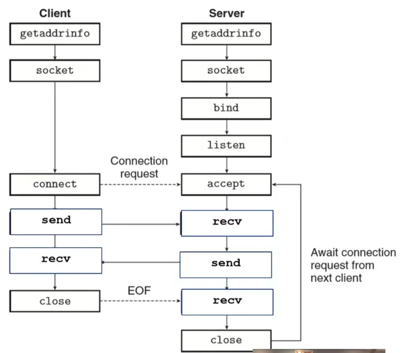

# Unix Domain Socket [UDS]

## Architectural Overview
Unix Domain Sockets is an inter-process communication (IPC) end-point that allows programs/processes on the same host to securely and efficiently exchange data.
It uses standard socket APIs just like network TCP/IP sockets, but bypasses the network layer entirely.

There are two ways to communicate using sockets, you can communicate as client that initiates a connection and you can communicate as a server that receives the connections.

In Client side, connect is an "active open" where a client knows about a server, and requests service.
In Server Side, the server needs to reserve a specific (ip, port) pair for receiving connections, also known as a "passive open".

Resource: https://www.youtube.com/watch?v=XXfdzwEsxFk

After a client connects to the server, there is nothing "special" about client vs server besides how the application layer protocol works. Both sides can send, recv, and close whenever they want.
- `getaddrinfo()` call is a unix function that is used to leverage the DNS lookup i.e. input a DNS hostname and get an output which is a lost of potential IPs to connect to/listen on.
- `socket()` call creates a file descriptor, just like open, but all it does is create the file descriptor, but not connects it to a stream of bytes like `open` does. In an analogy way, socket() basically builds a doorframe that isn't yet connected to anything. Note: socket() does not use the output of getaddrinfo().
- `connect()` call takes an input file descriptor and an IP to connect to, for creating a connection. It uses TCP under the hood. In an analogy way, it installs the door in a house, for us to use it.
- `send()` & `recv()` calls are used on both server and client side, and when given a connected file descriptor, it submit bytes to the OS for delivery and ask the OS to deliver bytes. It works very similarly to read & write, and send & recv operate on user level memory and kernel level buffers. they do not do the sending themselves.
- `close()` call take in a connected file descriptor, which inform the OS kernel that it can terminate this connection. So this is a special send kind of command that requests to terminate the connection and the kernel continues sending buffered byte if it hasnt finish sending them all. At the end of the buffered bytes, it sends the special "EOF" message to terminate the connection.

On the Server Side, there are three things needed to be done for setting up a server i.e. `bind()`, `listen()`, and `accept()`.
- `bind()` call takes in a given file descriptor, which tells the kernel to associate it with a given IP and port. To explain in an Analogy way, it basicaly makes a reservation at a restraurant.
- `listen()` call takes a file descriptor that has been binded to a IP/port, which communicates with the  OS that you want to start receiving connections.
- `accept()` call takes in a file descriptor that has already been activated via listen(), creates a new File Descriptor (FD) that can be used to communicate with an individual client. by default, this call blocks until a client shows up. To explain in an analogy, the OS tells that the client can enter the store, then the shopkeeper (application code) can talk directly to that individual client.

## Other Resources
1. https://medium.com/swlh/getting-started-with-unix-domain-sockets-4472c0db4eb1
2. To add new resources here!!